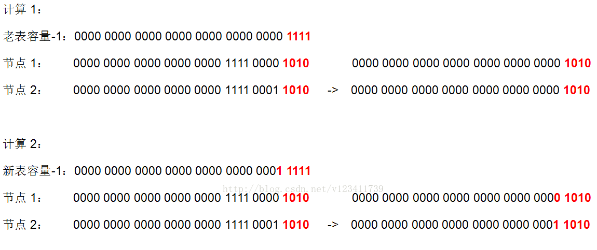

## 数组索引计算
HashMap定位数组索引位置，直接决定了hash方法的离散性能。整个过程本质上就是三步：
    
- 计算key的hashCode值
- 将hashCode的高位参与运算，重新计算hash值
- 将计算出来的hash值与(table.length - 1)进行&运算
    
```
// 代码1
static final int hash(Object key) { // 计算key的hash值
    int h;
    // ^ ：按位异或
    // >>> ：无符号右移，忽略符号位，空位都以0补齐
    // 1. 先拿到key的hashCode值
    // 2. 将hashCode的高16位参与运算
    return (key == null) ? 0 : (h = key.hashCode()) ^ (h >>> 16);
}


// 代码2
// 将(table.length - 1) 与 hash值进行&运算
int index = (table.length - 1) & hash(key);

```
    

## 求余(%)运算
对于整型数a、b来说，a % b 取模运算或者求余运算的方法都是：
1. 求 整数商: c = a / b
2. 计算模或者余数：r = a - c * b
    

## & 位运算
在计算散列位置时，理论上是将hash值对散列表长度table.length（默认长度16）取模，由于取模运算的消耗比较大，我们知道计算机位运算很快，因此JDK团队对取模运算进行了优化，使用与(&)运算来代替模运算。
    

## size 为什么必须是2的幂次方
当数组长度是2的幂次方时，取余操作存在公式： h % 2ⁿ = h & (2ⁿ - 1)，因此HashMap设计初始大小为16，是为了取模时能够使用速度更快的与运算。
    
实际开发中，自定义HashMap容量应为2的幂次方，否则&操作会存在散列不均匀，有的散列位置无法到达的问题。
    
自定义大小时，会调用`tableSizeFor(int cap)`方法将容量跳转为2的幂次方：
    
```
static final int tableSizeFor(int cap) {
    int n = cap - 1;
    n |= n >>> 1;
    n |= n >>> 2;
    n |= n >>> 4;
    n |= n >>> 8;
    n |= n >>> 16;
    return (n < 0) ? 1 : (n >= MAXIMUM_CAPACITY) ? MAXIMUM_CAPACITY : n + 1;
}
```
    
数组长度不是2的幂次方时的数组索引对比：
    
 
    

## resize 按2的倍数扩容时的原有元素rehash只可能分布在原索引位置与原索引+oldCap位置？
resize 后原有节点在新数组的index，要么在原索引，要么在oldCapacity + 原索引。
    
这是因为散列位置采用的是&位运算，实际上只有 capacity - 1 参与位运算。扩容时，参与&位运算的位数多出一个1，该位运算结果只可能时0 或者 1，为0时其散列结果与原数组相同，为1时其散列结果为oldCapacity + 原索引。
    
 
    

