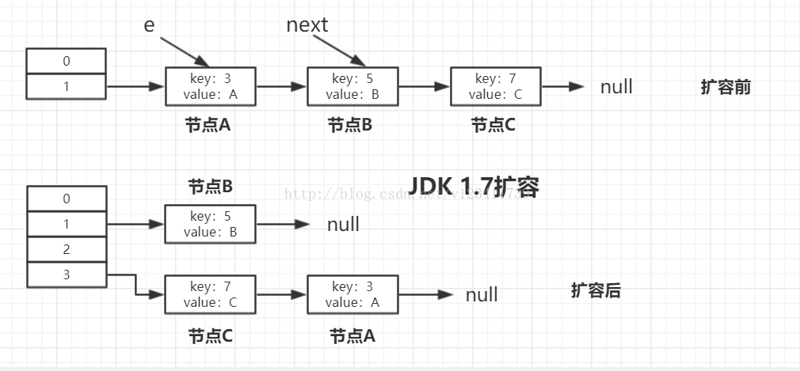
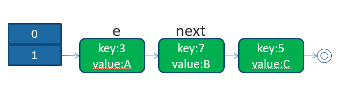
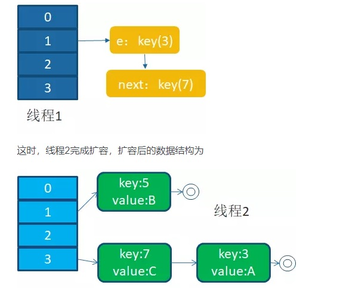
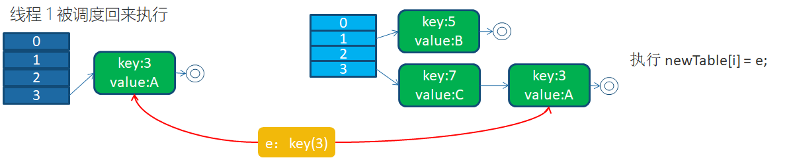
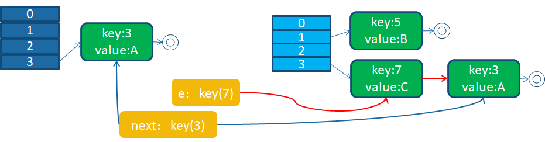
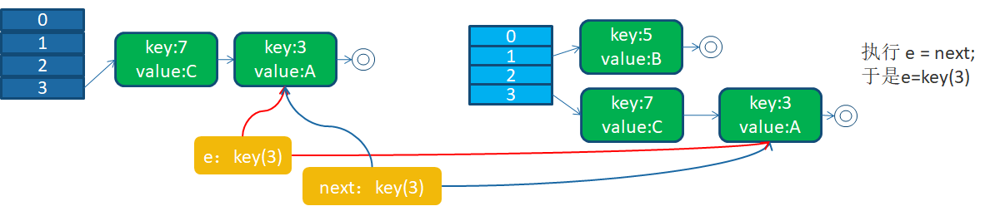
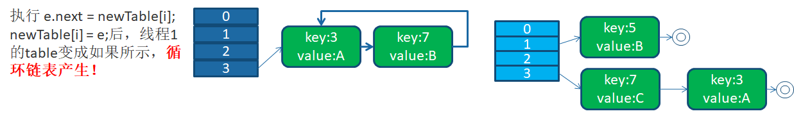
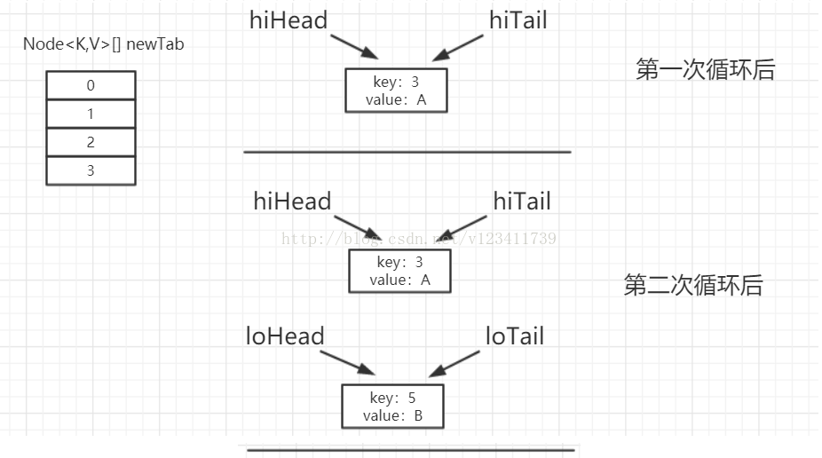
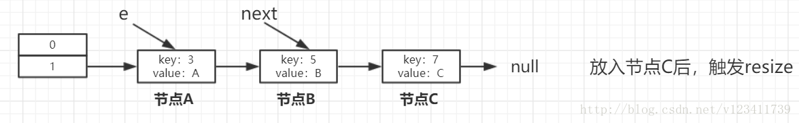
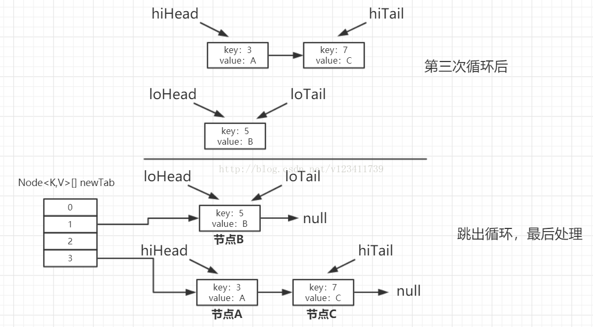

## 死循环问题
在Jdk 1.8以前，Java语言在并发情况下使用HashMap造成Race Condition，从而导致死循环。程序经常占了100%的CPU，查看堆栈，你会发现程序都Hang在了HashMap.get()这个方法上了，重启程序后问题消失。但是过段时间又会来。而且，这个问题在测试环境里可能很难重现。
    
HashMap通常会用一个指针数组（假设为table[]）来做分散所有的key，当一个key被加入时，会通过Hash算法通过key算出这个数组的下标i，然后就把这个<key, value>插到table[i]中，如果有两个不同的key被算在了同一个i，那么就叫哈希冲突，又叫碰撞，这样会在table[i]上形成一个链表。
    
我们知道，如果table[]的尺寸很小，比如只有2个，如果要放进10个keys的话，那么碰撞非常频繁，于是一个O(1)的查找算法，就变成了链表遍历，性能变成了O(n)，这是Hash表的缺陷。
    
所以，Hash表的尺寸和容量非常的重要。一般来说，Hash表这个容器当有数据要插入时，都会检查容量有没有超过设定的thredhold，如果超过，需要增大Hash表的尺寸，但是这样一来，整个Hash表里的无素都需要被重算一遍。这叫rehash，这个成本相当的大。
    

```java7
// Put一个Key,Value对到Hash表中
public V put(K key, V value) {
    ......
    // 算Hash值
    int hash = hash(key.hashCode());
    int i = indexFor(hash, table.length);
    // 如果该key已被插入，则替换掉旧的value （链接操作）
    for (Entry<K,V> e = table[i]; e != null; e = e.next) {
        Object k;
        if (e.hash == hash && ((k = e.key) == key || key.equals(k))) {
            V oldValue = e.value;
            e.value = value;
            // LinkedHashMap的方法
            e.recordAccess(this);
            return oldValue;
        }
    }
    modCount++;
    // 该key不存在，需要增加一个结点
    addEntry(hash, key, value, i);
    return null;
}

// 检查容量是否超标
void addEntry(int hash, K key, V value, int bucketIndex) {
    Entry<K,V> e = table[bucketIndex];
    table[bucketIndex] = new Entry<K,V>(hash, key, value, e);
    // 查看当前的size是否超过了我们设定的阈值threshold，如果超过，需要resize
    if (size++ >= threshold)
        resize(2 * table.length);
}

// 新建一个更大尺寸的hash表，然后把数据从老的Hash表中迁移到新的Hash表中。
void resize(int newCapacity) {
    Entry[] oldTable = table;
    int oldCapacity = oldTable.length;
    ......
    // 创建一个新的Hash Table
    Entry[] newTable = new Entry[newCapacity];
    // 将Old Hash Table上的数据迁移到New Hash Table上
    transfer(newTable);
    table = newTable;
    threshold = (int)(newCapacity * loadFactor);
}

// 迁移旧元素
void transfer(Entry[] newTable) {
    Entry[] src = table;
    int newCapacity = newTable.length;
    // 下面这段代码的意思是：
    // 从OldTable里摘一个元素出来，然后放到NewTable中
    for (int j = 0; j < src.length; j++) {
        Entry<K,V> e = src[j];
        if (e != null) {
            src[j] = null;
            do {
                Entry<K,V> next = e.next;
                int i = indexFor(e.hash, newCapacity);
                e.next = newTable[i];
                newTable[i] = e;
                e = next;
            } while (e != null);
        }
    }
}
```
    
Jdk 1.8以前，扩容后，节点的顺序会反掉：
    
 
    

## 并发下的Rehash
下面的代码在多线程下可能构造出循环链表：
    
```
do {
    Entry<K,V> next = e.next;
    int i = indexFor(e.hash, newCapacity);
    e.next = newTable[i];
    newTable[i] = e;
    e = next;
} while (e != null);
```
    
 
    
1. 在多线程环境下有线程一和线程二，同时对该map进行扩容。
    
线程一执行到 `Entry<K,V> next = e.next;` 由于时间片用完被调度挂起了。而线程二执行transfer完成了。
    
 
    
此时，线程一的变量 e指向了key(3)，变量 next指向了key(7)。
    

2. 线程一被调度回来继续执行。

- 挂起时 e = key(3); next = key(7)
- e.next = newTable[i]; -> key(3).next 设为null
- newTalbe[i] = e; -> newTalbe[3] 指向 key(3)
    
 
    
- e = next; -> 变量 e指向key(7)
- 下一次循环从变量e = key(7)开始，next = e.next -> next = key(7).next -> next = key(3)
    
 
    
key(7).next原本是key(5)，但是由于线程二已完成rehash并写入内存，而线程一没有读取过key(7).next属性，所以会直接从内存中读取key(7).next属性，从而导致变量 next = key(3)。
    

3. 线程一接着工作。
此时，e = key(7); next = key(3);
    
把key(7)摘下来，将key7插入key3之前。key(7).next属性指向key(3)，newTalbe[3] 指向 key(7)。
    
e = next -> e = key(3); next = key(3);
    
 
    

4. 环形链接出现。
- 新的循环从 e = key(3); 开始。
- next = e.next; -> next = null; (在第二步中key(3).next被设为null)
- e.next = newTable[i] -> key(3).next 指向了 key(7)。
- newTalbe[i] = e; -> newTalbe[3] 指向 key(3)
- 此时的key(7).next 已经指向了key(3) (在第三步中key(7).next被设为key(3))， 环形链表就这样出现了。
- 由于此时 e = next; -> e = null; next = null; 导致key(5)在线程一中丢失了。
- 当线程一调用 HashTable.get()，当定位到newTalbe[3]的时候，就会产生死循环 Infinite Loop。
    
 
    

## JDK 1.8扩容过程
JDK1.8 普通链表的扩容代码：
    
 
    
具体扩容过程：
    
 
    

 
    

 
    
可以看出，扩容后，节点A和节点C的先后顺序跟扩容前是一样的。因此，即使此时有多个线程并发扩容，也不会出现死循环的情况。当然，这仍然改变不了HashMap仍是非并发安全，在并发下，还是要使用ConcurrentHashMap来代替。
    

    