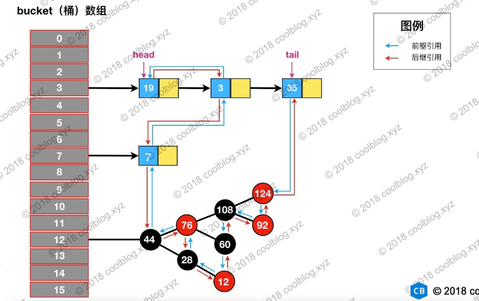

# LinkedHashMap
LinkedHashMap是HashMap的子类，但是内部还有一个双向链表维护键值对的顺序，每个键值对既位于哈希表中，也位于双向链表中。LinkedHashMap支持两种顺序插入顺序 、 访问顺序。
    
它继承了HashMap，仅重写了几个方法，以改变它迭代遍历时的顺序。这也是其与HashMap相比最大的不同。 在每次插入数据，或者访问、修改数据时，会增加节点、或调整链表的节点顺序。以决定迭代时输出的顺序。
    
- accessOrder 默认是false，则迭代时输出的顺序是插入节点的顺序。若为true，则输出的顺序是按照访问节点的顺序。为true时，可以在这基础之上构建一个LruCache。
- LinkedHashMap并没有重写任何put方法。但是其重写了构建新节点的newNode()方法。在每次构建新节点时，将新节点链接在内部双向链表的尾部。
- accessOrder = true的模式下，在afterNodeAccess()函数中，会将当前被访问到的节点e，移动至内部的双向链表的尾部。值得注意的是，afterNodeAccess()函数中，会修改modCount，因此当你在accessOrder=true的模式下迭代LinkedHashMap时，如果同时查询访问数据，也会导致fail-fast，因为迭代的顺序已经改变。
- nextNode() 就是迭代器里的next()方法 。 该方法的实现可以看出，迭代LinkedHashMap，就是从内部维护的双链表的表头开始循环输出。 而双链表节点的顺序在LinkedHashMap的增、删、改、查时都会更新。以满足按照插入顺序输出，还是访问顺序输出。
- 它与HashMap比，还有一个小小的优化，重写了containsValue()方法，直接遍历内部链表去比对value值是否相等。
    

## 构造方法
LinkedHashMap有5个构造方法，其中4个都是按插入顺序，只有一个是可以指定按访问顺序：
    
`public LinkedHashMap(int initialCapacity, float loadFactor, boolean accessOrder)`
    
其中参数accessOrder是用来指定是否按访问顺序，如果为true，就是迭代顺序。默认false表示按插入节点的顺序迭代Entry。
    
## 基于访问顺序的LRU缓存实现
HashMap在进行putVal时会调用afterNodeInsertion方法，该方法在HashMap中是空实现，LinkedHashMap中进行了重写，以实现根据removeEldestEntry返回结果决定是否删除双向队列的head元素。
    
```
void afterNodeInsertion(boolean evict) { // possibly remove eldest
    LinkedHashMap.Entry<K,V> first;
    if (evict && (first = head) != null && removeEldestEntry(first)) {
        K key = first.key;
        removeNode(hash(key), key, null, false, true);
    }
}

protected boolean removeEldestEntry(Map.Entry<K,V> eldest) {
    return false;
}
```
   
LRU缓存的实现时重写removeEldestEntry方法，以实现当Map的元素大于某个限制时删除head元素。
    
```
import java.util.LinkedHashMap;
import java.util.Map;

public class LRUCache<K, V> {

    private static final float FACTOR = 0.75f;
    private LinkedHashMap<K, V> map;
    private int total;

    @SuppressWarnings("serial")
    public LRUCache(int total) {
        this.total = total;
        int capacity = (int) Math.ceil(total / FACTOR) + 1;
        // false = 按插入顺序排序、true = 按访问顺序排序
        this.map = new LinkedHashMap<K, V>(capacity, FACTOR, true) {
            // put、putAll触发删除双向链表尾部元素
            @Override
            protected boolean removeEldestEntry(Map.Entry<K, V> eldest) {
                return size() > LRUCache.this.total;
            }
        };
    }
    
    public synchronized V get(K key) {
        return map.get(key);
    }
    public synchronized void put(K key,V value) {
        map.put(key, value);
    }
    public synchronized void clear(){
        map.clear();
    }
}
```
    

## LinkedHashMap的结构

 
    

## 节点

 
    
LinkedHashMap 内部类 Entry 继承自 HashMap 内部类 Node，并新增了两个引用，分别是 before 和 after用于维护双向链表。同时，HashMap的TreeNode 继承了子类 LinkedHashMap 的内部类 Entry 后，就具备了和其他 Entry 一起组成链表的能力。
    
当我们使用 HashMap 时，TreeNode 并不需要具备组成链表能力。如果继承 LinkedHashMap 内部类 Entry，TreeNode 就多了两个用不到的引用，这样做不是会浪费空间吗？简单说明一下这个问题，这里这么做确实会浪费空间，但与 TreeNode 通过继承获取的组成链表的能力相比，这点浪费是值得的。
    
TreeNode 对象的大小约是普通 Node 对象的2倍，我们仅在桶（bin）中包含足够多的节点时再使用。当桶中的节点数量变少时（取决于删除和扩容），TreeNode 会被转成 Node。当用户实现的 hashCode 方法具有良好分布性时，树类型的桶将会很少被使用。

    
```
static class Entry<K,V> extends HashMap.Node<K,V> {
    Entry<K,V> before, after;
    Entry(int hash, K key, V value, Node<K,V> next) {
        super(hash, key, value, next);
    }
}
```
    

## 回调方法
JDK 1.8 HashMap 的源码中，定义了3个回调方法供LinkedHashMap重写，以实现双向链表的维护功能。
    
```
// Callbacks to allow LinkedHashMap post-actions
// 访问节点，包括修改节点
void afterNodeAccess(Node<K,V> p) { }
// 插入节点
void afterNodeInsertion(boolean evict) { }
// 删除节点
void afterNodeRemoval(Node<K,V> p) { }
```
    

## put方法
LinkedHashMap 本身并没有覆写父类的 put 方法，而是直接使用了父类的实现。
    
```
// HashMap 中实现
public V put(K key, V value) {
    return putVal(hash(key), key, value, false, true);
}

// HashMap 中实现
final V putVal(int hash, K key, V value, boolean onlyIfAbsent,
               boolean evict) {
    Node<K,V>[] tab; Node<K,V> p; int n, i;
    if ((tab = table) == null || (n = tab.length) == 0) {...}
    // 通过节点 hash 定位节点所在的桶位置，并检测桶中是否包含节点引用
    if ((p = tab[i = (n - 1) & hash]) == null) {...}
    else {
        Node<K,V> e; K k;
        if (p.hash == hash &&
            ((k = p.key) == key || (key != null && key.equals(k))))
            e = p;
        else if (p instanceof TreeNode) {...}
        else {
            // 遍历链表，并统计链表长度
            for (int binCount = 0; ; ++binCount) {
                // 未在单链表中找到要插入的节点，将新节点接在单链表的后面
                if ((e = p.next) == null) {
                    p.next = newNode(hash, key, value, null);
                    if (binCount >= TREEIFY_THRESHOLD - 1) {...}
                    break;
                }
                // 插入的节点已经存在于单链表中
                if (e.hash == hash &&
                    ((k = e.key) == key || (key != null && key.equals(k))))
                    break;
                p = e;
            }
        }
        if (e != null) { // existing mapping for key
            V oldValue = e.value;
            if (!onlyIfAbsent || oldValue == null) {...}
            afterNodeAccess(e);    // 回调方法，LinkedHashMap重写，用于维护双向链表
            return oldValue;
        }
    }
    ++modCount;
    if (++size > threshold) {...}
    afterNodeInsertion(evict);    // 回调方法，LinkedHashMap重写，用于实现删除链表head元素
    return null;
}
```
    
在 HashMap 中，put 方法插入的是 HashMap 内部类 Node 类型的节点，该类型的节点并不具备与 LinkedHashMap 内部类 Entry 及其子类型节点组成链表的能力。LinkedHashMap重写了newNode方法以返回LinkedHashMap.Entry类型节点并通过 linkNodeLast 方法将 Entry 接在双向链表的尾部，实现了双向链表的建立。
    
```
// HashMap 中实现
Node<K,V> newNode(int hash, K key, V value, Node<K,V> next) {
    return new Node<>(hash, key, value, next);
}

// LinkedHashMap 中覆写
Node<K,V> newNode(int hash, K key, V value, Node<K,V> e) {
    LinkedHashMap.Entry<K,V> p =
        new LinkedHashMap.Entry<K,V>(hash, key, value, e);
    // 将 Entry 接在双向链表的尾部
    linkNodeLast(p);
    return p;
}

// LinkedHashMap 中实现
private void linkNodeLast(LinkedHashMap.Entry<K,V> p) {
    LinkedHashMap.Entry<K,V> last = tail;
    tail = p;
    // last 为 null，表明链表还未建立
    if (last == null)
        head = p;
    else {
        // 将新节点 p 接在链表尾部
        p.before = last;
        last.after = p;
    }
}
```
    
## get方法
LinkedHashMap重写了get方法，默认情况下，LinkedHashMap 是按插入顺序维护链表。不过我们可以在初始化 LinkedHashMap，指定 accessOrder 参数为 true，即可让它按访问顺序维护链表。访问顺序的原理上并不复杂，当我们调用get/getOrDefault/replace等方法时，只需要将这些方法访问的节点移动到链表的尾部即可。
    
```
// LinkedHashMap 中覆写
public V get(Object key) {
    Node<K,V> e;
    if ((e = getNode(hash(key), key)) == null)
        return null;
    // 如果 accessOrder 为 true，则调用 afterNodeAccess 将被访问节点移动到链表最后
    if (accessOrder)
        afterNodeAccess(e);
    return e.value;
}

// LinkedHashMap 中覆写
void afterNodeAccess(Node<K,V> e) { // move node to last
    LinkedHashMap.Entry<K,V> last;
    if (accessOrder && (last = tail) != e) {
        LinkedHashMap.Entry<K,V> p =
            (LinkedHashMap.Entry<K,V>)e, b = p.before, a = p.after;
        p.after = null;
        // 如果 b 为 null，表明 p 为头节点
        if (b == null)
            head = a;
        else
            b.after = a;

        if (a != null)
            a.before = b;
        else
            last = b;

        if (last == null)
            head = p;
        else {
            // 将 p 接在链表的最后
            p.before = last;
            last.after = p;
        }
        tail = p;
        ++modCount;
    }
}
```
    
 
    
访问后，键值为3的节点将会被移动到双向链表的最后位置，其前驱和后继也会跟着更新。
    
 
    

## remove方法
LinkedHashMap 删除操作相关的代码也是直接用父类的实现。在删除节点时，父类的删除逻辑并不会修复 LinkedHashMap 所维护的双向链表。在删除节点后，回调方法 afterNodeRemoval 会被调用。LinkedHashMap 覆写该方法，并在该方法中完成了移除链表中被删除节点的操作。
    
```
// HashMap 中实现
public V remove(Object key) {
    Node<K,V> e;
    return (e = removeNode(hash(key), key, null, false, true)) == null ?
        null : e.value;
}

// HashMap 中实现
final Node<K,V> removeNode(int hash, Object key, Object value,
                           boolean matchValue, boolean movable) {
    Node<K,V>[] tab; Node<K,V> p; int n, index;
    if ((tab = table) != null && (n = tab.length) > 0 &&
        (p = tab[index = (n - 1) & hash]) != null) {
        Node<K,V> node = null, e; K k; V v;
        if (p.hash == hash &&
            ((k = p.key) == key || (key != null && key.equals(k))))
            node = p;
        else if ((e = p.next) != null) {
            if (p instanceof TreeNode) {...}
            else {
                // 遍历单链表，寻找要删除的节点，并赋值给 node 变量
                do {
                    ......
                } while ((e = e.next) != null);
            }
        }
        if (node != null && (!matchValue || (v = node.value) == value ||
                             (value != null && value.equals(v)))) {
            if (node instanceof TreeNode) {...}
            // 将要删除的节点从单链表中移除
            else if (node == p)
                tab[index] = node.next;
            else
                p.next = node.next;
            ++modCount;
            --size;
            afterNodeRemoval(node);    // 调用删除回调方法进行后续操作
            return node;
        }
    }
    return null;
}

// LinkedHashMap 中覆写
void afterNodeRemoval(Node<K,V> e) { // unlink
    LinkedHashMap.Entry<K,V> p =
        (LinkedHashMap.Entry<K,V>)e, b = p.before, a = p.after;
    // 将 p 节点的前驱后后继引用置空
    p.before = p.after = null;
    // b 为 null，表明 p 是头节点
    if (b == null)
        head = a;
    else
        b.after = a;
    // a 为 null，表明 p 是尾节点
    if (a == null)
        tail = b;
    else
        a.before = b;
}
```
    
删除的过程并不复杂，上面这么多代码其实就做了三件事：

- 根据 hash 定位到桶位置
- 遍历链表或调用红黑树相关的删除方法
- 从 LinkedHashMap 维护的双链表中移除要删除的节点
    
 
    
根据 hash 定位到该节点属于3号桶，然后在对3号桶保存的单链表进行遍历。找到要删除的节点后，先从单链表中移除该节点。然后再双向链表中移除该节点。
    
 
    


## 总结

- LinkedHashMap是继承于HashMap，是基于HashMap和双向链表来实现的。
- HashMap无序；LinkedHashMap有序，可分为插入顺序和访问顺序两种。如果是访问顺序，那put和get操作已存在的Entry时，都会把Entry移动到双向链表的表尾(其实是先删除再插入)。
- LinkedHashMap存取数据，还是跟HashMap一样使用的Entry[]的方式，双向链表只是为了保证顺序。
- LinkedHashMap是线程不安全的。


