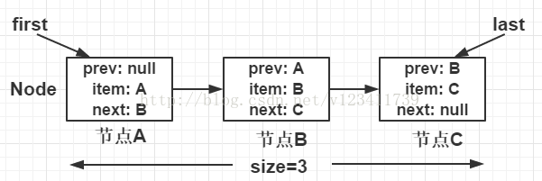

# LinkedList
LinkedList 是线程不安全的，允许元素为null的双向链表。 
其底层数据结构是链表，它实现List<E>, Deque<E>, Cloneable, java.io.Serializable接口，它实现了Deque<E>，所以它也可以作为一个双端队列。和ArrayList比，没有实现RandomAccess，随机访问元素速度较慢。

因其底层数据结构是链表，所以可想而知，它的增删只需要移动指针即可，故时间效率较高。不需要批量扩容，也不需要预留空间，所以空间效率比ArrayList高。
    
缺点就是需要随机访问元素时，时间效率很低，虽然底层在根据下标查询Node的时候，会根据index判断目标Node在前半段还是后半段，然后决定是顺序还是逆序查询，以提升时间效率。不过随着n的增大，总体时间效率依然很低。
    

## Node

 
    
```
private static class Node<E> {
    E item;//节点值
    Node<E> next;//后继节点
    Node<E> prev;//前驱节点

    Node(Node<E> prev, E element, Node<E> next) {
        this.item = element;
        this.next = next;
        this.prev = prev;
    }
}
```
    

## add 方法

```
/在尾部插入一个节点： add
public boolean add(E e) {
    linkLast(e);
    return true;
}

// 生成新节点 并插入到 链表尾部， 更新 last/first 节点。
void linkLast(E e) { 
    final Node<E> l = last; //记录原尾部节点
    final Node<E> newNode = new Node<>(l, e, null);//以原尾部节点为新节点的前置节点
    last = newNode;//更新尾部节点
    if (l == null)//若原链表为空链表，需要额外更新头结点
        first = newNode;
    else//否则更新原尾节点的后置节点为现在的尾节点（新节点）
        l.next = newNode;
    size++;
    modCount++;
}

// 在指定下标，index处，插入一个节点
public void add(int index, E element) {
    checkPositionIndex(index);//检查下标是否越界
    if (index == size)
        linkLast(element);//在尾节点后插入
    else
        linkBefore(element, node(index));//在节点之前插入
    }
}
// 在succ节点前，插入一个新节点e
void linkBefore(E e, Node<E> succ) {
    // assert succ != null;
    //保存后置节点的前置节点
    final Node<E> pred = succ.prev;
    //以前置和后置节点和元素值e 构建一个新节点
    final Node<E> newNode = new Node<>(pred, e, succ);
    //新节点new是原节点succ的前置节点
    succ.prev = newNode;
    if (pred == null)//如果之前的前置节点是空，说明succ是原头结点。所以新节点是现在的头结点
        first = newNode;
    else//否则构建前置节点的后置节点为new
        pred.next = newNode;
    size++;
    modCount++;
}
```
    

## addAll 方法

```
//addAll ,在尾部批量增加
public boolean addAll(Collection<? extends E> c) {
    return addAll(size, c);//以size为插入下标，插入集合c中所有元素
}
//以index为插入下标，插入集合c中所有元素
public boolean addAll(int index, Collection<? extends E> c) {
    checkPositionIndex(index);//检查越界 [0,size] 闭区间

    Object[] a = c.toArray();//拿到目标集合数组
    int numNew = a.length;//新增元素的数量
    if (numNew == 0)//如果新增元素数量为0，则不增加，并返回false
        return false;

    Node<E> pred, succ;  //index节点的前置节点，后置节点
    if (index == size) { //在链表尾部追加数据
        succ = null;  //size节点（队尾）的后置节点一定是null
        pred = last;//前置节点是队尾
    } else {
        succ = node(index);//取出index节点，作为后置节点
        pred = succ.prev; //前置节点是，index节点的前一个节点
    }
    //链表批量增加，是靠for循环遍历原数组，依次执行插入节点操作。对比ArrayList是通过System.arraycopy完成批量增加的
    for (Object o : a) {//遍历要添加的节点。
        @SuppressWarnings("unchecked") E e = (E) o;
        Node<E> newNode = new Node<>(pred, e, null);//以前置节点 和 元素值e，构建new一个新节点，
        if (pred == null) //如果前置节点是空，说明是头结点
            first = newNode;
        else//否则 前置节点的后置节点设置问新节点
            pred.next = newNode;
        pred = newNode;//步进，当前的节点为前置节点了，为下次添加节点做准备
    }

    if (succ == null) {//循环结束后，判断，如果后置节点是null。 说明此时是在队尾append的。
        last = pred; //则设置尾节点
    } else {
        pred.next = succ; // 否则是在队中插入的节点 ，更新前置节点 后置节点
        succ.prev = pred; //更新后置节点的前置节点
    }

    size += numNew;
    modCount++;
    return true;
}

//根据index 查询出Node，
Node<E> node(int index) {
    // assert isElementIndex(index);
//通过下标获取某个node 的时候，（增、查 ），会根据index处于前半段还是后半段 进行一个折半，以提升查询效率
    if (index < (size >> 1)) {
        Node<E> x = first;
        for (int i = 0; i < index; i++)
            x = x.next;
        return x;
    } else {
        Node<E> x = last;
        for (int i = size - 1; i > index; i--)
            x = x.prev;
        return x;
    }
}

private void checkPositionIndex(int index) {
    if (!isPositionIndex(index))
        throw new IndexOutOfBoundsException(outOfBoundsMsg(index));
}
private boolean isPositionIndex(int index) {
    return index >= 0 && index <= size;  //插入时的检查，下标可以是size [0,size]
}
```
    
可以看出addAll方法通常包括下面四个步骤：    
1. 检查index范围是否在size之内
2. toArray()方法把集合的数据存到对象数组中
3. 得到插入位置的前驱和后继节点
4. 遍历数据，将数据插入到指定位置
    

## remove 方法

```
//删除节点
public E remove(int index) {
    checkElementIndex(index);//检查是否越界 下标[0,size)
    return unlink(node(index));//从链表上删除某节点
}
//从链表上删除x节点
E unlink(Node<E> x) {
    // assert x != null;
    final E element = x.item; //当前节点的元素值
    final Node<E> next = x.next; //当前节点的后置节点
    final Node<E> prev = x.prev;//当前节点的前置节点

    if (prev == null) { //如果前置节点为空(说明当前节点原本是头结点)
        first = next;  //则头结点等于后置节点 
    } else { 
        prev.next = next;
        x.prev = null; //将当前节点的 前置节点置空
    }

    if (next == null) {//如果后置节点为空（说明当前节点原本是尾节点）
        last = prev; //则 尾节点为前置节点
    } else {
        next.prev = prev;
        x.next = null;//将当前节点的 后置节点置空
    }

    x.item = null; //将当前元素值置空
    size--;
    modCount++;
    return element; //返回取出的元素值
}
private void checkElementIndex(int index) {
    if (!isElementIndex(index))
    throw new IndexOutOfBoundsException(outOfBoundsMsg(index));
}
//下标[0,size)
private boolean isElementIndex(int index) {
    return index >= 0 && index < size;
}
```
    

## 总结
- 通过下标获取某个node 的时候，会根据index处于前半段还是后半段进行折半，以提升查询效率。
- add 直接在尾部插入一个节点。
- addAll 批量增加，是靠for循环遍历原数组，依次执行插入节点操作。对比ArrayList是通过System.arraycopy完成批量增加的。
- remove 按下标删除，先根据index找到Node，然后在链表上unlink掉这个Node。 按元素删，会先去遍历链表寻找是否有该Node，如果有，在链表上unlink掉这个Node。
- set 先根据index找到Node，然后替换值。set不修改modCount。
- get 根据index找到Node。
    

## ArrayList和LinkedList比较

- ArrayList底层基于动态数组实现，LinkedList底层基于链表实现
- 对于随机访问（get/set方法），ArrayList通过index直接定位到数组对应位置的节点，而LinkedList需要从头结点或尾节点开始遍历，直到寻找到目标节点，因此在效率上ArrayList优于LinkedList
- 对于插入和删除（add/remove方法），ArrayList需要移动目标节点后面的节点（使用System.arraycopy方法移动节点），而LinkedList只需修改目标节点前后节点的next或prev属性即可，因此在效率上LinkedList优于ArrayList。


