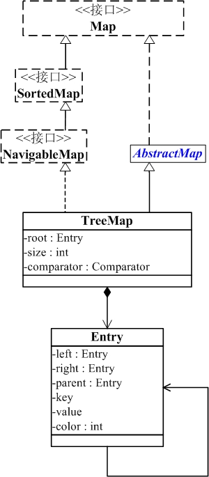

# TreeMap
TreeMap是一个能比较元素大小的Map集合，会对传入的key进行了大小排序。其中，可以使用元素的自然顺序，也可以使用集合中自定义的比较器来进行排序。
    
不同于HashMap的哈希映射，TreeMap底层实现了树形结构，TreeMap实现了红黑树的结构，形成了一颗二叉树。
    
## TreeMap结构
 
    
TreeMap继承于AbstractMap，实现了Map, Cloneable, NavigableMap, Serializable接口。

- TreeMap 继承于AbstractMap，而AbstractMap实现了Map接口，并实现了Map接口中定义的方法，减少了其子类继承的复杂度；

- TreeMap 实现了Map接口，成为Map框架中的一员，可以包含着key-value形式的元素；

- TreeMap 实现了NavigableMap接口，意味着拥有了更强的元素搜索能力；

- TreeMap 实现了Cloneable接口，实现了clone()方法，可以被克隆；

- TreeMap 实现了Java.io.Serializable接口，可通过序列化协议进行传输；
    

## SortedMap
SortedMap接口中定义的方法 - `Comparator<? super K> comparator()`，该方法决定了TreeMap体系的走向，有了比较器，就可以对插入的元素进行排序了。
    
```
public interface SortedMap<K,V> extends Map<K,V> {
    
    //返回元素比较器。如果是自然顺序，则返回null；
    Comparator<? super K> comparator();
    
    //返回从fromKey到toKey的集合：含头不含尾
    java.util.SortedMap<K,V> subMap(K fromKey, K toKey);

    //返回从头到toKey的集合：不包含toKey
    java.util.SortedMap<K,V> headMap(K toKey);

    //返回从fromKey到结尾的集合：包含fromKey
    java.util.SortedMap<K,V> tailMap(K fromKey);
    
    //返回集合中的第一个元素：
    K firstKey();
   
    //返回集合中的最后一个元素：
    K lastKey();
    
    //返回集合中所有key的集合：
    Set<K> keySet();
    
    //返回集合中所有value的集合：
    Collection<V> values();
    
    //返回集合中的元素映射：
    Set<Map.Entry<K, V>> entrySet();
}
```
    

## NavigableMap
NavigableMap接口又是对SortedMap进一步的扩展：主要增加了对集合内元素的搜索获取操作，例如：返回集合中某一区间内的元素、返回小于大于某一值的元素等类似操作。

```
public interface NavigableMap<K,V> extends SortedMap<K,V> {

    //返回小于key的第一个元素：
    Map.Entry<K,V> lowerEntry(K key);

    //返回小于key的第一个键：
    K lowerKey(K key);

    //返回小于等于key的第一个元素：
    Map.Entry<K,V> floorEntry(K key);

    //返回小于等于key的第一个键：
    K floorKey(K key);

    //返回大于或者等于key的第一个元素：
    Map.Entry<K,V> ceilingEntry(K key);

    //返回大于或者等于key的第一个键：
    K ceilingKey(K key);

    //返回大于key的第一个元素：
    Map.Entry<K,V> higherEntry(K key);

    //返回大于key的第一个键：
    K higherKey(K key);

    //返回集合中第一个元素：
    Map.Entry<K,V> firstEntry();

    //返回集合中最后一个元素：
    Map.Entry<K,V> lastEntry();

    //返回集合中第一个元素，并从集合中删除：
    Map.Entry<K,V> pollFirstEntry();

    //返回集合中最后一个元素，并从集合中删除：
    Map.Entry<K,V> pollLastEntry();

    //返回倒序的Map集合：
    java.util.NavigableMap<K,V> descendingMap();

    NavigableSet<K> navigableKeySet();

    //返回Map集合中倒序的Key组成的Set集合：
    NavigableSet<K> descendingKeySet();

    java.util.NavigableMap<K,V> subMap(K fromKey, boolean fromInclusive,
                                       K toKey, boolean toInclusive);

    java.util.NavigableMap<K,V> headMap(K toKey, boolean inclusive);

    java.util.NavigableMap<K,V> tailMap(K fromKey, boolean inclusive);

    SortedMap<K,V> subMap(K fromKey, K toKey);

    SortedMap<K,V> headMap(K toKey);

    SortedMap<K,V> tailMap(K fromKey);
}
```
    

## TreeMap排序

- 默认元素自然排序，Key必须实现Comparable接口

- 使用自定义比较器排序，需要在创建TreeMap对象时，将自定义比较器对象（实现Comparator接口）传入到TreeMap构造方法中


## get方法
TreeMap底层是红黑树结构，而红黑树本质是一颗二叉查找树，所以在获取节点方面，使用二分查找算法性能最高。
    
```
//通过key获取对应的value：
public V get(Object key) {
    //获取TreeMap中对应的节点：
    java.util.TreeMap.Entry<K,V> p = getEntry(key);
    //获取节点的值：
    return (p==null ? null : p.value);
}

//通过key获取Entry对象：
final java.util.TreeMap.Entry<K,V> getEntry(Object key) {
    //TreeMap自定义比较器不为空，使用自定义比较器对象来获取节点：
    if (comparator != null)
        //获取节点：
        return getEntryUsingComparator(key);

    //如果key为null，则抛出异常，TreeMap中不允许存在为null的key：
    if (key == null)
        throw new NullPointerException();

    //将传入的key转换成Comparable类型，传入的key必须实现Comparable接口
    Comparable<? super K> k = (Comparable<? super K>) key;
    //获取根节点：
    java.util.TreeMap.Entry<K,V> p = root;

    // 使用二分查找方式，首先判断传入的key与根节点的key哪个大：
    while (p != null) {
        //传入的key与p节点的key进行大小比较：
        int cmp = k.compareTo(p.key);
        //传入的key小于p节点的key,则从根的左子树中搜索：
        if (cmp < 0)
            //左边
            p = p.left;
        else if (cmp > 0)
            //传入的key大于p节点的key,则从根的右边子树中搜索：
            //右边
            p = p.right;
        else
            //传入的key等于p节点的key,则直接返回当前节点：
            return p;
    }
    //以上循环没有找对对应的节点，则返回null：
    return null;
}

//使用自定义比较器进行元素比较，获取对节点：
final java.util.TreeMap.Entry<K,V> getEntryUsingComparator(Object key) {
    K k = (K) key;
    Comparator<? super K> cpr = comparator;
    if (cpr != null) {
        java.util.TreeMap.Entry<K,V> p = root;
        while (p != null) {
            int cmp = cpr.compare(k, p.key);
            if (cmp < 0)
                p = p.left;
            else if (cmp > 0)
                p = p.right;
            else
                return p;
        }
    }
    return null;
}
```
    

## put方法
在将一个节点插入到红黑树中，首选需要将红黑树当做一颗二叉树查找树来对待，将节点进行插入。然后，为新插入的节点进行着色；最后，通过旋转和重新着色的方式来修正树的平衡，使其成为一颗红黑树。
    
```
//插入key-value:
public V put(K key, V value) {
    //根节点赋值给t:
    java.util.TreeMap.Entry<K,V> t = root;
    //如果根节点为null，则创建第一个节点，根节点
    if (t == null) {
        //对传入的元素进行比较，若TreeMap没定义了Comparator，则验证传入的元素是否实现了Comparable接口；
        compare(key, key);
        //根节点赋值：
        root = new java.util.TreeMap.Entry<>(key, value, null);
        //长度为1：
        size = 1;
        //修改次数+1
        modCount++;
        //直接返回：此时根节点默认为黑色
        return null;
    }

    //如果根节点不为null:
    int cmp;
    java.util.TreeMap.Entry<K,V> parent;
    Comparator<? super K> cpr = comparator;

    //判断TreeMap中自定义比较器comparator是否为null：
    if (cpr != null) {
        // do while循环，查找新插入节点的父节点：
        do {
            // 记录上次循环的节点t，首先将根节点赋值给parent:
            parent = t;
            //利用自定义比较器的比较方法：传入的key跟当前遍历节点比较：
            cmp = cpr.compare(key, t.key);
            //判断结果小于0，处于父节点的左边 
            if (cmp < 0)
                t = t.left;
            else if (cmp > 0)
            //判断结果大于0，处于父节点的右边 
                t = t.right;
            else
            //判断结果等于0，为当前节点，覆盖原有节点处的value：
                return t.setValue(value);
        // 只有当t为null，也就是找到了新节点的parent了
        } while (t != null);
    } else {
        //没有自定义比较器：
        if (key == null)
            //TreeMap不允许插入key为null，抛异常：
            throw new NullPointerException();
        //将key转换为Comparable对象：若key没有实现Comparable接口，此处会报错
        Comparable<? super K> k = (Comparable<? super K>) key;
        //同上：寻找新增节点的父节点：
        do {
            parent = t;
            cmp = k.compareTo(t.key);
            if (cmp < 0)
                t = t.left;
            else if (cmp > 0)
                t = t.right;
            else
                return t.setValue(value);
        } while (t != null);
    }

    //构造新增节点对象：
    java.util.TreeMap.Entry<K,V> e = new java.util.TreeMap.Entry<>(key, value, parent);

    //根据之前的比较结果，判断新增节点是在父节点的左边还是右边
    if (cmp < 0)
        // 如果新节点key的值小于父节点key的值，则插在父节点的左侧
        parent.left = e;
    else
        // 如果新节点key的值大于父节点key的值，则插在父节点的右侧
        parent.right = e;
    //核心方法：插入新的节点后，为了保持红黑树平衡，对红黑树进行调整
    fixAfterInsertion(e);
    size++;
    modCount++;
    return null;
}

//对插入的元素比较：若TreeMap没有自定义比较器，则调用调用默认自然顺序比较，要求元素必须实现Comparable接口；
//若自定义比较器，则用自定义比较器对元素进行比较；
final int compare(Object k1, Object k2) {
    return comparator == null ? ((Comparable<? super K>)k1).compareTo((K)k2)
            : comparator.compare((K)k1, (K)k2);
}

//核心方法：维护TreeMap平衡的处理逻辑
private void fixAfterInsertion(java.util.TreeMap.Entry<K,V> x) {
    //首先将新插入节点的颜色设置为红色
    x.color = RED;
    //TreeMap是否平衡的重要判断，当不在满足循环条件时，代表树已经平衡；
    //x不为null，不是根节点，父节点是红色（三者均满足才进行维护）：
    while (x != null && x != root && x.parent.color == RED) {
        //节点x的父节点 是 x祖父节点的左孩子：
        if (parentOf(x) == leftOf(parentOf(parentOf(x)))) {
            //获取x节点的叔叔节点y:
            java.util.TreeMap.Entry<K,V> y = rightOf(parentOf(parentOf(x)));
            
            //叔叔节点y是红色：
            if (colorOf(y) == RED) {
                //将x的父节点设置黑色：
                setColor(parentOf(x), BLACK);  
                //将x的叔叔节点y设置成黑色：
                setColor(y, BLACK);
                //将x的祖父节点设置成红色：
                setColor(parentOf(parentOf(x)), RED);
                //将x节点的祖父节点设置成x(进入了下一次判断)：
                x = parentOf(parentOf(x));
            } else {
                 //叔叔节点y不为红色：
                //x为其父节点的右孩子：
                if (x == rightOf(parentOf(x))) {
                    x = parentOf(x);
                    rotateLeft(x);
                }
                setColor(parentOf(x), BLACK);
                setColor(parentOf(parentOf(x)), RED);
                //右旋：
                rotateRight(parentOf(parentOf(x)));
            }
        } else {
            //节点x的父节点 是x祖父节点的右孩子：

            //获取x节点的叔叔节点y:
            java.util.TreeMap.Entry<K,V> y = leftOf(parentOf(parentOf(x)));
            //判断叔叔节点y是否为红色：
            if (colorOf(y) == RED) {
                setColor(parentOf(x), BLACK);12
                setColor(y, BLACK);5
                setColor(parentOf(parentOf(x)), RED);10
                x = parentOf(parentOf(x));
            } else {
                if (x == leftOf(parentOf(x))) {
                    x = parentOf(x);
                    rotateRight(x);
                }
                setColor(parentOf(x), BLACK);
                setColor(parentOf(parentOf(x)), RED);
                //左旋：
                rotateLeft(parentOf(parentOf(x)));
            }
        }
    }
    root.color = BLACK;
}

//获取节点的颜色：
private static <K,V> boolean colorOf(java.util.TreeMap.Entry<K,V> p) {
    //节点为null,则默认为黑色；
    return (p == null ? BLACK : p.color);
}

//获取p节点的父节点：
private static <K,V> java.util.TreeMap.Entry<K,V> parentOf(java.util.TreeMap.Entry<K,V> p) {
    return (p == null ? null: p.parent);
}

//对节点进行着色，TreeMap使用了boolean类型来代表颜色（true为红色，false为黑色）
private static <K,V> void setColor(java.util.TreeMap.Entry<K,V> p, boolean c){
    if (p != null)
        p.color = c;
}

//获取左子节点：
private static <K,V> java.util.TreeMap.Entry<K,V> leftOf(java.util.TreeMap.Entry<K,V> p) {
    return (p == null) ? null: p.left;
}

//获取右子节点：
private static <K,V> java.util.TreeMap.Entry<K,V> rightOf(java.util.TreeMap.Entry<K,V> p) {
    return (p == null) ? null: p.right;
}

//左旋：
private void rotateLeft(java.util.TreeMap.Entry<K,V> p) {
    if (p != null) {
        java.util.TreeMap.Entry<K,V> r = p.right;
        p.right = r.left;
        if (r.left != null)
            r.left.parent = p;
        r.parent = p.parent;
        if (p.parent == null)
            root = r;
        else if (p.parent.left == p)
            p.parent.left = r;
        else
            p.parent.right = r;
        r.left = p;
        p.parent = r;
    }
}

//右旋：
private void rotateRight(java.util.TreeMap.Entry<K,V> p) {
    if (p != null) {
        java.util.TreeMap.Entry<K,V> l = p.left;
        p.left = l.right;
        if (l.right != null) l.right.parent = p;
        l.parent = p.parent;
        if (p.parent == null)
            root = l;
        else if (p.parent.right == p)
            p.parent.right = l;
        else p.parent.left = l;
        l.right = p;
        p.parent = l;
    }
}
```
    

## remove 方法
找到被删除的节点D的子节点C，用C来替代D，不是直接删除D，因为D被C替代了，直接删除C即可。所以这里就将删除父节点D的事情转变为了删除子节点C的事情，这样处理就将复杂的删除事件简单化了。子节点C的规则是：右分支最左边，或者 左分支最右边的。
    
 
    
```
public V remove(Object key) {
    Entry<K,V> p = getEntry(key);  //根据key查找节点，并返回该节点
    if (p == null)
        return null;

    V oldValue = p.value;    //获取key对应的值
    deleteEntry(p);     //删除节点
    return oldValue;   //返回key对应的值
}

final Entry<K,V> getEntry(Object key) {
    //根据键寻找节点，有非为两种方式，如果定制了比较器，采用定制排序方式，否则使用自然排序
    if (comparator != null) 
        return getEntryUsingComparator(key); //循环遍历树，寻找和key相等的节点
    if (key == null)
        throw new NullPointerException();
    Comparable<? super K> k = (Comparable<? super K>) key;
    Entry<K,V> p = root;
    while (p != null) {  //循环遍历树，寻找和key相等的节点
        int cmp = k.compareTo(p.key);
        if (cmp < 0)
            p = p.left;
        else if (cmp > 0)
            p = p.right;
        else
            return p;
    }
    return null;
}
//删除节点
private void deleteEntry(Entry<K,V> p) {
    modCount++;  //记录修改的次数
    size--;   //数量减1

    //当前节点的两个孩子都不为空
    if (p.left != null && p.right != null) {
        //寻找继承者，继承者为当前节点的右孩子节点或者右孩子节点的最小左孩子
        Entry<K,V> s = successor(p);
        p.key = s.key;     //key - value  的替换 ，并没有替换颜色
        p.value = s.value;
        p = s;  //指向继承者
    } // p has 2 children

    // Start fixup at replacement node, if it exists.
    //开始修复树结构，继承者的左孩子不为空，返回左孩子，否则返回右孩子
    //不可能存在左右两个孩子都存在的情况，successor寻找的就是最小节点，它的左孩子节点为null
    Entry<K,V> replacement = (p.left != null ? p.left : p.right);

    if (replacement != null) {
        // Link replacement to parent
        //已经被选为继承者，当前拥有的一切放弃，所以将孩子交给爷爷抚养
        replacement.parent = p.parent;
        //p节点没有父节点，则指向根节点
        if (p.parent == null)
           root = replacement;
        //如果p为左孩子，如果p为左孩子，则将p.parent.left = p.left
        else if (p == p.parent.left)
            p.parent.left  = replacement;
        else
            p.parent.right = replacement;

        //删除p节点到左右分支，和父节点的引用
        p.left = p.right = p.parent = null;

        // Fix replacement
        if (p.color == BLACK)
            //恢复颜色分配
            fixAfterDeletion(replacement);
    } else if (p.parent == null) { // return if we are the only node.
        //红黑书中父节点为空的只能是根节点。
        root = null;
    } else { //  No children. Use self as phantom replacement and unlink.
        if (p.color == BLACK)
            fixAfterDeletion(p);

        if (p.parent != null) {
            if (p == p.parent.left)
                p.parent.left = null;
            else if (p == p.parent.right)
                p.parent.right = null;
            p.parent = null;
        }
    }
}
private void fixAfterDeletion(Entry<K,V> x) {
    //不是根节点，颜色为黑色，调整结构
    while (x != root && colorOf(x) == BLACK) {

        //判断x是否为左孩子
        if (x == leftOf(parentOf(x))) {
            //x的兄弟节点
            Entry<K,V> sib = rightOf(parentOf(x));
            //若兄弟节点是红色
            if (colorOf(sib) == RED) {
                setColor(sib, BLACK);   //设置兄弟节点变为黑色
                setColor(parentOf(x), RED);  //父节点设置为红色
                rotateLeft(parentOf(x));   //左旋父节点
                sib = rightOf(parentOf(x)); //重新设置x的兄弟节点
            }

            if (colorOf(leftOf(sib))  == BLACK &&
                colorOf(rightOf(sib)) == BLACK) {
                setColor(sib, RED); //兄弟节点的两个孩子都是黑色的重新设置兄弟节点的颜色，修改为红色
                x = parentOf(x);   //将x定位到父节点
            } else {
                if (colorOf(rightOf(sib)) == BLACK) {   //兄弟节点的右孩子是黑色的，左孩子是红色的
                    setColor(leftOf(sib), BLACK);  //设置左孩子节点为黑色
                    setColor(sib, RED); //兄弟节点为红色
                    rotateRight(sib);   //右旋
                    sib = rightOf(parentOf(x));  //右旋后重新设置兄弟节点
                }
                setColor(sib, colorOf(parentOf(x)));  //兄弟节点颜色设置和父节点的颜色相同
                setColor(parentOf(x), BLACK);   //父节点设置为黑色
                setColor(rightOf(sib), BLACK);  //将兄弟节点的有孩子设置为黑色
                rotateLeft(parentOf(x));   //左旋
                x = root;  //设置x为根节点
            }
        } else { // symmetric
            //x为父节点的右节点，参考上面的操作
            Entry<K,V> sib = leftOf(parentOf(x));

            if (colorOf(sib) == RED) {
                setColor(sib, BLACK);
                setColor(parentOf(x), RED);
                rotateRight(parentOf(x));
                sib = leftOf(parentOf(x));
            }

            if (colorOf(rightOf(sib)) == BLACK &&colorOf(leftOf(sib)) == BLACK) {
                    setColor(sib, RED);
                    x = parentOf(x);
            } else {
                if (colorOf(leftOf(sib)) == BLACK) {
                    setColor(rightOf(sib), BLACK);
                    setColor(sib, RED);
                    rotateLeft(sib);
                    sib = leftOf(parentOf(x));
                }
                setColor(sib, colorOf(parentOf(x)));
                setColor(parentOf(x), BLACK);
                setColor(leftOf(sib), BLACK);
                rotateRight(parentOf(x));
                x = root;
            }
        }
    }

    setColor(x, BLACK);
}
```
    

## 红黑树
 
    
- 节点是红色或黑色。
- 根是黑色。
- 所有叶子都是黑色（叶子是NIL节点）。
- 每个红色节点必须有两个黑色的子节点。也就是说从每个叶子到根的所有路径上不能有两个连续的红色节点。
- 从任一节点到其每个叶子的所有简单路径都包含相同数目的黑色节点。
    

## 左旋
 
    

## 右旋
 


