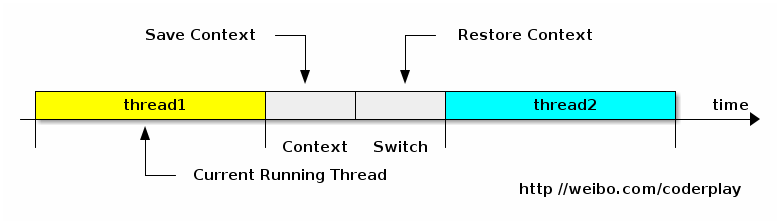

## 上下文切换

- CPU通过时间片分配算法来循环执行任务，CPU通过给每个线程分配CPU时间片来实现这个机制，当前任务执行一个时间片后会切换到下一个任务。

- 时间片是CPU分配给各个线程的时间，因为时间片非常短，所以CPU通过不停地切换线程执行，让我们感觉多个线程像是同时执行。时间片一般是几十毫秒（ms） 。

- 在切换前会保存上一个任务的状态，以便下次切换回这个任务时，可以再加载这个任务的状态。上下文是指某一时间点 CPU 寄存器和程序计数器的内容。

- 寄存器 是 CPU 内部的数量较少但是速度很快的内存（与之对应的是 CPU 外部相对较慢的 RAM 主内存）。寄存器通过对常用值（通常是运算的中间值）的快速访问来提高计算机程序运行的速度。

- 程序计数器是一个专用的寄存器，用于表明指令序列中 CPU 正在执行的位置，存的值为正在执行的指令的位置或者下一个将要被执行的指令的位置，具体依赖于特定的系统。

- 任务从保存一个线程的上下文到再加载另一个线程的上下文的过程就是一次上下文切换。
    
  
    

## 切换原因
对于抢占式调度系统，引起线程上下文切换的原因有以下几种：
    
- 当前执行任务的时间片用完之后，系统CPU正常调度下一个任务。

- 当前执行任务遇到IO阻塞，调度器将此任务挂起，继续下一任务。

- 多个任务抢占锁资源，当前任务没有抢到锁资源，被调度器挂起，继续下一任务。

- 用户代码挂起当前任务，让出CPU时间。

- 硬件中断。
    

## 切换损耗
上下文切换会带来 直接和间接 两种因素影响程序性能的消耗。

- 直接消耗：指的是CPU寄存器需要保存和加载, 系统调度器的代码需要执行, TLB实例需要重新加载, CPU 的pipeline需要刷掉。

- 间接消耗：指的是多核的cache之间得共享数据, 间接消耗对于程序的影响要看线程工作区操作数据的大小。
    

## 如何减少上下文切换
既然上下文切换会导致额外的开销，因此减少上下文切换次数便可以提高多线程程序的运行效率。但上下文切换又分为2种：

- 让步式上下文切换：执行线程主动释放CPU，与锁竞争严重程度成正比，可通过减少锁竞争来避免。

- 抢占式上下文切换：线程因分配的时间片用尽而被迫放弃CPU或者被其他优先级更高的线程所抢占，一般由于线程数大于CPU可用核心数引起，可通过调整线程数，适当减少线程数来避免。
    

所以，减少上下文切换的方法有：无锁并发编程、CAS算法、使用最少线程和使用协程。

- 无锁并发编程。多线程竞争锁时，会引起上下文切换，所以多线程处理数据时，可以用一些办法来避免使用锁，如将数据的ID按照Hash算法取模分段，不同的线程处理不同段的数据。

- CAS算法。Java的Atomic包使用CAS算法来更新数据，而不需要加锁。

- 使用最少线程。避免创建不需要的线程，比如任务很少，但是创建了很多线程来处理，这样会造成大量线程都处于等待状态。

- 使用协程。在单线程里实现多任务的调度，并在单线程里维持多个任务间的切换。
    

## 合理设置线程数目
合理设置线程数目，关键点是：

- 尽量减少线程切换和管理的开支，要求线程数尽量少，这样可以减少线程切换和管理的开支。

- 最大化利用CPU，要求尽量多的线程，以保证CPU资源最大化的利用。
    
所以 对于任务耗时短的情况，要求线程尽量少，如果线程太多，有可能出现线程切换和管理的时间，大于任务执行的时间，那效率就低了。
    
对于耗时长的任务，要分是CPU任务，还是IO等类型的任务。如果是CPU类型的任务，线程数不宜太多；但是如果是IO类型的任务，线程多一些更好，可以等待IO的时间更充分利用CPU。
    
- 高并发，低耗时的情况：建议少线程，只要满足并发即可，因为上下文切换本来就多，并且高并发就意味着CPU是处于繁忙状态的， 增加更多地线程也不会让线程得到执行时间片，反而会增加线程切换的开销；例如并发100，线程池可能设置为10就可以。

- 低并发，高耗时的情况：建议多线程，保证有空闲线程，接受新的任务；例如并发10，线程池可能就要设置为20。

