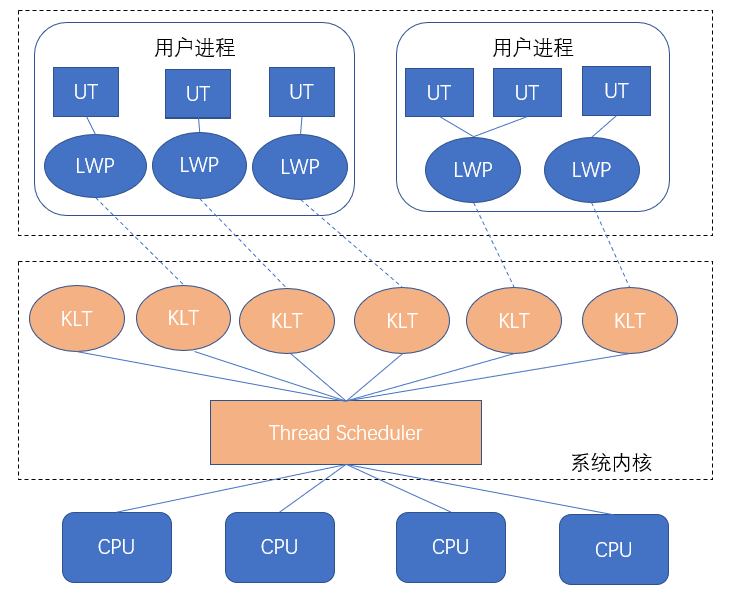
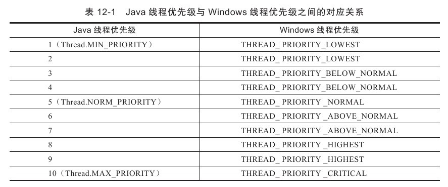

## Java 线程模型

Java语言提供了在不同硬件和操作系统平台下对线程操作的统一处理，每个已经执行start（）且还未结束的java.lang.Thread类的实例就代表了一个线程。我们注意到Thread类与大部分的Java API有显著的差别，它的所有关键方法都是声明为Native的。在Java API中，一个Native方法往往意味着这个方法没有使用或无法使用平台无关的手段来实现（当然也可能是为了执行效率而使用Native方法，不过，通常最高效率的手段也就是平台相关的手段）。
    

## 线程的实现

实现线程主要有3种方式：使用内核线程实现、使用用户线程实现和使用用户线程加轻量级进程混合实现。
    

### 内核线程模型

内核线程模型即完全依赖操作系统内核提供的内核线程（Kernel-Level Thread ，KLT）来实现多线程。在此模型下，线程的切换调度由系统内核完成，系统内核负责将多个线程执行的任务映射到各个CPU中去执行。
    
程序一般不会直接去使用内核线程，而是去使用内核线程的一种高级接口——轻量级进程（Light Weight Process,LWP），轻量级进程就是我们通常意义上所讲的线程，由于每个轻量级进程都由一个内核线程支持，因此只有先支持内核线程，才能有轻量级进程。这种轻量级进程与内核线程之间1:1的关系称为一对一的线程模型。
    
  
    
用户进程使用系统内核提供的接口———轻量级进程（Light Weight Process，LWP）来使用系统内核线程。在此种线程模型下，由于一个用户线程对应一个LWP，因此某个LWP在调用过程中阻塞了不会影响整个进程的执行。
    
由于内核线程的支持，每个轻量级进程都成为一个独立的调度单元，即使有一个轻量级进程在系统调用中阻塞了，也不会影响整个进程继续工作，但是轻量级进程具有它的局限性：
    
首先，由于是基于内核线程实现的，所以各种线程操作，如创建、析构及同步，都需要进行系统调用。而系统调用的代价相对较高，需要在用户态（User Mode）和内核态（Kernel Mode）中来回切换。
    
其次，每个轻量级进程都需要有一个内核线程的支持，因此轻量级进程要消耗一定的内核资源（如内核线程的栈空间），因此一个系统支持轻量级进程的数量是有限的。
    

### 用户线程模型

从广义上来讲，一个线程只要不是内核线程，就可以认为是用户线程（User Thread,UT），因此，从这个定义上来讲，轻量级进程也属于用户线程，但轻量级进程的实现始终是建立在内核之上的，许多操作都要进行系统调用，效率会受到限制。
    
而狭义上的用户线程指的是完全建立在用户空间的线程库上，系统内核不能感知线程存在的实现。用户线程的建立、同步、销毁和调度完全在用户态中完成，不需要内核的帮助。如果程序实现得当，这种线程不需要切换到内核态，因此操作可以是非常快速且低消耗的，也可以支持规模更大的线程数量，部分高性能数据库中的多线程就是由用户线程实现的。这种进程与用户线程之间1：N的关系称为一对多的线程模型。
    
  
    
使用用户线程的优势在于不需要系统内核支援，劣势也在于没有系统内核的支援，所有的线程操作都需要用户程序自己处理。线程的创建、切换和调度都是需要考虑的问题，而且由于操作系统只把处理器资源分配到进程，那诸如“阻塞如何处理”、“多处理器系统中如何将线程映射到其他处理器上”这类问题解决起来将会异常困难，甚至不可能完成。因而使用用户线程实现的程序一般都比较复杂，此处所讲的“复杂”与“程序自己完成线程操作”，并不限制程序中必须编写了复杂的实现用户线程的代码，使用用户线程的程序，很多都依赖特定的线程库来完成基本的线程操作，这些复杂性都封装在线程库之中，除了以前在不支持多线程的操作系统中（如DOS）的多线程程序与少数有特殊需求的程序外，现在使用用户线程的程序越来越少了，Java、Ruby等语言都曾经使用过用户线程，最终又都放弃使用它。
    

### 混合线程模型

线程除了依赖内核线程实现和完全由用户程序自己实现之外，还有一种将内核线程与用户线程一起使用的实现方式。在这种混合实现下，既存在用户线程，也存在轻量级进程。用户线程还是完全建立在用户空间中，因此用户线程的创建、切换、析构等操作依然廉价，并且可以支持大规模的用户线程并发。而操作系统提供支持的轻量级进程则作为用户线程和内核线程之间的桥梁，这样可以使用内核提供的线程调度功能及处理器映射，并且用户线程的系统调用要通过轻量级线程来完成，大大降低了整个进程被完全阻塞的风险。在这种混合模式中，用户线程与轻量级进程的数量比是不定的，即为N：M的关系。许多UNIX系列的操作系统，如Solaris、HP-UX等都提供了N：M的线程模型实现。
    
 
    

对于Sun JDK来说，它的Windows版与Linux版都是使用一对一的线程模型实现的，一条Java线程就映射到一条轻量级进程之中，因为Windows和Linux系统提供的线程模型就是一对一的。
    
在Solaris平台中，由于操作系统的线程特性可以同时支持一对一（通过Bound Threads或Alternate Libthread实现）及多对多（通过LWP/Thread Based Synchronization实现）的线程模型，因此在Solaris版的JDK中也对应提供了两个平台专有的虚拟机参数：-XX：+UseLWPSynchronization（默认值）和-XX：+UseBoundThreads来明确指定虚拟机使用哪种线程模型。
    

## Java线程调度

线程调度是指系统为线程分配处理器使用权的过程，主要调度方式有两种，分别是协同式线程调度（Cooperative Threads-Scheduling）和抢占式线程调度（Preemptive Threads-Scheduling）。
    
### 协同式调度
如果使用协同式调度的多线程系统，线程的执行时间由线程本身来控制，线程把自己的工作执行完了之后，要主动通知系统切换到另外一个线程上。协同式多线程的最大好处是实现简单，而且由于线程要把自己的事情干完后才会进行线程切换，切换操作对线程自己是可知的，所以没有什么线程同步的问题。Lua语言中的“协同例程”就是这类实现。它的坏处也很明显：线程执行时间不可控制，甚至如果一个线程编写有问题，一直不告知系统进行线程切换，那么程序就会一直阻塞在那里。很久以前的Windows 3.x系统就是使用协同式来实现多进程多任务的，相当不稳定，一个进程坚持不让出CPU执行时间就可能会导致整个系统崩溃。
   

### 抢占式调度
如果使用抢占式调度的多线程系统，那么每个线程将由系统来分配执行时间，线程的切换不由线程本身来决定（在Java中，Thread.yield（）可以让出执行时间，但是要获取执行时间的话，线程本身是没有什么办法的）。在这种实现线程调度的方式下，线程的执行时间是系统可控的，也不会有一个线程导致整个进程阻塞的问题，Java使用的线程调度方式就是抢占式调度。在JDK后续版本中有可能会提供协程（Coroutines）方式来进行多任务处理。与前面所说的Windows 3.x的例子相对，在Windows 9x/NT内核中就是使用抢占式来实现多进程的，当一个进程出了问题，我们还可以使用任务管理器把这个进程“杀掉”，而不至于导致系统崩溃。
   

## 线程优先级
虽然Java线程调度是系统自动完成的，但是我们还是可以“建议”系统给某些线程多分配一点执行时间，另外的一些线程则可以少分配一点——这项操作可以通过设置线程优先级来完成。Java语言一共设置了10个级别的线程优先级（Thread.MIN_PRIORITY至Thread.MAX_PRIORITY），在两个线程同时处于Ready状态时，优先级越高的线程越容易被系统选择执行。不过，线程优先级并不是太靠谱，原因是Java的线程是通过映射到系统的原生线程上来实现的，所以线程调度最终还是取决于操作系统，虽然现在很多操作系统都提供线程优先级的概念，但是并不见得能与Java线程的优先级一一对应，如Solaris中有2147483648（232）种优先级，但Windows中就只有7种，比Java线程优先级多的系统还好说，中间留下一点空位就可以了，但比Java线程优先级少的系统，就不得不出现几个优先级相同的情况了，表12-1显示了Java线程优先级与Windows线程优先级之间的对应关系，Windows平台的JDK中使用了除THREAD_PRIORITY_IDLE之外的其余6种线程优先级。
    
 
   

