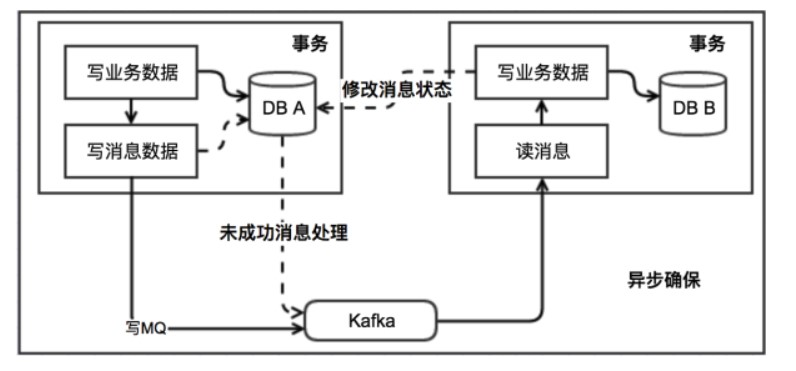

# 什么是分布式事务
分布式事务就是指事务的参与者、支持事务的服务器、资源服务器以及事务管理器分别位于不同的分布式系统的不同节点之上。简单的说，就是一次大的操作由不同的小操作组成，这些小的操作分布在不同的服务器上，且属于不同的应用，分布式事务需要保证这些小操作要么全部成功，要么全部失败。本质上来说，分布式事务就是为了保证不同数据库的数据一致性。    

# 分布式事务的产生的原因
## 数据库分库分表
当数据库单表一年产生的数据超过1000W，那么就要考虑分库分表，简单的说就是原来的一个数据库变成了多个数据库。这时候，如果一个操作既访问A库，又访问B库，而且要保证数据的一致性，那么就要用到分布式事务。    
 

## 应用SOA化
所谓的SOA化，就是业务的服务化。比如原来单机支撑了整个电商网站，现在对整个网站进行拆解，分离出了订单中心、用户中心、库存中心。对于订单中心，有专门的数据库存储订单信息，用户中心也有专门的数据库存储用户信息，库存中心也会有专门的数据库存储库存信息。这时候如果要同时对订单和库存进行操作，那么就会涉及到订单数据库和库存数据库，为了保证数据一致性，就需要用到分布式事务。    
 
    

# 分布式事务的应用场景

## 支付
最经典的场景就是支付了，一笔支付，是对买家账户进行扣款，同时对卖家账户进行入款，这些操作必须在一个事务里执行，要么全部成功，要么全部失败。而对于买家账户属于买家中心，对应的是买家数据库，而卖家账户属于卖家中心，对应的是卖家数据库，对不同数据库的操作必然需要引入分布式事务。    

## 在线下单
买家在电商平台下单，往往会涉及到两个动作，一个是扣库存，第二个是更新订单状态，库存和订单一般属于不同的数据库，需要使用分布式事务保证数据一致性。   

# CAP定理
- 一致性(Consistency) ： 客户端知道一系列的操作都会同时发生(生效)
- 可用性(Availability) ： 每个操作都必须以可预期的响应结束
- 分区容错性(Partition tolerance) ： 即使出现单个组件无法可用,操作依然可以完成 
在分布式系统中，在任何数据库设计中，一个Web应用至多只能同时支持上面的两个属性。显然，任何横向扩展策略都要依赖于数据分区。因此，设计人员必须在一致性与可用性之间做出选择。     

# BASE理论
在分布式系统中，我们往往追求的是可用性，它的重要程序比一致性要高，那么如何实现高可用性呢？ 前人已经给我们提出来了另外一个理论，就是BASE理论，它是用来对CAP定理进行进一步扩充的。
- Basically Available（基本可用）
- Soft state（软状态）
- Eventually consistent（最终一致性）
BASE理论是对CAP中的一致性和可用性进行一个权衡的结果，理论的核心思想就是：我们无法做到强一致，但每个应用都可以根据自身的业务特点，采用适当的方式来使系统达到最终一致性（Eventual consistency）。
    
    
# 分布式事务解决方案

## 基于XA协议的两阶段提交
XA是一个分布式事务协议，由Tuxedo提出。XA中大致分为两部分：事务管理器和本地资源管理器。其中本地资源管理器往往由数据库实现，比如Oracle、DB2这些商业数据库都实现了XA接口，而事务管理器作为全局的调度者，负责各个本地资源的提交和回滚。    
   

1. 应用程序（client）发起一个开始请求到TC；
2. TC先将<prepare>消息写到本地日志，之后向所有的Si发起<prepare>消息。以支付宝转账到余额宝为例，TC给A的prepare消息是通知支付宝数据库相应账目扣款1万，TC给B的prepare消息是通知余额宝数据库相应账目增加1w。为什么在执行任务前需要先写本地日志，主要是为了故障后恢复用，本地日志起到现实生活中凭证 的效果，如果没有本地日志（凭证），出问题容易死无对证；
3. Si收到<prepare>消息后，执行具体本机事务，但不会进行commit，如果成功返回yes，不成功返回no。同理，返回前都应把要返回的消息写到日志里，当作凭证。
3. TC收集所有执行器返回的消息，如果所有执行器都返回yes，那么给所有执行器发生送commit消息，执行器收到commit后执行本地事务的commit操作；如果有任一个执行器返回no，那么给所有执行器发送abort消息，执行器收到abort消息后执行事务abort操作。   
注：TC或Si把发送或接收到的消息先写到日志里，主要是为了故障后恢复用。
    

XA协议比较简单，而且一旦商业数据库实现了XA协议，使用分布式事务的成本也比较低。但是，XA也有致命的缺点，那就是性能不理想，特别是在交易下单链路，往往并发量很高，XA无法满足高并发场景。XA目前在商业数据库支持的比较理想，在mysql数据库中支持的不太理想，mysql的XA实现，没有记录prepare阶段日志，主备切换回导致主库与备库数据不一致。许多nosql也没有支持XA，这让XA的应用场景变得非常狭隘。   

一般来说某个系统内部如果出现跨多个库的操作，是不合规范的。 现在微服务，一个大的系统分成几十个甚至几百个服务。一般来说，我们的规定和规范，是要求每个服务只能操作自己对应的数据库。    

如果要操作别的服务对应的库，不允许直连别的服务的库，这违反微服务架构的规范，如果交叉访问，几百个服务的话，这样的一套服务是没法治理的，可能会出现数据被别人改错，自己的库被别人写挂等情况。   

如果你要操作别人的服务的库，必须是通过调用别的服务的接口来实现，绝对不允许交叉访问别人的数据库。

## TCC编程模式
TCC 其实就是采用的补偿机制，其核心思想是：针对每个操作，都要注册一个与其对应的确认和补偿（撤销）操作。    
它分为三个阶段：
- Try 阶段主要是对业务系统做检测及资源预留
- Confirm 阶段主要是对业务系统做确认提交，Try阶段执行成功并开始执行 Confirm阶段时，默认 Confirm阶段是不会出错的。即：只要Try成功，Confirm一定成功。
- Cancel 阶段主要是在业务执行错误，需要回滚的状态下执行的业务取消，预留资源释放。 
    
   

是两阶段提交的一个变种。TCC提供了一个编程框架，将整个业务逻辑分为三块：Try、Confirm和Cancel三个操作。以在线下单为例，Try阶段会去扣库存，Confirm阶段则是去更新订单状态，如果更新订单失败，则进入Cancel阶段，会去恢复库存。总之，TCC就是通过代码人为实现了两阶段提交，不同的业务场景所写的代码都不一样，复杂度也不一样，因此，这种模式并不能很好地被复用。    
   
## 本地消息表
此方案的核心是将需要分布式处理的任务通过消息日志的方式来异步执行。消息日志可以存储到本地文本、数据库或消息队列，再通过业务规则自动或人工发起重试。
本地消息表与业务数据表处于同一个数据库中，这样就能利用本地事务来保证在对这两个表的操作满足事务特性，并且使用了消息队列来保证最终一致性。    
   
1. A 系统在自己本地一个事务里操作同时，插入一条数据到消息表；
2. 接着 A 系统将这个消息发送到 MQ 中去；
3. B 系统接收到消息之后，在一个事务里，往自己本地消息表里插入一条数据，同时执行其他的业务操作，如果这个消息已经被处理过了，那么此时这个事务会回滚，这样保证不会重复处理消息；
4. B 系统执行成功之后，就会更新自己本地消息表的状态以及 A 系统消息表的状态；
5. 如果 B 系统处理失败了，那么就不会更新消息表状态，那么此时 A 系统会定时扫描自己的消息表，如果有未处理的消息，会再次发送到 MQ 中去，让 B 再次处理；
    
这个方案保证了最终一致性，哪怕 B 事务失败了，但是 A 会不断重发消息，直到 B 那边成功为止。    
    
优点： 一种非常经典的实现，避免了分布式事务，实现了最终一致性。    
缺点： 消息表会耦合到业务系统中，严重依赖于数据库的消息表来管理事务，如果是高并发场景不好扩展。
   

## 消息事务+最终一致性

所谓的消息事务就是基于消息中间件的两阶段提交，本质上是对消息中间件的一种特殊利用，它是将本地事务和发消息放在了一个分布式事务里，保证要么本地操作成功并且对外发消息成功，要么两者都失败，开源的RocketMQ就支持这一特性。    

在高并发场景下，将一个分布式事务拆成一个消息事务（A系统的本地操作+发消息）+ B系统的本地操作，其中B系统的操作由消息驱动，只要消息事务成功，那么A操作一定成功，消息也一定发出来了，这时候B会收到消息去执行本地操作，如果B本地操作失败，消息会重投，直到B操作成功，这样就变相地实现了A与B的分布式事务。    

   
如果确认消息发送失败了RocketMQ会定期扫描消息集群中的事务消息，这时候发现了Prepared消息，它会向消息发送者确认，所以生产方需要实现一个check接口，RocketMQ会根据发送端设置的策略来决定是回滚还是继续发送确认消息。这样就保证了消息发送与本地事务同时成功或同时失败。
   

1. 支付宝在扣款事务提交之前，向实时消息服务请求发送消息，实时消息服务只记录消息数据，而不真正发送，只有消息发送成功后才会提交事务；
2. 当支付宝扣款事务被提交成功后，向实时消息服务确认发送。只有在得到确认发送指令后，实时消息服务才真正发送该消息；
3. 当支付宝扣款事务提交失败回滚后，向实时消息服务取消发送。在得到取消发送指令后，该消息将不会被发送；
4. 对于那些未确认的消息或者取消的消息，需要有一个消息状态确认系统定时去支付宝系统查询这个消息的状态并进行更新。为什么需要这一步骤，举个例子：假设在第2步支付宝扣款事务被成功提交后，系统挂了，此时消息状态并未被更新为“确认发送”，从而导致消息不能被发送。    
5. 系统 B 的事务失败了咋办？重试咯，自动不断重试直到成功，如果实在是不行，要么就是针对重要的资金类业务进行回滚，比如 B 系统本地回滚后，想办法通知系统 A 也回滚；或者是发送报警由人工来手工回滚和补偿。

优点：消息数据独立存储，降低业务系统与消息系统间的耦合；实现了最终一致性，不需要依赖本地数据库事务。    
缺点：一次消息发送需要两次请求；业务处理服务需要实现消息状态回查接口，实现难度大，主流MQ不支持。    

虽然这个方案能够完成A和B的操作，但是A和B并不是严格一致的，而是最终一致的，在这里牺牲了一致性，换来了性能的大幅度提升。当然，这也是有风险的，如果B一直执行不成功，那么一致性会被破坏，具体怎么使用，还是得看业务能够承担多少风险。    

### 消息重复投递
为什么相同的消息会被重复投递？比如余额宝处理完消息msg后，发送了处理成功的消息给支付宝，正常情况下支付宝应该要删除消息msg，但如果支付宝这时候悲剧的挂了，重启后一看消息msg还在，就会继续发送消息msg。     

解决方法很简单，在余额宝这边增加消息应用状态表（message_apply），通俗来说就是个账本，用于记录消息的消费情况，每次来一个消息，在真正执行之前，先去消息应用状态表中查询一遍，如果找到说明是重复消息，丢弃即可，如果没找到才执行，同时插入到消息应用状态表（同一事务）。   

