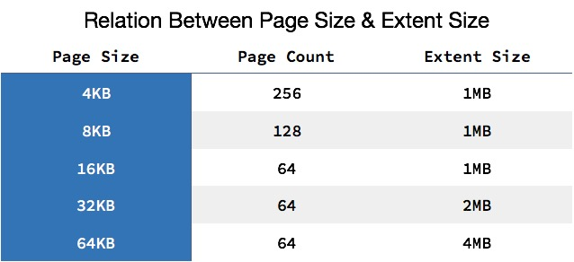

# MySQL 的架构
  
    
最上层用于连接、线程处理，很多服务都有类似的组成部分；第二层中包含了大多数 MySQL 的核心服务，包括了对 SQL 的解析、分析、优化和缓存等功能，存储过程、触发器和视图都是在这里实现的；而第三层就是 MySQL 中真正负责数据的存储和提取的存储引擎，例如：InnoDB、MyISAM 等
    
# 数据的存储
在 InnoDB 存储引擎中，所有的数据都被逻辑地存放在表空间中，表空间（tablespace）是存储引擎中最高的存储逻辑单位，在表空间的下面又包括段（segment）、区（extent）、页（page）：
    
  
    
同一个数据库实例的所有表空间都有相同的页大小；默认情况下，表空间中的页大小都为 16KB，当然也可以通过改变 innodb_page_size 选项对默认大小进行修改，在 InnoDB 存储引擎中，一个区的大小最小为 1MB，页的数量最少为 64 个。需要注意的是不同的页大小最终也会导致区大小的不同：
    
  
    
# 如何存储表
MySQL 使用 InnoDB 存储表时，会将表的定义和数据索引等信息分开存储，其中前者存储在 .frm 文件中，后者存储在 .ibd 文件中。
    
  

## .frm 文件
无论在 MySQL 中选择了哪个存储引擎，所有的 MySQL 表都会在硬盘上创建一个 .frm 文件用来描述表的格式或者说定义；.frm 文件的格式在不同的平台上都是相同的。
    
# .ibd 文件
InnoDB 中用于存储数据的文件总共有两个部分，一是系统表空间文件，包括 ibdata1、ibdata2 等文件，其中存储了 InnoDB 系统信息和用户数据库表数据和索引，是所有表公用的。
    
当打开 innodb_file_per_table 选项时，.ibd 文件就是每一个表独有的表空间，文件存储了当前表的数据和相关的索引数据。
    
# 如何存储记录
与现有的大多数存储引擎一样，InnoDB 使用页作为磁盘管理的最小单位；数据在 InnoDB 存储引擎中都是按行存储的，每个 16KB 大小的页中可以存放 2-200 行的记录。
    
# 行溢出数据
当 InnoDB 使用 Compact 或者 Redundant 格式存储极长的 VARCHAR 或者 BLOB 这类大对象时，我们并不会直接将所有的内容都存放在数据页节点中，而是将行数据中的前 768 个字节存储在数据页中，后面会通过偏移量指向溢出页。
    
  

当我们使用新的行记录格式 Compressed 或者 Dynamic 时都只会在行记录中保存 20 个字节的指针，实际的数据都会存放在溢出页面中。
    
  
    
# 数据页结构
页是 InnoDB 存储引擎管理数据的最小磁盘单位，而 B-Tree 节点就是实际存放表中数据的页面，我们在这里将要介绍页是如何组织和存储记录的；首先，一个 InnoDB 页有以下七个部分：

  
    
每一个页中包含了两对 header/trailer：内部的 Page Header/Page Directory 关心的是页的状态信息，而 Fil Header/Fil Trailer 关心的是记录页的头信息。
    
在页的头部和尾部之间就是用户记录和空闲空间了，每一个数据页中都包含 Infimum 和 Supremum 这两个虚拟的记录（可以理解为占位符），Infimum 记录是比该页中任何主键值都要小的值，Supremum 是该页中的最大值。
    
User Records 就是整个页面中真正用于存放行记录的部分，而 Free Space 就是空余空间了，它是一个链表的数据结构。
    

