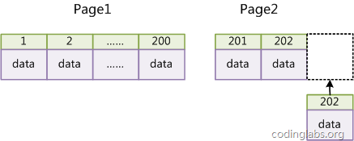

# B-Tree和B+Tree  
大部分数据库系统及文件系统都采用B-Tree或其变种B+Tree作为索引结构，MySQL使用B+Tree实现其索引结构。   

# MySQL索引实现  
在MySQL中，索引属于存储引擎级别的概念，不同存储引擎对索引的实现方式是不同的，本文主要讨论MyISAM和InnoDB两个存储引擎的索引实现方式。  

## MyISAM索引实现  
MyISAM引擎使用B+Tree作为索引结构，叶节点的data域存放的是数据记录的地址。  
下图是MyISAM索引的原理图：  
  

MyISAM的索引文件仅仅保存数据记录的地址。在MyISAM中，主索引和辅助索引（Secondary key）在结构上没有任何区别，只是主索引要求key是唯一的，而辅助索引的key可以重复。
  
  
因此，MyISAM中索引检索的算法为: 首先按照B+Tree搜索算法搜索索引，如果指定的Key存在，则取出其data域的值，然后以data域的值为地址，读取相应数据记录。  
MyISAM的索引方式也叫做“非聚集”的，之所以这么称呼是为了与InnoDB的聚集索引区分。  


## InnoDB索引实现  
虽然InnoDB也使用B+Tree作为索引结构，但具体实现方式却与MyISAM截然不同。  
  

第一个重大区别是InnoDB的数据文件本身就是索引文件。从上文知道，MyISAM索引文件和数据文件是分离的，索引文件仅保存数据记录的地址。而在InnoDB中，表数据文件本身就是按B+Tree组织的一个索引结构，这棵树的叶节点data域保存了完整的数据记录。这个索引的key是数据表的主键，因此InnoDB表数据文件本身就是主索引。  
  

可以看到叶节点包含了完整的数据记录。这种索引叫做聚集索引。因为InnoDB的数据文件本身要按主键聚集，所以InnoDB要求表必须有主键（MyISAM可以没有），如果没有显式指定，则MySQL系统会自动选择一个可以唯一标识数据记录的列作为主键，如果不存在这种列，则MySQL自动为InnoDB表生成一个隐含字段作为主键，这个字段长度为6个字节，类型为长整形。  

第二个与MyISAM索引的不同是InnoDB的辅助索引data域存储相应记录主键的值而不是地址。换句话说，InnoDB的所有辅助索引都引用主键作为data域。  
  
辅助索引搜索需要检索两遍索引：首先检索辅助索引获得主键，然后用主键到主索引中检索获得记录。  

了解不同存储引擎的索引实现方式对于正确使用和优化索引都非常有帮助，例如知道了InnoDB的索引实现后，就很容易明白为什么不建议使用过长的字段作为主键，因为所有辅助索引都引用主索引，过长的主索引会令辅助索引变得过大。再例如，用散列少的字段作为主键在InnoDB中不是个好主意，因为InnoDB数据文件本身是一颗B+Tree，散列少的主键会造成在插入新记录时数据文件为了维持B+Tree的特性而频繁的分裂调整，十分低效，而使用自增字段作为主键则是一个很好的选择。  


# 覆盖索引
select的数据列只用从索引中就能够取得，不必从数据表中读取，换句话说查询列要被所使用的索引覆盖。非聚集组合索引的一种形式，它包括在查询里的select、join和where子句用到的所有列（即建立索引的字段正好是覆盖查询语句[select子句]与查询条件[where子句]中所涉及的字段，索引包含了查询正在查找的所有数据）。  

# mysql索引类别
**单列**：普通索引(create index)，唯一索引（unique index），主键索引(primary key)，主键索引比普通索引快。   
**多列**：联合索引（多列，也称之为组合索引），比如：联合主键索引、联合唯一索引、联合普通索引，组合索引查询速度 优于 多个单索引合并查询速度。   

# 索引的种类
1. hash类型的索引：查询单条快，范围查询慢(> < like)，因为hash索引生成hash值的是无序的，所以不能使用排序。  
2. btree类型的索引：b+树，层数越多，数据量指数级增长（innodb默认支持它），二分查找查询（推荐使用自增主键）。  

# 索引性能
`all < index < range < index_merge < ref_or_null < ref < eq_ref < system/const`  
**ALL**：全表扫描，对于数据表从头到尾找一遍   
`select * from userinfo;`  
如果有limit限制，则找到之后就不在继续向下扫描   
`select * from userinfo where email = 'zhangsan112@qq.com' limit 1;`  

**INDEX**： 全索引扫描，对索引从头到尾找一遍   
`select id from userinfo;`  

**RANGE**： 对索引列进行范围查找(between and、in、 >  >=  <  <=  <>  !=)  
`select *  from userinfo where id > 1000;`  

**INDEX_MERGE**： 合并索引，使用多个单列索引搜索  
`select *  from userinfo where name = 'zhangsan' or id in (1001, 1002, 1003);`

**REF**： 根据索引查找一个或多个值  
`select *  from userinfo where id = 1000;`  

**EQ_REF**： 连接时使用primary key 或 unique类型  
`select u.name, d.deptname from userinfo u left join dept d on u.deptid = d.id;`  

**CONST**：常量，表最多有一个匹配行,因为仅有一行,在这行的列值可被优化器剩余部分认为是常数,const表很快,因为它们只读取一次。  
`select id from userinfo where id = 1002;`  

  
# 索引使用策略及优化
MySQL的优化主要分为结构优化（Scheme optimization）和查询优化（Query optimization）。本章讨论的高性能索引策略主要属于结构优化范畴。  

## 最左前缀原理与相关优化
高效使用索引的首要条件是知道什么样的查询会使用到索引，这个问题和B+Tree中的“最左前缀原理”有关，下面通过例子说明最左前缀原理。  

在上文中，我们都是假设索引只引用了单个的列，实际上，MySQL中的索引可以以一定顺序引用多个列，这种索引叫做联合索引，一般的，一个联合索引是一个有序元组<a1, a2, …, an>，其中各个元素均为数据表的一列。单列索引可以看成联合索引元素数为1的特例。  

以employees.titles表为例，下面先查看其上都有哪些索引：
```
SHOW INDEX FROM employees.titles;
+--------+------------+----------+--------------+-------------+-----------+-------------+------+------------+
| Table  | Non_unique | Key_name | Seq_in_index | Column_name | Collation | Cardinality | Null | Index_type |
+--------+------------+----------+--------------+-------------+-----------+-------------+------+------------+
| titles |          0 | PRIMARY  |            1 | emp_no      | A         |        NULL |      | BTREE      |
| titles |          0 | PRIMARY  |            2 | title       | A         |        NULL |      | BTREE      |
| titles |          0 | PRIMARY  |            3 | from_date   | A         |      443308 |      | BTREE      |
+--------+------------+----------+--------------+-------------+-----------+-------------+------+------------+
```
从结果中可以到titles表的主索引为<emp_no, title, from_date>。  

**情况一**：全列匹配。   
```
EXPLAIN SELECT * FROM employees.titles WHERE emp_no='1001' AND title='Senior Engineer' AND from_date='1986-06-26';
+----+-------------+--------+-------+---------------+---------+---------+-------------------+------+-------+
| id | select_type | table  | type  | possible_keys | key     | key_len | ref               | rows | Extra |
+----+-------------+--------+-------+---------------+---------+---------+-------------------+------+-------+
|  1 | SIMPLE      | titles | const | PRIMARY       | PRIMARY | 59      | const,const,const |    1 |       |
+----+-------------+--------+-------+---------------+---------+---------+-------------------+------+-------+
```
很明显，当按照索引中所有列进行精确匹配（这里精确匹配指“=”或“IN”匹配）时，索引可以被用到。这里有一点需要注意，理论上索引对顺序是敏感的，但是由于MySQL的查询优化器会自动调整where子句的条件顺序以使用适合的索引。  


**情况二**：最左前缀匹配。  
```
EXPLAIN SELECT * FROM employees.titles WHERE emp_no='1001';
+----+-------------+--------+------+---------------+---------+---------+-------+------+-------+
| id | select_type | table  | type | possible_keys | key     | key_len | ref   | rows | Extra |
+----+-------------+--------+------+---------------+---------+---------+-------+------+-------+
|  1 | SIMPLE      | titles | ref  | PRIMARY       | PRIMARY | 4       | const |    1 |       |
+----+-------------+--------+------+---------------+---------+---------+-------+------+-------+
```
当查询条件精确匹配索引的左边连续一个或几个列时，如<emp_no>或<emp_no, title>，索引可以被用到，但是只能用到一部分，即条件所组成的最左前缀。上面的查询从分析结果看用到了PRIMARY索引，但是key_len为4，说明只用到了索引的第一列前缀。  

**情况三**：查询条件用到了索引中列的精确匹配，但是中间某个条件未提供。  
```
EXPLAIN SELECT * FROM employees.titles WHERE emp_no='1001' AND from_date='1986-06-26';
+----+-------------+--------+------+---------------+---------+---------+-------+------+-------------+
| id | select_type | table  | type | possible_keys | key     | key_len | ref   | rows | Extra       |
+----+-------------+--------+------+---------------+---------+---------+-------+------+-------------+
|  1 | SIMPLE      | titles | ref  | PRIMARY       | PRIMARY | 4       | const |    1 | Using where |
+----+-------------+--------+------+---------------+---------+---------+-------+------+-------------+
```
此时索引使用情况和情况二相同，因为title未提供，所以查询只用到了索引的第一列，而后面的from_date虽然也在索引中，但是由于title不存在而无法和左前缀连接，因此需要对结果进行扫描过滤from_date。如果想让from_date也使用索引而不是where过滤，可以增加一个辅助索引<emp_no, from_date>，此时上面的查询会使用这个索引。除此之外，还可以使用一种称之为“隔离列”的优化方法，将emp_no与from_date之间的“坑”填上。  

首先我们看下title一共有几种不同的值：   
```
SELECT DISTINCT(title) FROM employees.titles;
+--------------------+
| title              |
+--------------------+
| Senior Engineer    |
| Staff              |
| Engineer           |
| Senior Staff       |
| Assistant Engineer |
| Technique Leader   |
| Manager            |
+--------------------+
```
只有7种。在这种成为“坑”的列值比较少的情况下，可以考虑用“IN”来填补这个“坑”从而形成最左前缀：
```
EXPLAIN SELECT * FROM employees.titles
WHERE emp_no='1001'
AND title IN ('Senior Engineer', 'Staff', 'Engineer', 'Senior Staff', 'Assistant Engineer', 'Technique Leader', 'Manager')
AND from_date='1986-06-26';
+----+-------------+--------+-------+---------------+---------+---------+------+------+-------------+
| id | select_type | table  | type  | possible_keys | key     | key_len | ref  | rows | Extra       |
+----+-------------+--------+-------+---------------+---------+---------+------+------+-------------+
|  1 | SIMPLE      | titles | range | PRIMARY       | PRIMARY | 59      | NULL |    7 | Using where |
+----+-------------+--------+-------+---------------+---------+---------+------+------+-------------+
```
这次key_len为59，说明索引被用全了，但是从type和rows看出IN实际上执行了一个range查询，这里检查了7个key。看下两种查询的性能比较：
```
SHOW PROFILES;
+----------+------------+-------------------------------------------------------------------------------+
| Query_ID | Duration   | Query                                                                         |
+----------+------------+-------------------------------------------------------------------------------+
|       10 | 0.00058000 | SELECT * FROM employees.titles WHERE emp_no='1001' AND from_date='1986-06-26'|
|       11 | 0.00052500 | SELECT * FROM employees.titles WHERE emp_no='1001' AND title IN ...          |
+----------+------------+-------------------------------------------------------------------------------+
```
“填坑”后性能提升了一点。如果经过emp_no筛选后余下很多数据，则后者性能优势会更加明显。当然，如果title的值很多，用填坑就不合适了，必须建立辅助索引。  

**情况四**：查询条件没有指定索引第一列。
```
EXPLAIN SELECT * FROM employees.titles WHERE from_date='1986-06-26';
+----+-------------+--------+------+---------------+------+---------+------+--------+-------------+
| id | select_type | table  | type | possible_keys | key  | key_len | ref  | rows   | Extra       |
+----+-------------+--------+------+---------------+------+---------+------+--------+-------------+
|  1 | SIMPLE      | titles | ALL  | NULL          | NULL | NULL    | NULL | 443308 | Using where |
+----+-------------+--------+------+---------------+------+---------+------+--------+-------------+
```
由于不是最左前缀，索引这样的查询显然用不到索引。  

**情况五**：匹配某列的前缀字符串。  
```
EXPLAIN SELECT * FROM employees.titles WHERE emp_no='1001' AND title LIKE 'Senior%';
+----+-------------+--------+-------+---------------+---------+---------+------+------+-------------+
| id | select_type | table  | type  | possible_keys | key     | key_len | ref  | rows | Extra       |
+----+-------------+--------+-------+---------------+---------+---------+------+------+-------------+
|  1 | SIMPLE      | titles | range | PRIMARY       | PRIMARY | 56      | NULL |    1 | Using where |
+----+-------------+--------+-------+---------------+---------+---------+------+------+-------------+
```
此时可以用到索引，但是如果通配符不是只出现在末尾，则无法使用索引title的索引。  


**情况六**：范围查询。  
```
EXPLAIN SELECT * FROM employees.titles WHERE emp_no < '1001' and title='Senior Engineer';
+----+-------------+--------+-------+---------------+---------+---------+------+------+-------------+
| id | select_type | table  | type  | possible_keys | key     | key_len | ref  | rows | Extra       |
+----+-------------+--------+-------+---------------+---------+---------+------+------+-------------+
|  1 | SIMPLE      | titles | range | PRIMARY       | PRIMARY | 4       | NULL |   16 | Using where |
+----+-------------+--------+-------+---------------+---------+---------+------+------+-------------+
```
范围列可以用到索引（必须是最左前缀），但是范围列后面的列无法用到索引。同时，索引最多用于一个范围列，因此如果查询条件中有两个范围列则无法全用到索引。  

**情况七**：查询条件中含有函数或表达式。  
很不幸，如果查询条件中含有函数或表达式，则MySQL不会为这列使用索引（虽然某些在数学意义上可以使用）。例如：
```
EXPLAIN SELECT * FROM employees.titles WHERE emp_no='1001' AND left(title, 6)='Senior';
+----+-------------+--------+------+---------------+---------+---------+-------+------+-------------+
| id | select_type | table  | type | possible_keys | key     | key_len | ref   | rows | Extra       |
+----+-------------+--------+------+---------------+---------+---------+-------+------+-------------+
|  1 | SIMPLE      | titles | ref  | PRIMARY       | PRIMARY | 4       | const |    1 | Using where |
+----+-------------+--------+------+---------------+---------+---------+-------+------+-------------+
```
虽然这个查询和情况五中功能相同，但是由于使用了函数left，则无法为title列应用索引，而情况五中用LIKE则可以。再如：
```
EXPLAIN SELECT * FROM employees.titles WHERE emp_no-1='1000';
+----+-------------+--------+------+---------------+------+---------+------+--------+-------------+
| id | select_type | table  | type | possible_keys | key  | key_len | ref  | rows   | Extra       |
+----+-------------+--------+------+---------------+------+---------+------+--------+-------------+
|  1 | SIMPLE      | titles | ALL  | NULL          | NULL | NULL    | NULL | 443308 | Using where |
+----+-------------+--------+------+---------------+------+---------+------+--------+-------------+
```
显然这个查询等价于查询emp_no=1001，但是由于查询条件是一个表达式，MySQL无法为其使用索引。因此在写查询语句时尽量避免表达式出现在查询中，而是先手工私下代数运算，转换为无表达式的查询语句。  


# InnoDB的主键选择与插入优化
在使用InnoDB存储引擎时，如果没有特别的需要，请永远使用一个与业务无关的自增字段作为主键。如果从数据库索引优化角度看，使用InnoDB引擎而不使用自增主键绝对是一个糟糕的主意。  

InnoDB使用聚集索引，数据记录本身被存于主索引（一颗B+Tree）的叶子节点上。这就要求同一个叶子节点内（大小为一个内存页或磁盘页）的各条数据记录按主键顺序存放，因此每当有一条新的记录插入时，MySQL会根据其主键将其插入适当的节点和位置，如果页面达到装载因子（InnoDB默认为15/16），则开辟一个新的页（节点）。如果表使用自增主键，那么每次插入新的记录，记录就会顺序添加到当前索引节点的后续位置，当一页写满，就会自动开辟一个新的页。  
  


这样就会形成一个紧凑的索引结构，近似顺序填满。由于每次插入时也不需要移动已有数据，因此效率很高，也不会增加很多开销在维护索引上。如果使用非自增主键（如果身份证号或学号等），由于每次插入主键的值近似于随机，因此每次新纪录都要被插到现有索引页得中间某个位置：   
  

此时MySQL不得不为了将新记录插到合适位置而移动数据，甚至目标页面可能已经被回写到磁盘上而从缓存中清掉，此时又要从磁盘上读回来，这增加了很多开销，同时频繁的移动、分页操作造成了大量的碎片，得到了不够紧凑的索引结构，后续不得不通过OPTIMIZE TABLE来重建表并优化填充页面。  

因此，只要可以，请尽量在InnoDB上采用自增字段做主键。


# mysql索引注意事项
- 减少io次数，数据库操作中超过90%的时间都是 IO 操作所占用的，减少 IO 次数是 SQL 优化中需要第一优先考虑
- 降低 CPU 计算， order by, group by, distinct等都是消耗 CPU 的大户，尽量少使用
- 尽量用join代替子查询
- 尽量少or，使用 union all 或者是union(必要的时候)的方式来代替“or”会得到更好的效果。
- 尽量用 union all 代替 union，union需要将两个结果集合并后再进行唯一性过滤操作，这就会涉及到排序，增加大量的 CPU 运算，加大资源消耗及延迟。
- 尽量早过滤以减少io操作
- 避免类型转换，如果我们传入的数据类型和字段类型不一致，同时我们又没有做任何类型转换处理，MySQL 可能会自己对我们的数据进行类型转换操作
- 尽量避免where子句中对字段进行null值的判断，会导致引擎放弃索引，进而进行全表扫描。
- 避免在where中使用!=, >, < ，否则引擎放弃使用索引，进行全表扫描。
- in和not in关键词慎用，容易导致全表扫面，对连续的数值尽量用between
- 在经常搜索select的列上建索引，加快搜索速度
- 在经常使用的where子句中的列上建索引，加快条件过滤的速度
- 在经常需要排序order by的列上建索引，因为索引本身已经排序，可以加快排序速度
- 在经常需要连接join on 的列上建索引，可以加快连接速度
- 索引对于大型表非常有效，但特大型表的维护开销太大，不适合建索引
- 需要索引的列设为not null，否则将导致引擎放弃使用索引而使用全表扫描
- 避免where子句中=左边进行函数、算术运算或其他表达式运算，这会造成无法命中索引
- 使用innodb时，使用自增主键，即 使用逻辑主键，尽量不要使用业务主键
- 删除长期未使用的索引，mysql5.7可以通过查询sys库的chema_unused_indexes视图来查询未被使用的索引
- limit 分页查询缓慢时，可以借助索引来提高性能


# 分页性能相关方案
第1页：  
`select * from userinfo limit 0,10;`  

第n页：
`select * from userinfo limit 10000,10;`  
......   
越往后查询，需要的时间约长，是因为越往后查，全文扫描查询，会去数据表中扫描查询  
1. 一个简单的方法就是尽可能地使用索引覆盖扫描，而不是查询所有的列，然后根据需要做一次关联操作再返回所需的列。
`select * from userinfo u join (select id from userinfo limit 10000,10) m on u.id=m.id;`  
2. 最优的解决方案  
下一页：  
`select * from userinfo where id>max_id limit 10;`  
上一页：  
`select * from userinfo where id<min_id order by id desc limit 10;`


