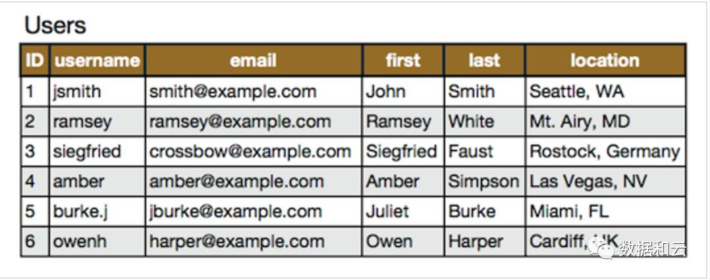
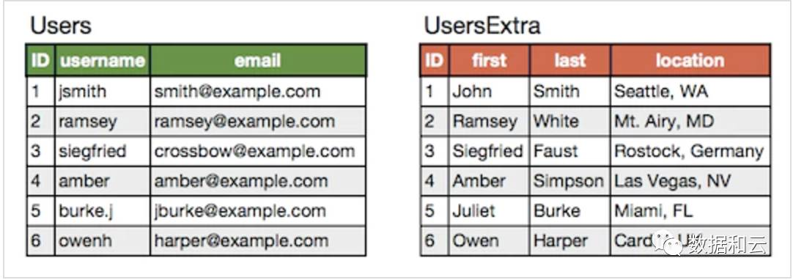
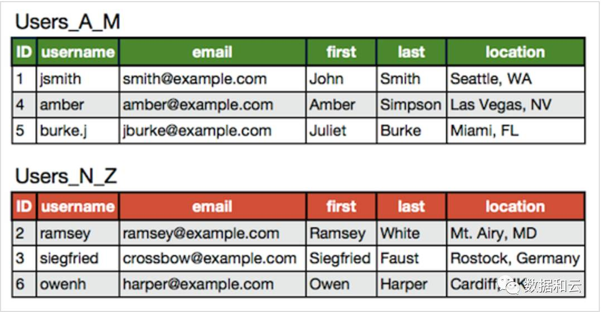

    

## 为查询缓存优化你的查询
大多数的MySQL服务器都开启了查询缓存。这是提高性最有效的方法之一，而且这是被MySQL的数据库引擎处理的。当有很多相同的查询被执行了多次的时候，这些查询结果会被放到一个缓存中，这样，后续的相同的查询就不用操作表而直接访问缓存结果了。
    
这里最主要的问题是，对于程序员来说，这个事情是很容易被忽略的。因为，我们某些查询语句会让MySQL不使用缓存。请看下面的示例：
     
```
// 查询缓存不开启
$r = mysql_query("SELECT username FROM user WHERE signup_date >= CURDATE()");

// 开启查询缓存
$today = date("Y-m-d");
$r = mysql_query("SELECT username FROM user WHERE signup_date >= '$today'");
```
    
上面两条SQL语句的差别就是 CURDATE() ，MySQL的查询缓存对这个函数不起作用。所以，像 NOW() 和 RAND() 或是其它的诸如此类的SQL函数都不会开启查询缓存，因为这些函数的返回是会不定的易变的。所以，你所需要的就是用一个变量来代替MySQL的函数，从而开启缓存。


## EXPLAIN 你的 SELECT 查询
使用 EXPLAIN 关键字可以让你知道MySQL是如何处理你的SQL语句的。这可以帮你分析你的查询语句或是表结构的性能瓶颈。

EXPLAIN 的查询结果还会告诉你你的索引主键被如何利用的，你的数据表是如何被搜索和排序的。
    

## 当只要一行数据时使用 LIMIT 1
当你查询表的有些时候，你已经知道结果只会有一条结果，但因为你可能需要去fetch游标，或是你也许会去检查返回的记录数。
    
在这种情况下，加上 LIMIT 1 可以增加性能。这样一样，MySQL数据库引擎会在找到一条数据后停止搜索，而不是继续往后查少下一条符合记录的数据。
    

## 为搜索字段建索引
索引并不一定就是给主键或是唯一的字段。如果在你的表中，有某个字段你总要会经常用来做搜索，那么，请为其建立索引吧。
    
另外，你应该也需要知道什么样的搜索是不能使用正常的索引的。例如，当你需要在一篇大的文章中搜索一个词时，如： “WHERE post_content LIKE ‘%apple%'”，索引可能是没有意义的。你可能需要使用MySQL全文索引 或是自己做一个索引（比如说：搜索关键词或是Tag什么的）。
    

## 在Join表的时候使用相当类型的例，并将其索引
如果你的应用程序有很多 JOIN 查询，你应该确认两个表中Join的字段是被建过索引的。这样，MySQL内部会启动为你优化Join的SQL语句的机制。
    
而且，这些被用来Join的字段，应该是相同的类型的。例如：如果你要把 DECIMAL 字段和一个 INT 字段Join在一起，MySQL就无法使用它们的索引。对于那些STRING类型，还需要有相同的字符集才行。
    

## 千万不要 ORDER BY RAND()
想打乱返回的数据行？随机挑一个数据？真不知道谁发明了这种用法，但很多新手很喜欢这样用。但你确不了解这样做有多么可怕的性能问题。
    
如果你真的想把返回的数据行打乱了，你有N种方法可以达到这个目的。这样使用只让你的数据库的性能呈指数级的下降。这里的问题是：MySQL会不得不去执行RAND()函数（很耗CPU时间），而且这是为了每一行记录去记行，然后再对其排序。就算是你用了Limit 1也无济于事（因为要排序）。


## 避免 SELECT *
从数据库里读出越多的数据，那么查询就会变得越慢。并且，如果你的数据库服务器和WEB服务器是两台独立的服务器的话，这还会增加网络传输的负载。
    
只取出需要的列的好处是，一旦需要的列符合索引覆盖，则只需要扫描索引表。所以，你应该养成一个需要什么就取什么的好的习惯。
    

## 永远为每张表设置一个ID，最好是业务无关的主键
我们应该为数据库里的每张表都设置一个ID做为其主键，而且最好的是一个INT型的（推荐使用UNSIGNED），并设置上自动增加的AUTO_INCREMENT标志。
    
就算是你 users 表有一个主键叫 “email”的字段，你也别让它成为主键。使用 VARCHAR 类型来当主键会使用得性能下降。另外，在你的程序中，你应该使用表的ID来构造你的数据结构。
    
而且，在MySQL数据引擎下，还有一些操作需要使用主键，在这些情况下，主键的性能和设置变得非常重要，比如，集群，分区……
    
在这里，只有一个情况是例外，那就是关联表，也就是说，这个表的联合主键，通过若干个别的表的主键构成。比如：有一个“学生表”有学生的ID，有一个“课程表”有课程ID，那么，“成绩表”就是关联表了，其关联了学生表和课程表，在成绩表中，学生ID和课程ID共同组成联合主键。
    

## 使用 ENUM 或者 INT 而不是 VARCHAR
ENUM 类型是非常快和紧凑的。在实际上，其保存的是 TINYINT，但其外表上显示为字符串。这样一来，用这个字段来做一些选项列表变得相当的完美。
    
如果你有一个字段，比如“性别”，“国家”，“民族”，“状态”或“部门”，你知道这些字段的取值是有限而且固定的，那么，你应该使用 ENUM 而不是 VARCHAR。
    

## 尽可能的使用 NOT NULL
除非你有一个很特别的原因去使用 NULL 值，你应该总是让你的字段保持 NOT NULL。
    
首先，问问你自己“Empty”和“NULL”有多大的区别（如果是INT，那就是0和NULL）？如果你觉得它们之间没有什么区别，那么你就不要使用NULL。（你知道吗？在 Oracle 里，NULL 和 Empty 的字符串是一样的！)
    
不要以为 NULL 不需要空间，其需要额外的空间，并且，在你进行比较的时候，你的程序会更复杂。 当然，这里并不是说你就不能使用NULL了，现实情况是很复杂的，依然会有些情况下，你需要使用NULL值。
    

## Prepared Statements
Prepared Statements很像存储过程，是一种运行在后台的SQL语句集合，我们可以从使用 prepared statements 获得很多好处，无论是性能问题还是安全问题。
    
Prepared Statements 可以检查一些你绑定好的变量，这样可以保护你的程序不会受到“SQL注入式”攻击。当然，你也可以手动地检查你的这些变量，然而，手动的检查容易出问题，而且很经常会被程序员忘了。当我们使用一些framework或是ORM的时候，这样的问题会好一些。
    
在性能方面，当一个相同的查询被使用多次的时候，这会为你带来可观的性能优势。你可以给这些Prepared Statements定义一些参数，而MySQL只会解析一次。最新版本的MySQL在传输Prepared Statements是使用二进制形式，所以这会使得网络传输非常有效率。
    

## 把IP地址存成 UNSIGNED INT
很多程序员都会创建一个 VARCHAR(15) 字段来存放字符串形式的IP而不是整形的IP。如果你用整形来存放，只需要4个字节，并且你可以有定长的字段。而且，这会为你带来查询上的优势，尤其是当你需要使用这样的WHERE条件：IP between ip1 and ip2。
    
我们必需要使用UNSIGNED INT，因为 IP地址会使用整个32位的无符号整形。
    

## 固定长度的表会更快
如果表中的所有字段都是“固定长度”的，整个表会被认为是 “static” 或 “fixed-length”。 例如，表中没有如下类型的字段： VARCHAR，TEXT，BLOB。只要你包括了其中一个这些字段，那么这个表就不是“固定长度静态表”了，这样，MySQL 引擎会用另一种方法来处理。
    
固定长度的表会提高性能，因为MySQL搜寻得会更快一些，因为这些固定的长度是很容易计算下一个数据的偏移量的，所以读取的自然也会很快。而如果字段不是定长的，那么，每一次要找下一条的话，需要程序找到主键。
    
并且，固定长度的表也更容易被缓存和重建。不过，唯一的副作用是，固定长度的字段会浪费一些空间，因为定长的字段无论你用不用，他都是要分配那么多的空间。
    
使用“垂直分割”技术（见下一条），你可以分割你的表成为两个一个是定长的，一个则是不定长的。
    

## 垂直分割
“垂直分割”是一种把数据库中的表按列变成几张表的方法，这样可以降低表的复杂度和字段的数目，从而达到优化的目的。
    

## 越小的列会越快
对于大多数的数据库引擎来说，硬盘操作可能是最重大的瓶颈。所以，把你的数据变得紧凑会对这种情况非常有帮助，因为这减少了对硬盘的访问。
    
如果一个表只会有几列罢了（比如说字典表，配置表），那么，我们就没有理由使用 INT 来做主键，使用 MEDIUMINT, SMALLINT 或是更小的 TINYINT 会更经济一些。如果你不需要记录时间，使用 DATE 要比 DATETIME 好得多。
    

## 选择正确的存储引擎
在 MySQL 中有两个存储引擎 MyISAM 和 InnoDB，每个引擎都有利有弊。
    
MyISAM 适合于一些需要大量查询的应用，但其对于有大量写操作并不是很好。甚至你只是需要update一个字段，整个表都会被锁起来，而别的进程，就算是读进程都无法操作直到读操作完成。另外，MyISAM 对于 SELECT COUNT(*) 这类的计算是超快无比的。
    
InnoDB 的是一个非常复杂的存储引擎，对于一些小的应用，它会比 MyISAM 还慢。他是它支持“行锁” ，于是在写操作比较多的时候，会更优秀。并且，他还支持更多的高级应用，比如：事务。
    

## 使用一个对象关系映射器（Object Relational Mapper）
使用 ORM (Object Relational Mapper)，你能够获得可靠的性能增涨。一个ORM可以做的所有事情，也能被手动的编写出来。但是，这需要一个高级专家。
    
ORM 的最重要的是“Lazy Loading”，也就是说，只有在需要的去取值的时候才会去真正的去做。但你也需要小心这种机制的副作用，因为这很有可能会因为要去创建很多很多小的查询反而会降低性能。
    
ORM 还可以把你的SQL语句打包成一个事务，这会比单独执行他们快得多得多。
    
    

## 单表优化
除非单表数据未来会一直不断上涨，否则不要一开始就考虑拆分，拆分会带来逻辑、部署、运维的各种复杂度，一般以整型值为主的表在千万级以下，字符串为主的表在五百万以下是没有太大问题的。而事实上很多时候MySQL单表的性能依然有不少优化空间，甚至能正常支撑千万级以上的数据量：
- 字段: 尽量使用TINYINT、SMALLINT、MEDIUM_INT作为整数类型而非INT，如果非负则加上UNSIGNED
- VARCHAR的长度只分配真正需要的空间
- 使用枚举或整数代替字符串类型
- 尽量使用TIMESTAMP而非DATETIME，
- 单表不要有太多字段，建议在20以内
- 避免使用NULL字段，很难查询优化且占用额外索引空间
- 用整型来存IP
    

## 索引优化
- 索引并不是越多越好，要根据查询有针对性的创建，考虑在WHERE和ORDER BY命令上涉及的列建立索引，可根据EXPLAIN来查看是否用了索引还是全表扫描
- 应尽量避免在WHERE子句中对字段进行NULL值判断，否则将导致引擎放弃使用索引而进行全表扫描
- 值分布很稀少的字段不适合建索引，例如"性别"这种只有两三个值的字段
- 字符字段只建前缀索引
- 字符字段最好不要做主键
- 不用外键，由程序保证约束
- 尽量不用UNIQUE，由程序保证约束
- 使用多列索引时主意顺序和查询条件保持一致，同时删除不必要的单列索引  
    

## 查询SQL优化
- 可通过开启慢查询日志来找出较慢的SQL
- 不做列运算：SELECT id WHERE age + 1 = 10，任何对列的操作都将导致表扫描，它包括数据库教程函数、计算表达式等等，查询时要尽可能将操作移至等号右边
- sql语句尽可能简单：一条sql只能在一个cpu运算；大语句拆小语句，减少锁时间；一条大sql可以堵死整个库
- 不用SELECT *，只选择需要的列，如果符合索引覆盖，则只扫描索引表
- OR改写成IN：OR的效率是n级别，IN的效率是log(n)级别，in的个数建议控制在200以内
- 不用函数和触发器，在应用程序实现
- 避免%xxx式查询
- 少用JOIN
- 使用同类型进行比较，比如用'123'和'123'比，123和123比
- 尽量避免在WHERE子句中使用!=或<>操作符，否则将引擎放弃使用索引而进行全表扫描
- 对于连续数值，使用BETWEEN不用IN：SELECT id FROM t WHERE num BETWEEN 1 AND 5
- 列表数据不要拿全表，要使用LIMIT来分页，每页数量也不要太大   
    

## 限定数据的范围
务必禁止不带任何限制数据范围条件的查询语句。比如：我们当用户在查询订单历史的时候，我们可以控制在一个月的范围内。   

## 读/写分离
经典的数据库拆分方案，主库负责写，从库负责读； 一般不要采用双主或多主引入很多复杂性。   

## 垂直分区
根据数据库里面数据表的相关性进行拆分。 例如，用户表中既有用户的登录信息又有用户的基本信息，可以将用户表拆分成两个单独的表，甚至放到单独的库做分库。    

简单来说垂直拆分是指数据表列的拆分，把一张列比较多的表拆分为多张表。
    
  
    
垂直拆分后：
    
  

垂直拆分的优点： 可以使得列数据变小，在查询时减少读取的Block数，减少I/O次数。此外，垂直分区可以简化表的结构，易于维护。

垂直拆分的缺点： 主键会出现冗余，需要管理冗余列，并会引起Join操作，可以通过在应用层进行Join来解决。此外，垂直分区会让事务变得更加复杂；


## 表分区
MySQL在5.1版引入的分区是一种简单的水平拆分，用户需要在建表的时候加上分区参数，对应用是透明的无需修改代码。  

对用户来说，分区表是一个独立的逻辑表，但是底层由多个物理子表组成，实现分区的代码实际上是通过对一组底层表的对象封装，但对SQL层来说是一个完全封装底层的黑盒子。MySQL实现分区的方式也意味着索引也是按照分区的子表定义，没有全局索引。    


## 水平分区
保持数据表结构不变，通过某种策略存储数据分片。这样每一片数据分散到不同的表或者库中，达到了分布式的目的。 水平拆分可以支撑非常大的数据量。   

水平拆分是指数据表行的拆分，表的行数超过200万行时，就会变慢，这时可以把一张的表的数据拆成多张表来存放。举个例子：我们可以将用户信息表拆分成多个用户信息表，这样就可以避免单一表数据量过大对性能造成影响。
  
 
水平拆分可以支持非常大的数据量。需要注意的一点是：分表仅仅是解决了单一表数据过大的问题，但由于表的数据还是在同一台机器上，其实对于提升MySQL并发能力没有什么意义，所以 水平拆分最好分库 。   

水平拆分能够 支持非常大的数据量存储，应用端改造也少，但 分片事务难以解决 ，跨节点Join性能较差，逻辑复杂。《Java工程师修炼之道》的作者推荐 尽量不要对数据进行分片，因为拆分会带来逻辑、部署、运维的各种复杂度 ，一般的数据表在优化得当的情况下支撑千万以下的数据量是没有太大问题的。如果实在要分片，尽量选择客户端分片架构，这样可以减少一次和中间件的网络I/O。   
    

### 数据库分片的两种常见方案
- 客户端代理： 分片逻辑在应用端，封装在jar包中，通过修改或者封装JDBC层来实现。 当当网的 Sharding-JDBC 、阿里的TDDL是两种比较常用的实现。  
- 中间件代理： 在应用和数据中间加了一个代理层。分片逻辑统一维护在中间件服务中。 我们现在谈的 Mycat 、360的Atlas、网易的DDB等等都是这种架构的实现。  
    

## 缓存
缓存可以发生在这些层次：
- MySQL内部：在系统调优参数介绍了相关设置
- 数据访问层：比如MyBatis针对SQL语句做缓存，而Hibernate可以精确到单个记录，这里缓存的对象主要是持久化对象Persistence Object
- 应用服务层：这里可以通过编程手段对缓存做到更精准的控制和更多的实现策略，这里缓存的对象是数据传输对象Data Transfer Object
- Web层：针对web页面做缓存
- 浏览器客户端：用户端的缓存
  

## 可以使用下面几个工具来做基准测试：
- sysbench：一个模块化，跨平台以及多线程的性能测试工具
- iibench-mysql：基于 Java 的 MySQL/Percona/MariaDB 索引进行插入性能测试工具
- tpcc-mysql：Percona开发的TPC-C测试工具
   

## 调优参数
具体的调优参数内容较多，具体可参考官方文档，这里介绍一些比较重要的参数：   

- back_log：back_log值指出在MySQL暂时停止回答新请求之前的短时间内多少个请求可以被存在堆栈中。也就是说，如果MySql的连接数据达到max_connections时，新来的请求将会被存在堆栈中，以等待某一连接释放资源，该堆栈的数量即back_log，如果等待连接的数量超过back_log，将不被授予连接资源。可以从默认的50升至500

- wait_timeout：数据库连接闲置时间，闲置连接会占用内存资源。可以从默认的8小时减到半小时

- max_user_connection: 最大连接数，默认为0无上限，最好设一个合理上限

- thread_concurrency：并发线程数，设为CPU核数的两倍

- skip_name_resolve：禁止对外部连接进行DNS解析，消除DNS解析时间，但需要所有远程主机用IP访问

- key_buffer_size：索引块的缓存大小，增加会提升索引处理速度，对MyISAM表性能影响最大。对于内存4G左右，可设为256M或384M，通过查询show status like 'key_read%'，保证key_reads / key_read_requests在0.1%以下最好

- innodb_buffer_pool_size：缓存数据块和索引块，对InnoDB表性能影响最大。通过查询show status like 'Innodb_buffer_pool_read%'，保证 (Innodb_buffer_pool_read_requests – Innodb_buffer_pool_reads) / Innodb_buffer_pool_read_requests越高越好

- innodb_additional_mem_pool_size：InnoDB存储引擎用来存放数据字典信息以及一些内部数据结构的内存空间大小，当数据库对象非常多的时候，适当调整该参数的大小以确保所有数据都能存放在内存中提高访问效率，当过小的时候，MySQL会记录Warning信息到数据库的错误日志中，这时就需要该调整这个参数大小

- innodb_log_buffer_size：InnoDB存储引擎的事务日志所使用的缓冲区，一般来说不建议超过32MB

- query_cache_size：缓存MySQL中的ResultSet，也就是一条SQL语句执行的结果集，所以仅仅只能针对select语句。当某个表的数据有任何任何变化，都会导致所有引用了该表的select语句在Query Cache中的缓存数据失效。所以，当我们的数据变化非常频繁的情况下，使用Query Cache可能会得不偿失。根据命中率(Qcache_hits/(Qcache_hits+Qcache_inserts)*100))进行调整，一般不建议太大，256MB可能已经差不多了，大型的配置型静态数据可适当调大.
可以通过命令show status like 'Qcache_%'查看目前系统Query catch使用大小

- read_buffer_size：MySql读入缓冲区大小。对表进行顺序扫描的请求将分配一个读入缓冲区，MySql会为它分配一段内存缓冲区。如果对表的顺序扫描请求非常频繁，可以通过增加该变量值以及内存缓冲区大小提高其性能

- sort_buffer_size：MySql执行排序使用的缓冲大小。如果想要增加ORDER BY的速度，首先看是否可以让MySQL使用索引而不是额外的排序阶段。如果不能，可以尝试增加sort_buffer_size变量的大小

- read_rnd_buffer_size：MySql的随机读缓冲区大小。当按任意顺序读取行时(例如，按照排序顺序)，将分配一个随机读缓存区。进行排序查询时，MySql会首先扫描一遍该缓冲，以避免磁盘搜索，提高查询速度，如果需要排序大量数据，可适当调高该值。但MySql会为每个客户连接发放该缓冲空间，所以应尽量适当设置该值，以避免内存开销过大。

- record_buffer：每个进行一个顺序扫描的线程为其扫描的每张表分配这个大小的一个缓冲区。如果你做很多顺序扫描，可能想要增加该值

- thread_cache_size：保存当前没有与连接关联但是准备为后面新的连接服务的线程，可以快速响应连接的线程请求而无需创建新的

- table_cache：类似于thread_cache_size，但用来缓存表文件，对InnoDB效果不大，主要用于MyISAM


