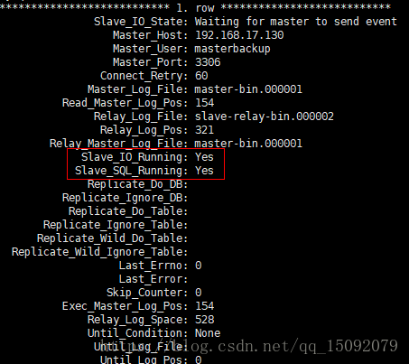

# mysql 主从复制(master-slave)

高并发系统的数据库需要做读写分离，实际上大部分的互联网公司的网站或者 app，其实都是读多写少。针对这个场景，使用一个master进行写操作，但是master挂载多个slave，从多个slave进行读操作，以支撑更高的读并发压力。
    
mysql基于主从复制架构实现读写分离，简单来说，就搞一个主库，挂载多个从库，然后只是写主库，从库自动从主库 同步/异步 复制数据。
    

## MySQL 主从复制原理
主库将变更写入 binlog 日志，然后从库连接到主库之后，从库有一个 IO 线程，将主库的 binlog 日志拷贝到自己本地，写入一个 relay log中继日志中。接着从库中有一个 SQL 线程会从中继日志读取 binlog，然后执行 binlog 日志中的内容，也就是在自己本地再次执行一遍 SQL，这样就可以保证自己跟主库的数据是一样的。   

  
   
这里非常重要的一点，就是从库同步主库数据的过程是串行化的，也就是说主库上并行的操作，在从库上会串行执行。由于从库从主库拷贝日志以及串行执行 SQL 的特点，在高并发场景下，从库的数据一定会比主库慢一些，是有延时的。所以经常出现，刚写入主库的数据可能是读不到的，要过几十毫秒，甚至几百毫秒才能读取到。     

而且这里还有另外一个问题，就是如果主库突然宕机，然后恰好数据还没同步到从库，那么有些数据可能在从库上是没有的，有些数据可能就丢失了。    

所以 MySQL 实际上在这一块有两个机制，一个是半同步复制，用来解决主库数据丢失问题；一个是并行复制，用来解决主从同步延时问题。   

这个所谓半同步复制，也叫 semi-sync 复制，指的就是主库写入 binlog 日志之后，就会将强制立即将数据同步到从库，从库将日志写入自己本地的 relay log 之后，接着会返回一个 ack 给主库，主库接收到至少一个从库的 ack 之后才会认为写操作完成了。    

所谓并行复制，指的是从库开启多个线程，并行读取 relay log 中不同database的日志，然后并行重放不同库的日志，这是库级别的并行。
    
## 主从同步复制有以下几种方式
1. 同步复制，master的变化，必须等待slave-1,slave-2,...,slave-n完成后才能返回。
2. 异步复制，master只需要完成自己的数据库操作即可，至于slaves是否收到二进制日志，是否完成操作，不用关心。MYSQL的默认设置。
3. 半同步复制，master只保证slaves中的一个操作成功，就返回，其他slave不管。这个功能，是由google为MYSQL引入的。


## MySQL 主从同步的延时问题
一般来说，如果主从延迟较为严重，有以下解决方案：  
-  分库，将一个主库拆分为多个主库，每个主库的写并发就减少了几倍，此时主从延迟可以忽略不计。
-  打开 MySQL 支持的并行复制，多个库并行复制。如果说某个库的写入并发就是特别高，单库写并发达到了 2000/s，并行复制还是没意义。
-  重写代码，写代码的同学，要慎重，插入数据时立马查询可能查不到。
-  如果确实是存在必须先插入，立马要求就查询到，然后立马就要反过来执行一些操作，对这个查询设置直连主库。不推荐这种方法，你要是这么搞，读写分离的意义就丧失了。
   
    
## master 配置
### 配置文件my.cnf的修改
```

[root@localhost mysql]# vim /etc/my.cnf
 
#在[mysqld]中添加：
#server-id 服务器唯一标识。
server-id=1
#log_bin 启动MySQL二进制日志，即数据同步语句，从数据库会一条一条的执行这些语句。
log_bin=master-bin
log_bin_index=master-bin.index
#binlog_do_db 指定记录二进制日志的数据库，即需要复制的数据库名，如果复制多个数据库，重复设置这个选项即可。
binlog_do_db=mybatis
#binlog_ignore_db 指定不记录二进制日志的数据库，即不需要复制的数据库名，如果有多个数据库，重复设置这个选项即可。
#binlog_do_db和binlog_ignore_db为互斥选项，一般只需要一个即可。
```
    
### 创建从服务器的用户和权限
```
[root@localhost mysql]# mysql -uroot -p
Enter password:
#创建从数据库的backup用户和权限
#192.168.0.%通配符，表示0-255的IP都可访问主服务器，正式环境请配置指定从服务器IP
#若将 192.168.0.% 改为 %，则任何ip均可作为其从数据库来访问主服务器
mysql> grant replication slave on *.* to backup@'192.168.0.%' identified by '123456';
```
    
### 重启mysql服务
`[root@localhost mysql]# systemctl restart mysqld`

### 查看主服务器状态
```
mysql> show master status;
+-------------------+----------+--------------+------------------+-------------------+
| File              | Position | Binlog_Do_DB | Binlog_Ignore_DB | Executed_Gtid_Set |
+-------------------+----------+--------------+------------------+-------------------+
| master-bin.000001 |      154 | mybatis      |                  |                   |
+-------------------+----------+--------------+------------------+-------------------+
```
其中 master-bin.000001 和 154在后面配置slave时需要用到。

## slave 配置
### 配置文件my.cnf的修改
```
[root@localhost mysql]# vim /etc/my.cnf

#在[mysqld]中添加：
#server-id 服务器唯一标识，如果有多个从服务器，每个服务器的server-id不能重复，如果你没设置server-id或者设置为0，则从服务器不会连接到主服务器。
server-id=2
#relay-log 启动MySQL二进制日志，可以用来做数据备份和崩溃恢复，或主服务器挂掉了，将此从服务器作为其他从服务器的主服务器。
relay-log=relay-bin
relay-log-index=relay-bin.index
#若在master端不指定binlog-do-db，则在slave端可用replication-do-db来过滤。
#replicate-do-db=mybatis
#replicate-ignore-db 不需要同步的数据库，如果有多个数据库，重复设置这个选项即可。
```
### 重启mysql服务
`[root@localhost mysql]# systemctl restart mysqld`

### 连接master主服务器
```
[root@localhost mysql]# mysql -uroot -p
Enter password:
#连接master主服务器
#master_host对应主服务器的IP地址。
#master_port对应主服务器的端口。
#master_log_file对应show master status显示的File列：master-bin.000001。
#master_log_pos对应show master status显示的Position列：154。
mysql> change master to master_host='192.168.0.102',master_port=3306,master_user='backup',master_password='123456',master_log_file='master-bin.000001',master_log_pos=154;
```

### 启动slave数据同步
```
#启动slave数据同步
mysql> start slave;
 
#停止slave数据同步（若有需要）
mysql> stop slave;
```

### 查看slave信息
`mysql> show slave status\G;`    
  

Slave_IO_Running和Slave_SQL_Running都为yes，则表示同步成功。    


# mysql 读写分离
## 客户端程序实现
- spring-jdbc的AbstractRoutingDataSource实现动态数据源切换

- service层实现aop切面，在入口处使用Threadlocal保存service方法的datasource配置

- service类/方法上通过注解指定使用slave/master数据源
   
[基于AbstractRoutingDataSource的读写分离实现](https://github.com/jaesonchen/multi-datasource)
   
## MySQL Router中间件

## mycat 中间件


