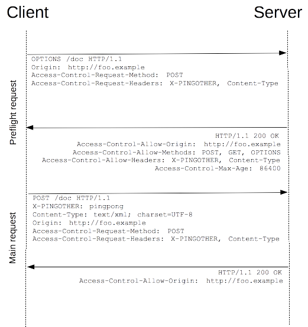

# CORS（Cross-origin resource sharing）跨域资源共享
跨域资源共享(CORS) 是一种机制，它使用额外的 HTTP 头来告诉浏览器  让运行在一个 origin (domain) 上的Web应用被准许访问来自不同源服务器上的指定的资源。当一个资源从与该资源本身所在的服务器不同的域、协议或端口请求一个资源时，资源会发起一个跨域 HTTP 请求(XMLHttpRequest)。
    
比如，站点 http://domain-a.com 的某 HTML 页面通过  的 src 请求 http://domain-b.com/image.jpg。网络上的许多页面都会加载来自不同域的CSS样式表，图像和脚本等资源。
    
  
    
跨域资源共享（ CORS ）机制允许 Web 应用服务器进行跨域访问控制，从而使跨域数据传输得以安全进行。现代浏览器支持在 API 容器中（例如 XMLHttpRequest 或 Fetch ）使用 CORS，以降低跨域 HTTP 请求所带来的风险。
    

## 什么情况下需要 CORS
跨域资源共享标准(cross-origin sharing standard)允许在下列场景中使用跨域 HTTP 请求：    
- 由 XMLHttpRequest 或 Fetch 发起的跨域 HTTP 请求。
- Web 字体 (CSS 中通过 @font-face 使用跨域字体资源), 网站可以发布 TrueType 字体资源，并只允许已授权网站进行跨站调用。
- WebGL 贴图
- 使用 drawImage 将 Images/video 画面绘制到 canvas
- 样式表（使用 CSSOM）
    

## 功能概述
跨域资源共享标准新增了一组 HTTP 首部字段，允许服务器声明哪些源站通过浏览器有权限访问哪些资源。另外，规范要求，对那些可能对服务器数据产生副作用的 HTTP 请求方法（特别是 GET 以外的 HTTP 请求，或者搭配某些 MIME 类型的 POST 请求），浏览器必须首先使用 OPTIONS 方法发起一个预检请求（preflight request），从而获知服务端是否允许该跨域请求。服务器确认允许之后，才发起实际的 HTTP 请求。在预检请求的返回中，服务器端也可以通知客户端，是否需要携带身份凭证（包括 Cookies 和 HTTP 认证相关数据）。
    
CORS请求失败会产生错误(40x)，但是为了安全，在JavaScript代码层面是无法获知到底具体是哪里出了问题。你只能查看浏览器的控制台以得知具体是哪里出现了错误。
    

## 简单请求
某些请求不会触发 CORS 预检请求。本文称这样的请求为“简单请求”。若请求满足所有下述条件，则该请求可视为“简单请求”：    
- 使用下列方法之一：
    - GET
    - HEAD
    - POST
- Fetch 规范定义了对 CORS 安全的首部字段集合，不得人为设置该集合之外的其他首部字段。该集合为：
    - Accept
    - Accept-Language
    - Content-Language
    - Content-Type （需要注意额外的限制）
    - http extensions: DPR Downlink Save-Data Viewport-Width Width
- Content-Type 的值仅限于下列三者之一：
    - text/plain
    - multipart/form-data
    - application/x-www-form-urlencoded
- 请求中的任意XMLHttpRequestUpload 对象均没有注册任何事件监听器；XMLHttpRequestUpload 对象可以使用 XMLHttpRequest.upload 属性访问。
- 请求中没有使用 ReadableStream 对象。
    
**注意**: 这些跨域请求与浏览器发出的其他跨域请求并无二致。如果服务器未返回正确的响应首部，则请求方不会收到任何数据。因此，那些不允许跨域请求的网站无需为这一新的 HTTP 访问控制特性担心。
    
比如说，假如站点 http://foo.example 的网页应用想要访问 http://bar.other 的资源。http://foo.example 的网页中可能包含类似于下面的 JavaScript 代码：
    
```
var invocation = new XMLHttpRequest();
var url = 'http://bar.other/resources/public-data/';

function callOtherDomain() {
  if(invocation) {    
    invocation.open('GET', url, true);
    invocation.onreadystatechange = handler;
    invocation.send(); 
  }
}
```
   
浏览器和服务器之间使用 CORS 首部字段来处理跨域权限：    
  
    
简单请求和响应报文：
    
```
GET /resources/public-data/ HTTP/1.1
Host: bar.other
User-Agent: Mozilla/5.0 (Macintosh; U; Intel Mac OS X 10.5; en-US; rv:1.9.1b3pre) Gecko/20081130 Minefield/3.1b3pre
Accept: text/html,application/xhtml+xml,application/xml;q=0.9,*/*;q=0.8
Accept-Language: en-us,en;q=0.5
Accept-Encoding: gzip,deflate
Accept-Charset: ISO-8859-1,utf-8;q=0.7,*;q=0.7
Connection: keep-alive
Referer: http://foo.example/examples/access-control/simpleXSInvocation.html
Origin: http://foo.example


HTTP/1.1 200 OK
Date: Mon, 01 Dec 2008 00:23:53 GMT
Server: Apache/2.0.61 
Access-Control-Allow-Origin: *
Keep-Alive: timeout=2, max=100
Connection: Keep-Alive
Transfer-Encoding: chunked
Content-Type: application/xml

[XML Data]
```
    
request header `Origin: http://foo.example` 中的首部字段 Origin 表明该请求来源于 http://foo.exmaple。
    
response header 中的`Access-Control-Allow-Origin: *`表明，该资源可以被任意外域访问。如果服务端仅允许来自 `http://foo.example` 的访问，该首部字段的内容如下：`Access-Control-Allow-Origin: http://foo.example`。
    
使用 Origin 和 Access-Control-Allow-Origin 就能完成最简单的访问控制。
    

## 预检请求
与前述简单请求不同，“需预检的请求”要求必须首先使用 OPTIONS   方法发起一个预检请求到服务器，以获知服务器是否允许该实际请求。"预检请求“的使用，可以避免跨域请求对服务器的用户数据产生未预期的影响。
    
需要执行预检请求的 HTTP 请求：
    
```
var invocation = new XMLHttpRequest();
var url = 'http://bar.other/resources/post-here/';
var body = '<?xml version="1.0"?><person><name>Arun</name></person>';
    
function callOtherDomain(){
  if(invocation)
    {
      invocation.open('POST', url, true);
      invocation.setRequestHeader('X-PINGOTHER', 'pingpong');
      invocation.setRequestHeader('Content-Type', 'application/xml');
      invocation.onreadystatechange = handler;
      invocation.send(body); 
    }
}
```
    
上面的代码使用 POST 请求发送一个 XML 文档，该请求包含了一个自定义的请求首部字段（X-PINGOTHER: pingpong）。另外，该请求的 Content-Type 为 application/xml。因此，该请求需要首先发起“预检请求”。
    
  
    
预检请求和响应报文：
    
```
OPTIONS /resources/post-here/ HTTP/1.1
Host: bar.other
User-Agent: Mozilla/5.0 (Macintosh; U; Intel Mac OS X 10.5; en-US; rv:1.9.1b3pre) Gecko/20081130 Minefield/3.1b3pre
Accept: text/html,application/xhtml+xml,application/xml;q=0.9,*/*;q=0.8
Accept-Language: en-us,en;q=0.5
Accept-Encoding: gzip,deflate
Accept-Charset: ISO-8859-1,utf-8;q=0.7,*;q=0.7
Connection: keep-alive
Origin: http://foo.example
Access-Control-Request-Method: POST
Access-Control-Request-Headers: X-PINGOTHER, Content-Type


HTTP/1.1 204 No Content
Date: Mon, 01 Dec 2008 01:15:39 GMT
Server: Apache/2.0.61 (Unix)
Access-Control-Allow-Origin: http://foo.example
Access-Control-Allow-Methods: POST, GET, OPTIONS
Access-Control-Allow-Headers: X-PINGOTHER, Content-Type
Access-Control-Max-Age: 86400
Vary: Accept-Encoding, Origin
Keep-Alive: timeout=2, max=100
Connection: Keep-Alive
```
    
浏览器检测到，从 JavaScript 中发起的请求需要被预检。从上面的报文中，我们看到发送了一个使用 OPTIONS 方法的“预检请求”。 OPTIONS 是 HTTP/1.1 协议中定义的方法，用以从服务器获取更多信息。该方法不会对服务器资源产生影响。 预检请求中同时携带了下面两个首部字段：
    
```
Access-Control-Request-Method: POST
Access-Control-Request-Headers: X-PINGOTHER, Content-Type
```
    
首部字段 `Access-Control-Request-Method` 告知服务器，实际请求将使用 POST 方法。    
首部字段 `Access-Control-Request-Headers` 告知服务器，实际请求将携带两个自定义请求首部字段：X-PINGOTHER 与 Content-Type。    
服务器据此决定，该实际请求是否被允许。
    
预检请求的响应，表明服务器将接受后续的实际请求。
    
```
Access-Control-Allow-Origin: http://foo.example
Access-Control-Allow-Methods: POST, GET, OPTIONS
Access-Control-Allow-Headers: X-PINGOTHER, Content-Type
Access-Control-Max-Age: 86400
```
    
首部字段 `Access-Control-Allow-Origin` 表明服务器接受来自域 `http://foo.example`的跨域请求。
首部字段 `Access-Control-Allow-Methods` 表明服务器允许客户端使用 `POST, GET 和 OPTIONS` 方法发起请求。    
首部字段 `Access-Control-Allow-Headers` 表明服务器允许请求中携带首部字段 `X-PINGOTHER 与 Content-Type`。    
首部字段 `Access-Control-Max-Age` 表明该预检响应的有效时间为 86400 秒，也就是 24 小时。在有效时间内，浏览器无须为同一请求再次发起预检请求。浏览器自身维护了一个最大有效时间，如果该首部字段的值超过了最大有效时间，将不会生效。
    

预检请求完成之后，发送实际请求：
    
```
POST /resources/post-here/ HTTP/1.1
Host: bar.other
User-Agent: Mozilla/5.0 (Macintosh; U; Intel Mac OS X 10.5; en-US; rv:1.9.1b3pre) Gecko/20081130 Minefield/3.1b3pre
Accept: text/html,application/xhtml+xml,application/xml;q=0.9,*/*;q=0.8
Accept-Language: en-us,en;q=0.5
Accept-Encoding: gzip,deflate
Accept-Charset: ISO-8859-1,utf-8;q=0.7,*;q=0.7
Connection: keep-alive
X-PINGOTHER: pingpong
Content-Type: text/xml; charset=UTF-8
Referer: http://foo.example/examples/preflightInvocation.html
Content-Length: 55
Origin: http://foo.example
Pragma: no-cache
Cache-Control: no-cache

<?xml version="1.0"?><person><name>Arun</name></person>


HTTP/1.1 200 OK
Date: Mon, 01 Dec 2008 01:15:40 GMT
Server: Apache/2.0.61 (Unix)
Access-Control-Allow-Origin: http://foo.example
Vary: Accept-Encoding, Origin
Content-Encoding: gzip
Content-Length: 235
Keep-Alive: timeout=2, max=99
Connection: Keep-Alive
Content-Type: text/plain

[Some GZIP'd payload]
```
    

## 附带身份凭证的请求
一般而言，对于跨域 XMLHttpRequest 或 Fetch 请求，浏览器不会发送身份凭证信息。如果要发送凭证信息，需要设置 XMLHttpRequest 的某个特殊标志位。可以基于  HTTP cookies 和 HTTP 认证信息发送身份凭证。
    
  
    
XMLHttpRequest 的 `withCredentials` 标志设置为 true，从而向服务器发送 Cookies。因为这是一个简单 GET 请求，所以浏览器不会对其发起“预检请求”。但是，如果服务器端的响应中未携带 `Access-Control-Allow-Credentials: true` ，浏览器将不会把响应内容返回给请求的发送者。
    
发起一个GET 请求，并设置 Cookies：
    
```
var invocation = new XMLHttpRequest();
var url = 'http://bar.other/resources/credentialed-content/';
    
function callOtherDomain(){
  if(invocation) {
    invocation.open('GET', url, true);
    invocation.withCredentials = true;
    invocation.onreadystatechange = handler;
    invocation.send(); 
  }
}
```
    
浏览器请求与服务器响应报文：
    
```
GET /resources/access-control-with-credentials/ HTTP/1.1
Host: bar.other
User-Agent: Mozilla/5.0 (Macintosh; U; Intel Mac OS X 10.5; en-US; rv:1.9.1b3pre) Gecko/20081130 Minefield/3.1b3pre
Accept: text/html,application/xhtml+xml,application/xml;q=0.9,*/*;q=0.8
Accept-Language: en-us,en;q=0.5
Accept-Encoding: gzip,deflate
Accept-Charset: ISO-8859-1,utf-8;q=0.7,*;q=0.7
Connection: keep-alive
Referer: http://foo.example/examples/credential.html
Origin: http://foo.example
Cookie: pageAccess=2


HTTP/1.1 200 OK
Date: Mon, 01 Dec 2008 01:34:52 GMT
Server: Apache/2.0.61 (Unix) PHP/4.4.7 mod_ssl/2.0.61 OpenSSL/0.9.7e mod_fastcgi/2.4.2 DAV/2 SVN/1.4.2
X-Powered-By: PHP/5.2.6
Access-Control-Allow-Origin: http://foo.example
Access-Control-Allow-Credentials: true
Cache-Control: no-cache
Pragma: no-cache
Set-Cookie: pageAccess=3; expires=Wed, 31-Dec-2008 01:34:53 GMT
Vary: Accept-Encoding, Origin
Content-Encoding: gzip
Content-Length: 106
Keep-Alive: timeout=2, max=100
Connection: Keep-Alive
Content-Type: text/plain

[text/plain payload]
```
    
### 附带身份凭证的请求与通配符
对于附带身份凭证的请求，服务器不能设置首部字段 `Access-Control-Allow-Origin` 的值为通配符“*”。
    
这是因为请求的首部中携带了 Cookie 信息，如果 Access-Control-Allow-Origin 的值为“*”，请求将会失败。而将 `Access-Control-Allow-Origin` 的值设置为 http://foo.example，则请求将成功执行。
    
另外，响应首部中也携带了 Set-Cookie 字段，尝试对 Cookie 进行修改。如果操作失败，将会抛出异常。
    


## HTTP 请求的首部字段
本节列出了可用于发起跨域请求的首部字段。请注意，这些首部字段无须手动设置。 当使用 XMLHttpRequest 对象发起跨域请求时，它们已经被设置就绪。

- `Origin` 首部字段表明预检请求或实际请求的源站。它不包含任何路径信息，只是服务器名称。

- `Access-Control-Request-Method` 首部字段用于预检请求。其作用是，将实际请求所使用的 HTTP 方法告诉服务器。

- `Access-Control-Request-Headers` 首部字段用于预检请求。其作用是，将实际请求所携带的首部字段告诉服务器。
    

## HTTP 响应的首部字段
本节列出了可用于发起跨域响应的首部字段。

- `Access-Control-Allow-Origin` 响应首部指定了允许访问该资源的外域URI。对于不需要携带身份凭证的请求，服务器可以指定该字段的值为通配符“*”，表示允许来自所有域的请求。如果服务端指定了具体的域名而非“*”，那么响应首部中的 Vary 字段的值必须包含 Origin。这将告诉客户端：服务器对不同的源站返回不同的内容。

- `Access-Control-Allow-Methods` 首部字段用于预检请求的响应。其指明了实际请求所允许使用的 HTTP 方法。

- `Access-Control-Allow-Headers` 首部字段用于预检请求的响应。其指明了实际请求中允许携带的首部字段。

- `Access-Control-Allow-Credentials` 首部字段指定了当浏览器的credentials设置为true时是否允许浏览器读取response的内容。当用在对preflight预检请求的响应中时，它指定了实际的请求是否可以使用credentials。

- `Access-Control-Max-Age` 首部字段指定了preflight请求的结果能够被缓存多久，单位秒。

- `Access-Control-Expose-Headers` XMLHttpRequest对象的getResponseHeader()方法只能拿到6个基本字段：`Cache-Control、Content-Language、Content-Type、Expires、Last-Modified、Pragma`。如果想拿到其他字段，就必须在`Access-Control-Expose-Headers`里面指定。


