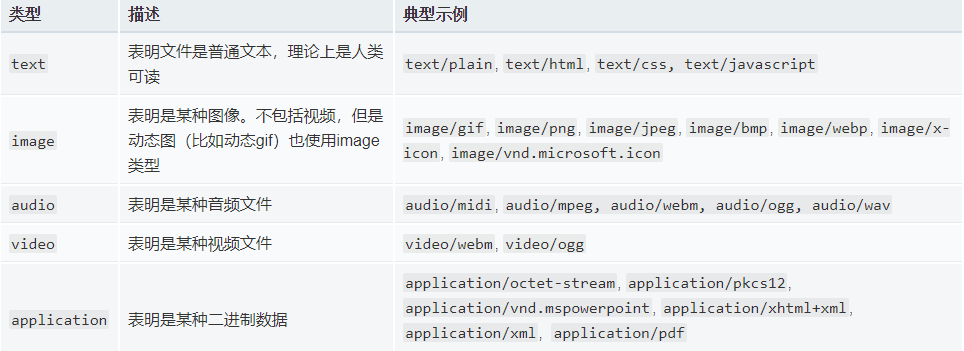
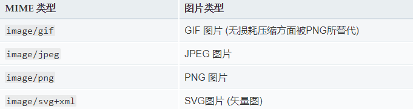
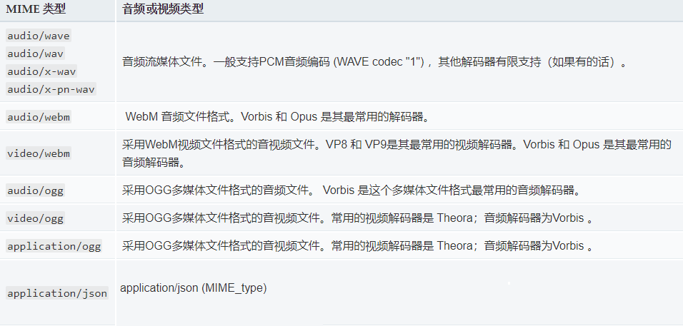

# MIME类型
媒体类型（通常称为 Multipurpose Internet Mail Extensions 或 MIME 类型 ）是一种标准，用来表示文档、文件或字节流的性质和格式。
    
**重要**：浏览器通常使用MIME类型（而不是文件扩展名）来确定如何处理URL，因此Web服务器在响应头中添加正确的MIME类型非常重要。如果配置不正确，浏览器可能会曲解文件内容，网站将无法正常工作，并且下载的文件也会被错误处理。
    
**单一精确的 MIME 类型**:  `<MIME_type>/<MIME_subtype>`
    
**一类 MIME 类型**: `<MIME_type>/*`
    
**任意类型的 MIME 类型**: `*/*`
    
**q因子权重**: `;q=(q因子权重)`
    
```
Accept: text/html

Accept: image/*

Accept: text/html, application/xhtml+xml, application/xml;q=0.9, */*;q=0.8
```
    
MIME的组成结构非常简单；由类型与子类型两个字符串中间用'/'分隔而组成。不允许空格存在。type 表示可以被分多个子类的独立类别。subtype 表示细分后的每个类型。MIME类型对大小写不敏感，但是传统写法都是小写。
    

```
text/plain
text/html
image/jpeg
image/png
audio/mpeg
video/mp4
application/*
application/json
application/javascript
application/ecmascript
application/octet-stream
```
    

## 独立类型
独立类型表明了对文件的分类，可以是如下之一：
    
  
    
对于text文件类型若没有特定的subtype，就使用 text/plain。类似的，二进制文件没有特定或已知的 subtype，即使用 application/octet-stream。
    


## 重要的MIME类型
- `application/octet-stream` 应用程序文件的默认值。意思是 未知的应用程序文件 ，浏览器一般不会自动执行或询问执行。浏览器会像对待 设置了HTTP头`Content-Disposition` 值为 `attachment` 的文件一样来对待这类文件。

- `text/plain` 文本文件默认值。即使它意味着未知的文本文件，但浏览器认为是可以直接展示的。

- `text/css` 在网页中要被解析为CSS的任何CSS文件必须指定MIME为`text/css`。通常，服务器不识别以.css为后缀的文件的MIME类型，而是将其以MIME为`text/plain 或 application/octet-stream` 来发送给浏览器：在这种情况下，大多数浏览器不识别其为CSS文件，直接忽略掉。特别要注意为CSS文件提供正确的MIME类型。

- `text/html` 所有的HTML内容都应该使用这种类型。XHTML的其他MIME类型（如`application/xml+html`）现在基本不再使用（HTML5统一了这些格式）。 如果想使用xml严格的解析规则，仍然需要使用`application/xml, application/xhtml+xml`。

## JavaScript 类型
所有的 `text/javascript` 类型已经被废弃。
- `application/javascript`
- `application/ecmascript`
    

## 图片类型
只有一小部分图片类型是被广泛支持的，Web安全的，可随时在Web页面中使用的：
    
  
    

## 音频与视频类型
HTML并没有明确定义被用于<audio>和<video>元素所支持的文件类型，所以在web上使用的只有相对较小的一组类型。
    
  
    

## multipart/form-data
`multipart/form-data` 可用于HTML表单从浏览器发送信息给服务器。作为多部分文档格式，它由边界线（一个由'--'开始的字符串）划分出的不同部分组成。每一部分有自己的实体，以及自己的 HTTP 请求头，Content-Disposition和 Content-Type 用于文件上传领域。
    
**如下所示的表单**:
    
```
<form action="http://localhost:8000/upload" method="post" enctype="multipart/form-data">
  <input type="text" name="myTextField">
  <input type="checkbox" name="myCheckBox">Check</input>
  <input type="file" name="myFile">
  <button>Send the file</button>
</form>
```
    
**会发送这样的请求**:
    
```
POST /upload HTTP/1.1
Host: localhost:8000
User-Agent: Mozilla/5.0 (Macintosh; Intel Mac OS X 10.9; rv:50.0) Gecko/20100101 Firefox/50.0
Accept: text/html,application/xhtml+xml,application/xml;q=0.9,*/*;q=0.8
Accept-Language: en-US,en;q=0.5
Accept-Encoding: gzip, deflate
Connection: keep-alive
Upgrade-Insecure-Requests: 1
Content-Type: multipart/form-data; boundary=8721656041911415653955004498
Content-Length: 465

--8721656041911415653955004498
Content-Disposition: form-data; name="myTextField"

Test
--8721656041911415653955004498
Content-Disposition: form-data; name="myCheckBox"

on
--8721656041911415653955004498
Content-Disposition: form-data; name="myFile"; filename="test.txt"
Content-Type: text/plain

Simple file.
--8721656041911415653955004498--
```
    

## multipart/byteranges
`multipart/byteranges` 用于把部分的响应报文发送回浏览器。当发送状态码`206 Partial Content` 时，这个MIME类型用于指出这个文件由若干部分组成，每一个都有其请求范围。每一个不同的部分都有Content-Type这样的HTTP头来说明文件的实际类型，以及 Content-Range来说明其范围。
    
```
HTTP/1.1 206 Partial Content
Accept-Ranges: bytes
Content-Type: multipart/byteranges; boundary=3d6b6a416f9b5
Content-Length: 385

--3d6b6a416f9b5
Content-Type: text/html
Content-Range: bytes 100-200/1270

eta http-equiv="Content-type" content="text/html; charset=utf-8" />
    <meta name="vieport" content
--3d6b6a416f9b5
Content-Type: text/html
Content-Range: bytes 300-400/1270

-color: #f0f0f2;
        margin: 0;
        padding: 0;
        font-family: "Open Sans", "Helvetica
--3d6b6a416f9b5--
```
    

## 设置正确的MIME类型的重要性
很多web服务器使用默认的 `application/octet-stream` 来发送未知类型。出于一些安全原因，对于这些资源浏览器不允许设置一些自定义默认操作，导致用户必须存储到本地以使用。常见的导致服务器配置错误的文件类型如下所示：

- RAR编码文件。理想状态是设置真实的编码文件类型，但这通常不可能。这这种情况服务器将发送 application/x-rar-compressed 作为MIME类型，用户不会将其定义为有用的默认操作。

- 音频或视频文件。只有正确设置了MIME类型的文件才能被 <video> 或<audio> 识别和播放。 

- 专有文件类型。是专有文件时需要特别注意。使用 application/octet-stream 作为特殊处理是不被允许的：对于一般的MIME类型浏览器不允许定义默认行为（比如“在Word中打开”）


