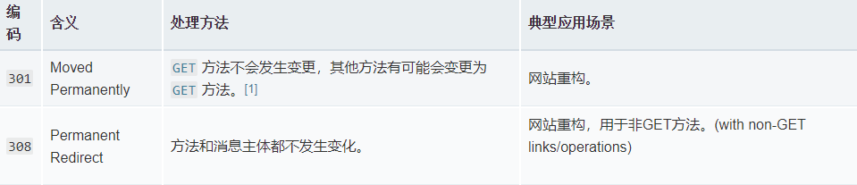
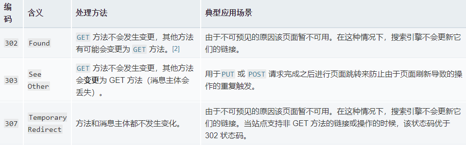
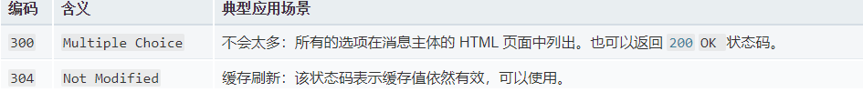

# http 会话
http 会话分为三个阶段：
- 客户端建立一条 TCP 连接。
- 客户端发送请求并等待响应。
- 服务器处理请求并发送响应，响应包括一个状态码和对应的数据。
    
从 HTTP/1.1 开始，连接在完成第三阶段后不再关闭，客户端可以再次发起新的请求。这意味着第二步和第三步可以连续进行数次。
    
HTTP消息是服务器和客户端之间交换数据的方式。有两种类型的消息︰ 
- 请求 - 由客户端发送请求报文用来触发一个服务器上的动作；
- 响应 - 来自服务器的应答报文。
    
HTTP消息由采用ASCII编码的多行文本构成。起始行和  HTTP 消息中的HTTP 首部统称为请求头，而其有效负载被称为消息正文。
    

## 客户端请求
一旦连接建立，用户代理就可以发送请求 (用户代理通常是 Web 浏览器，但也可以是其他的（例如爬虫）。客户端请求由ASCII编码的多行文本构成，并使用 CRLF 分隔，它们被划分为三个部分：
    
- 起始行 (start-line) 包含三个元素：
    - HTTP 方法，一个动词 (像 GET, POST) 或者一个名词 (像 HEAD, OPTIONS), 描述要执行的动作
    - 请求目标 (request target)，通常是一个 URL
        - 一个绝对路径，末尾跟上一个 ' ? ' 和queryString。这是最常见的形式，称为 原始形式 (origin form), `HEAD /test.html?query=alibaba HTTP/1.1`
        - 一个完整的URL，被称为 绝对形式 (absolute form)，主要在 GET 连接到代理时使用。`GET http://developer.mozilla.org/Messages HTTP/1.1`
        - 由域名和可选端口组成的 URL 的  authority form。 仅在使用 CONNECT 建立 HTTP 隧道时才使用。`CONNECT developer.mozilla.org:80 HTTP/1.1`
        - 星号形式 (asterisk form)，一个简单的星号('*')，配合 OPTIONS 方法使用，代表整个服务器。`OPTIONS * HTTP/1.1`
    - HTTP 版本 (HTTP version)，定义了剩余报文的结构，作为对期望的响应版本的指示符。
    
- HTTP 首部集合(Header)指明请求或描述消息正文，每一行都表示一个 HTTP 首部字段，为服务器提供关于请求所需数据的信息（例如语言或 MIME 类型），或是一些改变请求行为的数据（例如当数据已经被缓存就不再应答）。起始行和首部集合组成了请求头。

- 一个空行指示所有关于请求的元数据已经发送完毕。

- 一个可选的包含请求相关数据的正文 ， body 由两个 header 定义： `Content-Type` 和 `Content-Length`，通常被POST 请求（包含 HTML 表单数据）使用。不是所有的请求都有一个 body，GET / DELETE / HEAD / OPTIONS通常不需要 body。
    
```
POST /contact_form.jsp HTTP/1.1
Host: developer.mozilla.org
Content-Length: 64
Content-Type: application/x-www-form-urlencoded

name=Joe%20User&request=Send%20me%20one%20of%20your%20catalogue
```
    
注意空行，它把请求头(Header)与数据块(Body)分隔开。如果HTTP 首部中没有 Content-Length，那么表明数据块是空的，服务器可以在收到代表请求头结束的空行后就开始处理请求。
    

## 服务器响应
当收到用户代理发送的请求后，Web 服务器就会处理它，并最终送回一个响应。与客户端请求很类似，服务器响应由一系列ASCII编码的文本指令组成, 并使用 CRLF 分隔，它们被划分为三个部分：
    
- 状态行 (status line) `HTTP/1.1 404 Not Found`
    - HTTP协议版本，通常为 HTTP/1.1。
    - 状态码 (status code)，表明请求是成功或失败。常见的状态码是 200，404，或 500。
    - 状态描述 (status text)。一个简短的，纯粹的信息，通过状态码的文本描述，帮助人们理解该 HTTP 消息。

- 接下来的行每一行都表示一个 HTTP 首部字段(Header)，为客户端提供关于响应数据的信息（如类型，数据大小，使用的压缩算法，缓存指示等）。状态行和首部集合组成了响应头。

- 一个空行指示所有关于响应的元数据已经发送完毕。

- 最后一块是数据块，包含了响应的数据 （如果有的话）。不是所有的响应都有 body。
    
**Body 大致可分为三类**：

- `Single-resource bodies`，由已知长度的单个文件组成。该类型 body 由两个 header 定义：`Content-Type 和 Content-Length`。
- `Single-resource bodies`，由未知长度的单个文件组成，通过将 `Transfer-Encoding` 设置为 `chunked` 来使用 chunks 编码。
- `Multiple-resource bodies`，由多部分 body 组成，每部分包含不同的信息段。比较少见。
    

**成功的网页响应**：
    
```
HTTP/1.1 200 OK
Date: Sat, 09 Oct 2010 14:28:02 GMT
Server: Apache
Last-Modified: Tue, 01 Dec 2009 20:18:22 GMT
ETag: "51142bc1-7449-479b075b2891b"
Accept-Ranges: bytes
Content-Length: 29769
Content-Type: text/html

<!DOCTYPE html... (这里是 29769 字节的网页HTML源代码)
```
    
**请求资源不存在的网页响应**：
    
```
HTTP/1.1 404 Not Found
Date: Sat, 09 Oct 2010 14:33:02 GMT
Server: Apache
Last-Modified: Tue, 01 May 2007 14:24:39 GMT
ETag: "499fd34e-29ec-42f695ca96761;48fe7523cfcc1"
Accept-Ranges: bytes
Content-Length: 1024
Content-Type: text/html

<!DOCTYPE html... (包含一个站点自定义404页面, 帮助用户找到丢失的资源)
```
   

# 重定向
URL 重定向，也称为 URL 转发，是一种当实际资源，如单个页面、表单或者整个 Web 应用被迁移到新的 URL 下的时候，保持（原有）链接可用的技术。HTTP 协议提供了一种特殊形式的响应—— HTTP 重定向（HTTP redirects）来执行此类操作，该操作可以应用于多种多样的目标：网站维护期间的临时跳转，网站架构改变后为了保持外部链接继续可用的永久重定向，上传文件时的表示进度的页面等等。
    

## 重定向原理
在 HTTP 协议中，重定向操作由服务器通过发送特殊的响应（即 redirects）而触发。HTTP 协议的重定向响应的状态码为 3xx 。浏览器在接收到重定向响应的时候，会采用该响应提供的新的 URL ，并立即进行加载；大多数情况下，除了会有一小部分性能损失之外，重定向操作对于用户来说是不可见的。
    
不同类型的重定向映射可以划分为三个类别：永久重定向、临时重定向和特殊重定向。
    

## 永久重定向
这种重定向操作是永久性的。它表示原 URL 不应再被使用，而应该优先选用新的 URL。搜索引擎机器人会在遇到该状态码时触发更新操作，在其索引库中修改与该资源相关的 URL 。
    
  
    

## 临时重定向
有时候请求的资源无法从其标准地址访问，但是却可以从另外的地方访问。在这种情况下可以使用临时重定向。搜索引擎不会记录该新的、临时的链接。在创建、更新或者删除资源的时候，临时重定向也可以用于显示临时性的进度页面。
    
  
    

## 特殊重定向
除了上述两种常见的重定向之外，还有两种特殊的重定向。`304 Not Modified` 资源未被修改会使页面跳转到本地陈旧的缓存版本当中，而 `300 Multiple Choice`多项选择则是一种手工重定向：以 Web 页面形式呈现在浏览器中的消息主体包含了一个可能的重定向链接的列表，用户可以从中进行选择。
    
  
    

## 
HTTP 协议中重定向机制并非唯一的重定向映射的方式。其他两种方法包括：借助 HTML 的 meta 元素的 HTML 重定向机制和借助 DOM 的 JavaScript 重定向机制。
    
在多种方法同时设定的情况下，哪种方法会首先起作用呢？优先级顺序如下：

- HTTP 协议的重定向机制永远最先触发，即便是在没有传送任何页面——也就没有页面被（客户端）读取——的情况下。
- HTML 的重定向机制 (`<meta>`) 会在 HTTP 协议重定向机制未设置的情况下触发。
- JavaScript 的重定向机制总是作为最后诉诸的手段，并且只有在客户端开启了 JavaScript 的情况下才起作用。
    

## HTML 重定向机制
HTTP 协议中重定向机制是应该优先采用的创建重定向映射的方式，但是有时候 Web 开发者对于服务器没有控制权，或者无法对其进行配置。针对这些特定的应用情景，Web 开发者可以在精心制作的 HTML 页面的 <head>  部分添加一个 <meta> 元素，并将其 http-equiv 属性的值设置为 refresh 。当显示页面的时候，浏览器会检测该元素，然后跳转到指定的页面。
    
```
<head> 
  <meta http-equiv="refresh" content="0;URL=http://www.example.com/" />
</head>
```
    
content 属性的值开头是一个数字，指示浏览器在等待该数字表示的秒数之后再进行跳转。建议始终将其设置为 0 来获取更好的可访问性。该方法仅适用于 HTML 页面（或类似的页面），然而并不能应用于图片或者其他类型的内容。
    
注意这种机制会使浏览器的回退按钮失效：可以返回含有这个头部的页面，但是又会立即跳转。
    

## JavaScript 重定向机制
在 JavaScript 中，重定向机制的原理是设置 window.location 的属性值，然后加载新的页面。
    
这种方式并不适用于所有类型的资源，并且显然只有在支持 JavaScript 的客户端上才能使用。另外一方面，它也提供了更多的可能性，比如在只有满足了特定的条件的情况下才可以触发重定向机制的场景。
    
```
window.location = "http://www.example.com/";
```
    

## 应用场景

- 域名别称：理想情况下，一项资源只有一个访问位置，也就是只有一个 URL 。但是由于种种原因，需要为资源设定不同的名称（即不同的域名，例如带有和不带有 www 前缀的URL，以及简短易记的 URL 等）。在这种情况下，实用的方法是将其重定向到那个实际的（标准的）URL，而不是复制资源。
    - 扩大站点的用户覆盖面。一个常见的场景是，假如站点位于  www.example.com  域名下，那么通过  example.com 也应该可以访问到。这种情况下，可以建立从 example.com 的页面到  www.example.com 的重定向映射。
    - 迁移到另外一个域名。例如，公司改名后，你希望用户在搜索旧名称的时候，依然可以访问到应用了新名称的站点。
    - 强制使用 HTTPS 协议。对于 HTTP 版本站点的请求会被重定向至采用了 HTTPS 协议的版本。

- 保持链接有效：当你重构 Web 站点的时候，资源的 URL 会发生改变。即便是你可以更新站点内部的链接来适应新的命名体系，但无法控制被外部资源使用的 URL 。你并不想因此而使旧链接失效，因为它们会为你带来宝贵的用户，所以需要建立从旧链接到新链接的重定向映射。

- 对于不安全请求的临时响应：不安全（Unsafe）请求会修改服务器端的状态，应该避免用户无意的重复操作。

- 对于耗时请求的临时响应：一些请求的处理会需要比较长的时间，比如有时候 DELETE 请求会被安排为稍后处理。在这种情况下，会返回一个 303 (See Other)  重定向响应，该响应链接到一个页面，表示请求的操作已经被列入计划，并且最终会通知用户操作的进展情况，或者允许用户将其取消。
    

## 服务器中配置重定向

**Apache**:
    
```
<VirtualHost *:80>
    ServerName example.com
    Redirect / http://www.example.com
</VirtualHost>


RedirectMatch ^/images/(.*)$ http://images.example.com/$1
```
    

**Nginx**:
    
```
server {
    listen 80;
    server_name example.com;
    return 301 $scheme://www.example.com$request_uri;
}


rewrite ^/images/(.*)$ http://images.example.com/$1 redirect;
rewrite ^/images/(.*)$ http://images.example.com/$1 permanent;
```

   