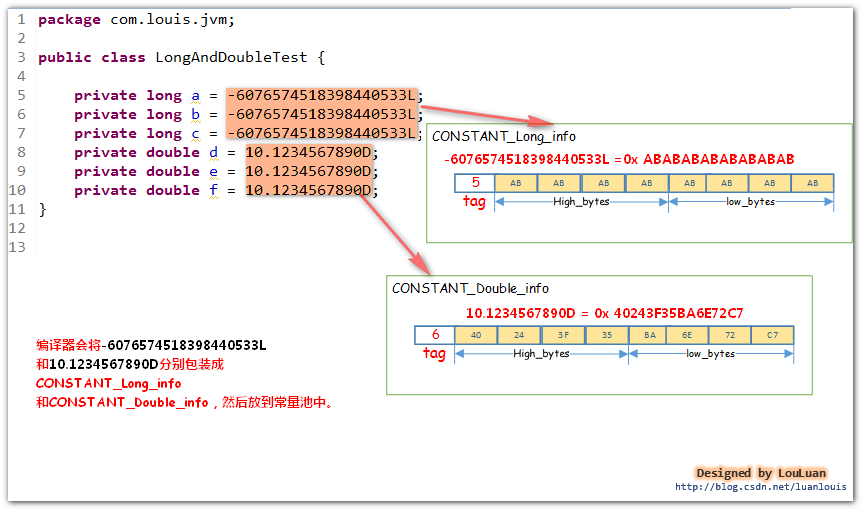
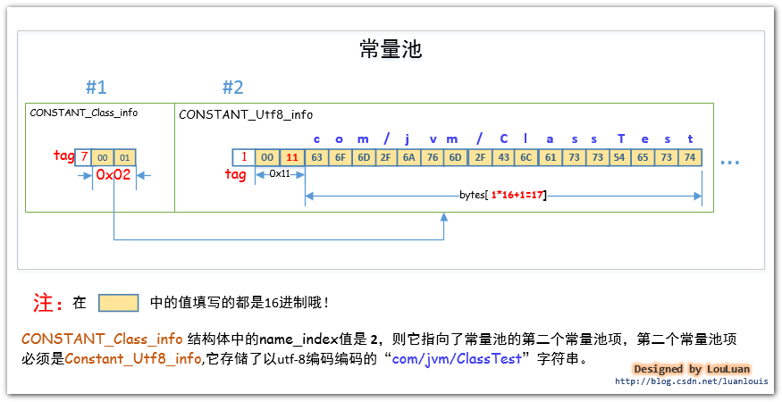

# 常量池
两个字节占有的位置叫做常量池计数器(constant_pool_count)，它记录着常量池的组成元素  常量池项(cp_info) 的个数。紧接着会排列着constant_pool_count-1个常量池项(cp_info)。0索引在常量池中代表没有此项，用于表示java.lang.Object类的超类索引。
    
  
    
## 常量池项 (cp_info) 的数据结构
每个常量池项(cp_info) 都会对应记录着class文件中的某中类型的字面量。    
  
    
## 常量池项类别
JVM虚拟机规定了不同的tag值和不同类型的字面量对应关系如下：    
  
    
根据cp_info中的tag 不同的值，可以将cp_info 更细化为以下结构体：    
  
    
## 常量池能够表示那些信息？
  
    
## int / float 字面量
Java语言规范规定了 int类型和Float 类型的数据类型占用 4 个字节的空间。在常量池中，将 int和Float类型的常量分别使用CONSTANT_Integer_info和 Constant_float_info表示，他们的结构如下所示：    
  
    
int / float 常量池项存储示例：    
  
    
## long / double 字面量
Java语言规范规定了 long 类型和 double类型的数据类型占用8 个字节的空间。在常量池中，将long和double类型的常量分别使用CONSTANT_Long_info和Constant_Double_info表示，他们的结构如下所示：    
  
    
long / double 常量池项存储示例：    
  
    
## String类型的字符串常量 （CONSTANT_String_info、CONSTANT_Utf8_info）
JVM会将字符串类型的字面量以UTF-8 编码格式存储到在class字节码文件中。先从直观的Java源码中出现的用双引号"" 括起来的字符串来看，在编译器编译的时候，都会将这些字符串转换成CONSTANT_String_info结构体，然后放置于常量池中。其结构如下所示：    
  
    
CONSTANT_String_info结构体中的string_index的值指向了CONSTANT_Utf8_info结构体，而字符串的utf-8编码数据就在这个结构体之中。其结构如下所示：    
  
    
通过javap -v StringTest 命令可以看到常量池信息：    
  
    
CONSTANT_String_info结构体位于常量池的第#15个索引位置。而存放"Java虚拟机原理" 字符串的 UTF-8编码格式的字节数组被放到CONSTANT_Utf8_info结构体中，该结构体位于常量池的第#16个索引位置。    
  
    
由上图可见：“JVM原理”的UTF-8编码的数组是：4A564D E5 8E 9FE7 90 86，并且存入了CONSTANT_Utf8_info结构体中。
    
## Class类型
 JVM会将某个Java 类中所有使用到了的类的完全限定名 以二进制形式的完全限定名 封装成CONSTANT_Class_info结构体中，然后将其放置到常量池里。CONSTANT_Class_info 的tag值为 7 。其结构如下：    
  
   
**Tip 类的完全限定名和二进制形式的完全限定名**：ClassTest类的完全限定名为com.louis.jvm.ClassTest，将JVM编译器将类编译成class文件后，此完全限定名在class文件中，是以二进制形式的完全限定名存储的，即它会把完全限定符的"."换成"/" ，即在class文件中存储的 ClassTest类的完全限定名称是"com/jvm/ClassTest"。    
  
    
com/jvm/ClassTest的CONSTANT_Class_info 结构体。它在常量池中的位置是#1，它的name_index值为#2，它指向了常量池的第2 个常量池项，如下所示:    
  
    
于某个类而言，其class文件中至少要有两个CONSTANT_Class_info常量池项，用来表示自己的类信息和其父类信息。(除了java.lang.Object类除外，其他的任何类都会默认继承自java.lang.Object）如果类声明实现了某些接口，那么接口的信息也会生成对应的CONSTANT_Class_info常量池项。
    
除此之外，如果在类中使用到了其他的类，只有真正使用到了相应的类，JDK编译器才会将类的信息组成CONSTANT_Class_info常量池项放置到常量池中。将类信息放置到常量池中的目的，是为了在后续的代码中有可能会反复用到它。只有在类中实际使用到了某个类时，该类的信息才会在常量池中有对应的CONSTANT_Class_info常量池项。
    
## field字段 (CONSTANT_Fieldref_info, CONSTANT_Name_Type_info)
一般而言，我们在定义类的过程中会定义一些 field 字段，然后会在这个类的其他地方（如方法中）使用到它。由于它可能会在此类中重复出现多次，所以JVM把它当作常量来看待，将字段封装成 CONSTANT_Fieldref_info 常量池项，放到常量池中，在类中引用到它的地方，直接放置一个指向field字段所在常量池的索引。     
  
    
  
    
  
    
  
    
  
    
字段描述符的表示：    
  
    
## method方法 (CONSTANT_Methodref_info, CONSTANT_Name_Type_info)
JVM编译器会将方法的引用信息包装成CONSTANT_Methodref_info结构体放入到常量池之中。     
  
    
  
    
  
    
  
    
方法描述符的表示：    
  
    
## 引用接口中定义的method方法 (CONSTANT_InterfaceMethodref_info, CONSTANT_Name_Type_info)
当我们在类中使用到了某个接口中的方法，JVM会将用到的接口中的方法信息方知道这个类的常量池中。    
  
    
CONSTANT_InterfaceMethodref_info 描述的是接口中定义的方法，而CONSTANT_Methodref_info描述的是实例类中的方法。

