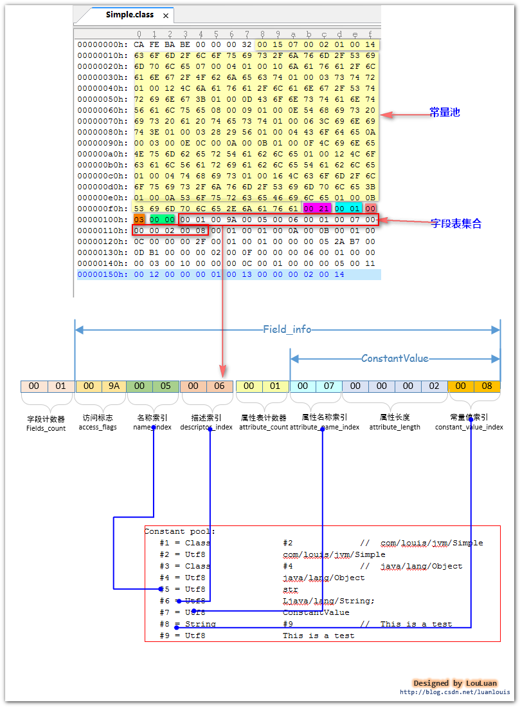

# field字段
字段表集合是指由若干个字段表（field_info）组成的集合。对于在类中定义的若干个字段，经过JVM编译成class文件后，会将相应的字段信息组织到一个叫做字段表集合的结构中，字段表集合是一个类数组结构。 
    
## field_info字段的表示
  
    
## field_info字段的结构
  
    
## field字段的访问标志：    
  
    
## field字段的数据类型表示和字段名称表示
class文件将字段名称和field字段的数据类型表示作为字符串存储在常量池中。在field_info结构体中，紧接着访问标志的，就是字段名称索引和字段描述符索引，它们分别占有两个字节，其内部存储的是指向了常量池中的某个常量池项的索引，对应的常量池项中存储的字符串，分别表示该字段的名称和字段描述符。
    
class文件对数据类型的表示如下图所示：    
  
    
## 属性表集合-----静态field字段的初始化
在定义field字段的过程中，我们有时候会很自然地对field字段直接赋值。    
field字段赋值的时机：
-  对于非静态的field字段的赋值将会出现在实例构造方法<init>()中
- 对于静态的field字段，有两个选择：1、在静态构造方法<cinit>()中进行  2、使用ConstantValue属性进行赋值
    
目前的Sun javac编译器的选择是：如果使用final和static同时修饰一个field字段，并且这个字段是基本类型或者String类型的，那么编译器在编译这个字段的时候，会在对应的field_info结构体中增加一个ConstantValue类型的结构体，在赋值的时候使用这个ConstantValue进行赋值；如果该field字段并没有被final修饰，或者不是基本类型或者String类型，那么将在类构造方法<cinit>()中赋值。    
    
对于public static final init MAX = 100; javac编译器在编译此field字段构建field_info结构体时，除了访问标志、名称索引、描述符索引外，会增加一个ConstantValue类型的属性表。    
  
    
常量赋值属性表实例：    
  
    