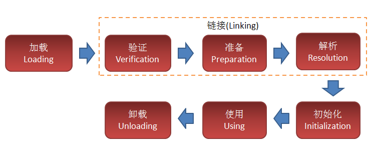
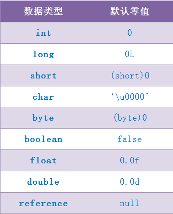

# JVM中类的生命周期
  
    

- 连接：是把读入的二进制形式的类型数据合并到虚拟机的运行时状态中去。连接分三个子步骤（验证、准备和解析）。
    - 验证步骤 确保java类型数据格式正确并且适合于java虚拟机使用。
    - 准备步骤 则负责为该类型分配它所需的内存，并将类变量设置为默认值。
    - 解析步骤 负责把常量池中的符号引用转换为直接引用(常量池解析)。虚拟机的实现通常推迟解析这一步，在程序真正使用某个符号引用时再去解析它。
- 初始化：当验证、准备和解析（可选）步骤都完成时，该类型就已经为初始化做好准备，在初始化期间，将给类变量赋以适当的初始值。
    

## 加载
加载是把二进制形式的class文件读入java虚拟机中。在加载阶段, 虚拟机需要完成以下三件事情:    
1. 通过一个类的全限定名来获取定义此类的二进制字节流。
2. 将这个字节流所代表的静态存储结构转化为方法区的运行时数据结构。
3. 将类的class文件读入内存，并为之创建一个java.lang.Class对象，作为方法区这个类的方法区数据的访问入口。
    
通过使用不同的类加载器，可以从不同来源加载类的二进制数据，通常有如下几种来源：     
- 从本地文件系统加载class文件。
- 从一个ZIP、JAR、CAB或者其他某种归档文件中提取Java class文件，JDBC编程时使用到的数据库驱动就是放在JAR文件中，JVM可以直接从JAR包中加载class文件。
- 通过网络加载class文件，这种场景最典型的应用就是 Applet。
- 动态编译一个java源文件动态编译、并执行加载。
- 运行时计算生成, 这种场景使用得最多的就是动态代理接术, 在 java.lang.reflect.Proxy中 , 就是用了 ProxyGenerator.generateProxyClass 来为特定接口生成形式为 *$Proxy 的代理类的二进制字节流。
    

## 连接
当类被加载后，系统为之生成一个对应的Class对象，接着会进入连接阶段，连接阶段把读入的二进制形式的类型数据合并到虚拟机的运行时状态中去。连接分三个子步骤（验证、准备和解析）。    
- 验证：确保java类型数据格式正确并且适合于java虚拟机使用。
- 准备：则负责为类的静态变量分配所需的内存，并将类变量设置为默认值。
- 解析：负责把常量池中的符号引用转换为直接引用(常量池解析)。虚拟机的实现通常推迟解析这一步，在程序真正使用某个符号引用时再去解析它。
    

### 验证
验证是连接阶段的第一步，这一步主要的目的是确保class文件的字节流中包含的信息符合当前虚拟机的要求。    
验证阶段会完成下面四个检验过程: 文件格式验证、 元数据验证、 字节码验证、符号引用验证。    
- 文件格式验证：验证字节流是否符合 Class文件格式的规范, 井且能被当前版本的虚拟机处理。
    - class文件是否已魔数 0xCAFEBABE 开头 
    - 主、次版本号是否在当前虚拟机处理范围之内
    - 常量池的常量中是否有不被支持的常量类型(检査常量tag 标志)
    - 指向常量的各种索引值中是否有指向不存在的常量或不符合装型的常量 
    - CONSTANT_Utf8_info型的常量中是否有不符合 UTF8编码的数据
    - Class 文件中各个部分及文件本身是否有被删除的或附加的其他信息

- 元数据验证：对字节码描述的信息进行语义分析，以保证起描述的信息符合java语言规范要求。
    - 这个类是否有父类(除了 java.lang.0bject之外,所有的类都应当有父类)
    - 这个类的父类是否继承了不允许被继承的类(被final修饰的类)
    - 如果这个类不是抽象类,是否实現了其父类或接口之中要求实现的所有方法
    - 类中的方法是否与父类产生了矛盾(例如覆盖了父类的final方法, 或者出現不符合规则的方法重载, 例如方法参数都一致, 但返回值类型却不同等)

- 字节码验证：通过数据流和控制流的分析，确定语义是合法的。这阶段将对类的方法体进行校验分析，保证被校验类的方法在运行时不会做出危害虚拟机安全的行为。
    - 保证任意时刻操作数栈的数据装型与指令代码序列都能配合工作, 例如不应出现这种情况:在操作栈中放置了一个 int类型的数据, 使用时却按long类型来加载入本地变量表中。
    - 保证跳转指令不会跳转到方法体以外的字节码指令上
    - 保证方法体中的类型转换是有效的, 例如可以把一个子类对象赋值给父类数据装型，这是安全的,但是把父类对象意赋值给子类数据类型,甚至把对象赋值给与它毫无继承关系、 完全不相干的一个数据类型, 则是危险和不合法的。

- 符号引用验证：发生在虚拟机将符号引用转化为直接引用的时候，符号引用验证可以看做是对类自身以外(常量池中的各种符号引用)的信息进行匹配性的校验。
    - 符号引用中通过字将串描述的全限定名是否能找到对应的类
    - 在指定类中是否存在符合方法的字段描述符以及简单名称所描述的方法和字段 。
    - 符号引用中的类、字段和方法的访问性(private、 protected、 public、 default)是否可被当前类访问
    
符号引用验证的目的是确保解析动作能正常执行, 如果无法通过符号引用验证, 将会抛出一个 java.lang.IncompatibleClassChangError异常的子类, 如 java.lang.IllegalAccessError、 java.lang.NoSuchFieldError、java.lang.NoSuchMethodError等。
    

### 准备
准备阶段是为类变量分配内存并设置类变量默认值的阶段，这些内存都将在方法区中进行分配。
    
内存分配仅包括类变量(static修饰的变量)，而不包括实例变量，实例变量将会在对象实例化时随着对象一起分配在堆中。
    
java变量默认值：
  
    
static 和static final在准备阶段的区别：
    
```
public static int value  = 12;
public static final int value = 12;
```
    
- static修饰的字段在连接过程中准备阶段被初始化，但是这个阶段只会赋值一个默认的值（0或者null而并非定义变量定义的值），初始化阶段在类构造器中<clinit>()才会赋值为变量定义的值。
- 如果类字段的字段属性表中存在ConstantValue属性，即同时被final和static修饰，在类加载的准备阶段直接把constantValue的值赋给该字段(限于基本类型和String)。
    

### 解析
解析阶段是虚拟机将常量池内的符号引用替换为直接引用的过程。
    
符号引用：符号引用是一组符号来描述所引用的目标对象，符号可以是任何形式的字面量，只要使用时能无歧义地定位到目标即可。
    
直接引用：直接引用可以是直接指向目标对象的指针、相对偏移量。每个类的常量池项只会被解析一次，解析后将用直接引用指针替换符号引用指向的UTF字面量。
    
虚拟机规范并没有规定解析阶段发生的具体时间，只要求了在执行anewarry、checkcast、getfield、instanceof、invokeinterface、invokespecial、invokestatic、invokevirtual、multianewarray、new、putfield和putstatic这13个用于操作符号引用的字节码指令之前，先对它们使用的符号引用进行解析。
    
解析的动作主要针对类或接口、字段、类方法、接口方法四类符号引用进行。分别对应编译后常量池内的CONSTANT_Class_Info、CONSTANT_Fieldref_Info、CONSTANT_Methodref_Info、CONSTANT_InterfaceMethodref_Info四种常量类型。
    

## 初始化
类的初始化阶段是类加载过程的最后一步，在准备阶段，类变量已赋过一次默认值；而在初始化阶段，则是根据通过程序制定的主观计划去初始化类变量和其他资源，从代码角度：初始化阶段是JVM执行类构造器<clinit>()方法的过程。
    
