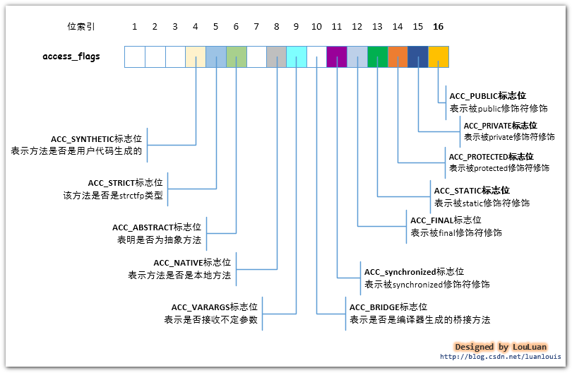
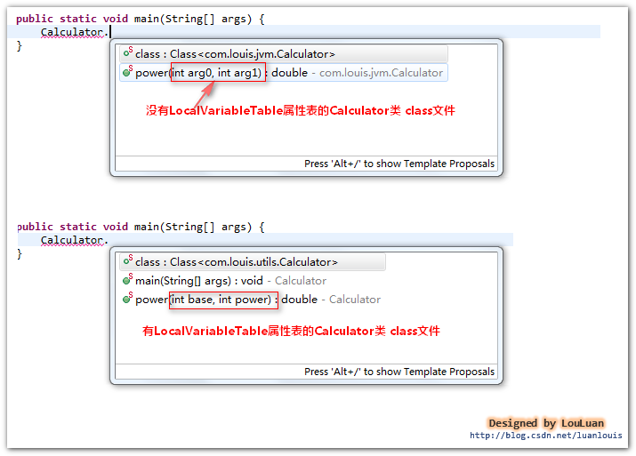

# method方法
方法表集合是指由若干个方法表（method_info）组成的集合。对于在类中定义的若干个方法，经过JVM编译成class文件后，会将相应的method方法信息组织到一个叫做方法表集合的结构中，字段表集合是一个类数组结构。
    
## method_info的表示
  
    
## method_info的结构
  
    
方法表的结构体由：访问标志(access_flags)、名称索引(name_index)、描述索引(descriptor_index)、属性表(attribute_info)集合组成。
    
## 访问标志(access_flags)---记录着method方法的访问信息
method_info结构体最前面的两个字节表示的访问标志（access_flags），记录这这个方法的作用域、静态or非静态、可变性、是否可同步、是否本地方法、是否抽象等信息。    
  
    
## 名称索引和描述符索引 - 一个方法的签名
紧跟在访问标志（access_flags）后面的两个字节称为名称索引，这两个字节中的值指向了常量池中的某一个常量池项，这个方法的名称以UTF-8格式的字符串存储在这个常量池项中。    
    
方法描述符索引(descrptor_index)是紧跟在名称索引后面的两个字节，这两个字节中的值跟名称索引中的值性质一样，都是指向了常量池中的某个常量池项。这两个字节中的指向的常量池项，是表示了方法描述符的字符串。
    
方法描述符的组成：    
  
    
  
    

## 属性表(attribute_info)
属性表集合记录了某个方法的一些属性信息，这些信息包括：    
- 这个方法的代码实现，即方法的可执行的机器指令(方法实现体)
- 这个方法声明的要抛出的异常信息(异常表)
- 这个方法是否被@deprecated注解表示
- 这个方法是否是编译器自动生成的
    
属性表（attribute_info）结构体：    
  
    

## Code类型的属性表 - method方法中的机器指令的信息
Code类型的属性表(attribute_info)可以说是class文件中最为重要的部分，因为它包含的是JVM可以运行的机器码指令，JVM能够运行这个类，就是从这个属性中取出机器码的。除了要执行的机器码，它还包含了一些其他信息，如下所示：    
  
    
Code属性表的组成部分：

**机器指令----code**：    
目前的JVM使用一个字节表示机器操作码，即对JVM底层而言，它能表示的机器操作码不多于2的 8 次方，即 256个。class文件中的机器指令部分是class文件中最重要的部分，并且非常复杂。
    
**异常处理跳转信息---exception_table**：    
如果代码中出现了try{}catch{}块，那么try{}块内的机器指令的地址范围记录下来，并且记录对应的catch{}块中的起始机器指令地址，当运行时在try块中有异常抛出的话，JVM会将catch{}块对应机器指令地址传递给PC寄存器，从而实现指令跳转。
    
**Java源码行号和机器指令的对应关系---LineNumberTable属性表**：    
编译器在将java源码编译成class文件时，会将源码中的语句行号跟编译好的机器指令关联起来，这样的class文件加载到内存中并运行时，如果抛出异常，JVM可以根据这个对应关系，抛出异常信息，告诉我们我们的源码的多少行有问题，方便我们定位问题。这个信息不是运行时必不可少的信息，但是默认情况下，编译器会生成这一项信息，如果你项取消这一信息，你可以使用 -g:none 或 -g:lines来取消或者要求设置这一项信息。如果使用了-g:none来生成class文件，class文件中将不会有LineNumberTable属性表，造成的影响就是将来如果代码报错，将无法定位错误信息报错的行，并且如果项调试代码，将不能在此类中打断点（因为没有指定行号）。
    
**局部变量表描述信息----LocalVariableTable属性表**：    
局部变量表信息会记录栈帧局部变量表中的变量和java源码中定义的变量之间的关系，这个信息不是运行时必须的属性，默认情况下不会生成到class文件中。你可以根据javac指令的-g:none 或者 -g:vars选项来取消或者设置这一项信息。
    
它有什么作用呢？当我们使用IDE进行开发时，最喜欢的莫过于它们的代码提示功能了。如果在项目中引用到了第三方的jar包，而第三方的包中的class文件中有无LocalVariableTable属性表的区别如下所示：     
  
    
    
**Code属性表结构体的解释**：    
1. attribute_name_index, 属性名称索引，占有2个字节，其内的值指向了常量池中的utf8项，该项表示字符串Code
2. attribute_length, 属性长度，占有 4个字节，其内的值表示后面有多少个字节是属于此Code属性表
3. max_stack, 操作数栈深度的最大值，占有 2 个字节，在方法执行的任意时刻，操作数栈都不应该超过这个值，虚拟机运行的时候，会根据这个值来设置该方法对应的栈帧(Stack Frame)中的操作数栈的深度
4. max_locals, 最大局部变量数目，占有 2个字节，其内的值表示局部变量表所需要的存储空间大小，局部变量表的第一个索引指向this
5. code_length, 机器指令长度，占有 4 个字节，表示跟在其后的多少个字节表示的是机器指令(方法实现)
6. code[], 机器指令区域，该区域占有的字节数目由 code_length中的值决定。JVM最底层要执行的机器指令就存储在这里
7. exception_table_length, 显式异常表长度，占有2个字节；如果在方法代码中出现了try{} catch() {}形式的结构，该值不会为0，其后会跟着若干个exception_table结构体，以表示异常捕获情况，如果没有try{} catch() {}代码块，该值为0
8. exception_table, 显式异常表，占有8 个字节，start_pc, end_pc, handler_pc中的值都表示的是PC计数器中的指令地址。如果字节码从第start_pc行到第end_pc行之间出现了catch_type所描述的异常类型，那么将跳转到 handler_pc 的指令地址处继续处理。
9. attribute_count, 属性计数器，占有 2 个字节，表示Code属性表的其他属性的数目
10. attribute_info, 表示Code属性表具有的属性表，它主要分为两个类型的属性表：LineNumberTable和LocalVariableTable类型。LineNumberTable类型的属性表记录着Java源码和机器指令之间的对应关系，LocalVariableTable类型的属性表记录着局部变量表中的变量和java源码中定义的变量之间的关系。
    

```
package com.louis.jvm;
public class Simple {
    public static synchronized final void greeting(){
        int a = 10;
    }
}
```
    
对应的属性表：    
  
    

## Exceptions类型的属性表 - method方法声明的要抛出的异常信息
有些方法在定义的时候，会声明该方法会抛出什么类型的异常。Exceptions类型的属性表(attribute_info)结构体：    
  
    
Exceptions类型的属性表的长度(attribute_length)计算：    
如果某个方法定义中，没有声明抛出异常；那么，表示该方法的方法表(method_info)结构体中的属性表集合中不会有Exceptions类型的属性表。如果方法声明了要抛出的异常， 属性长度(attribute_length)中的值 = 2 + 2*异常数量(number_of_exceptions)。Exceptions类型的属性表（attribute_info）的长度=2+4+属性长度(attribute_length)。
    

## IDE代码提示功能实现的基本原理
每个IDE都提供了代码提示功能，它们实现的基本原理其实就是IDE针对它们项目下的包中所有的class文件进行建模，解析出它们的方法信息，IDE会自动地将合适条件的方法列表展示给开发者，供开发者使用。    
  

