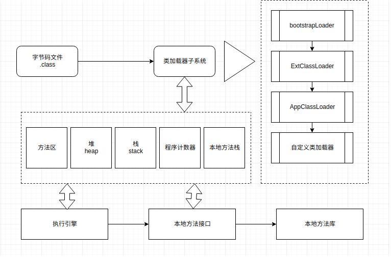
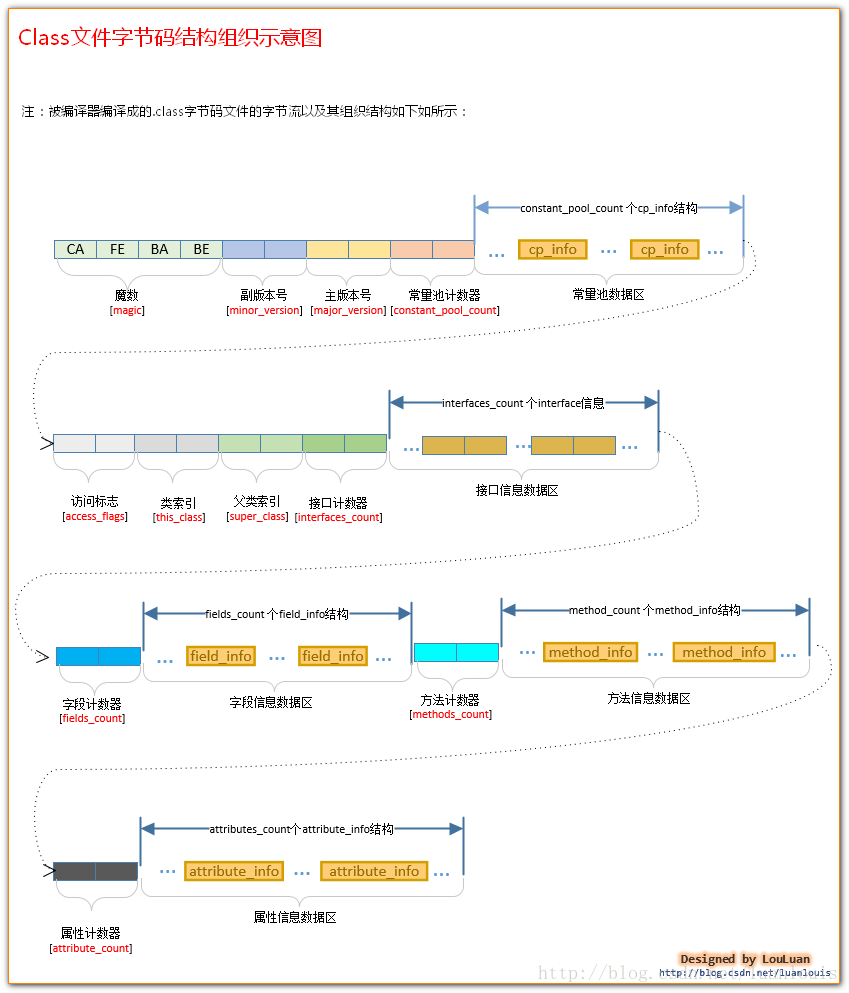
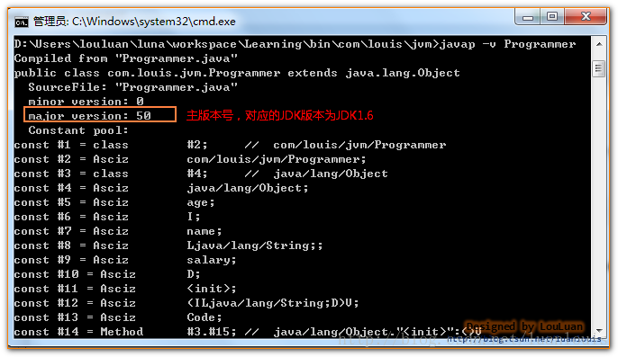
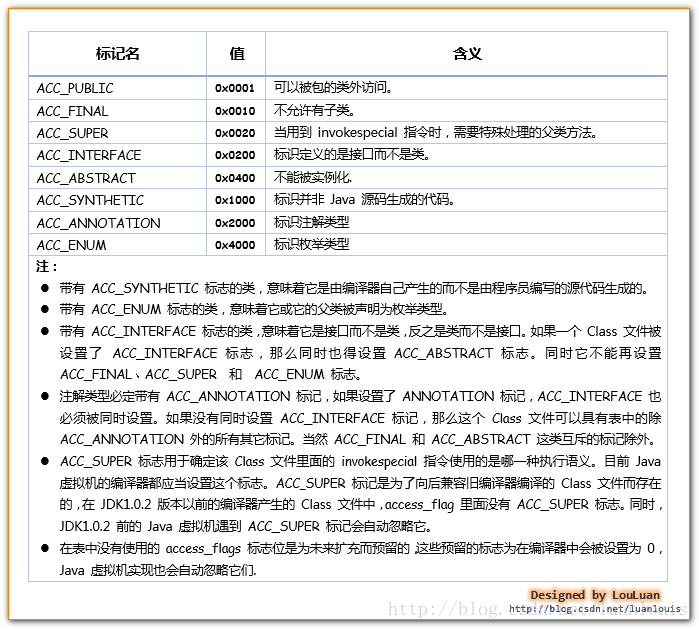
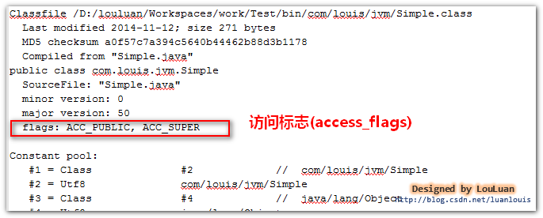
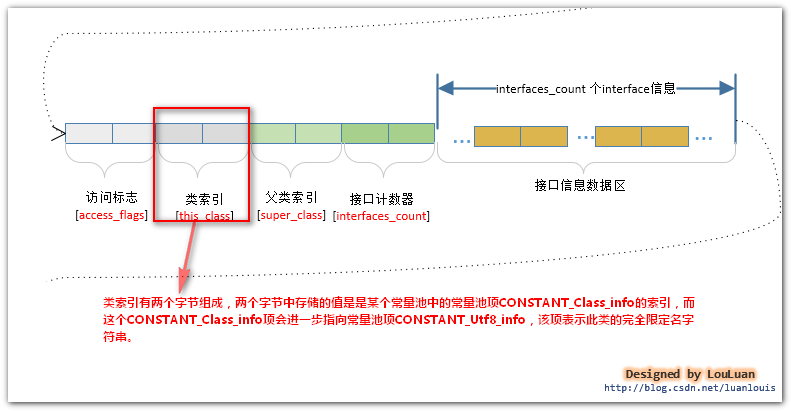
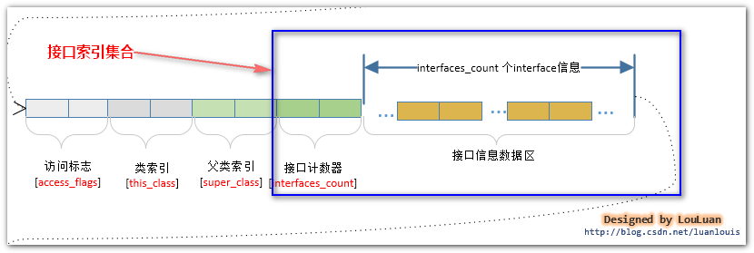
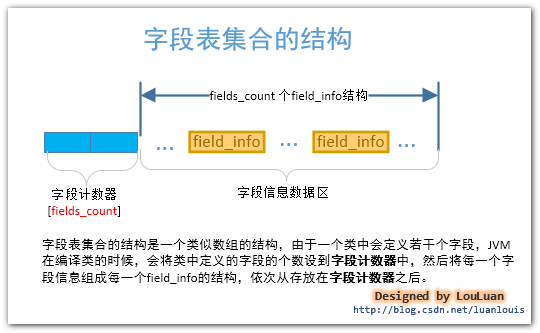

# jvm架构
  
    

# class文件组织结构
  
    
## 魔数(magic)
所有的由Java编译器编译而成的class文件的前4个字节都是“0xCAFEBABE”。
    
它的作用在于：当JVM在尝试加载某个文件到内存中来的时候，会首先判断此class文件有没有JVM认为可以接受的“签名”，即JVM会首先读取文件的前4个字节，判断该4个字节是否是“0xCAFEBABE”，如果是，则JVM会认为可以将此文件当作class文件来加载并使用。
    
## 版本号(minor_version,major_version)
随着Java本身的发展，Java语言特性和JVM虚拟机也会有相应的更新和增强。发布新版本的目的在于：在原有的版本上增加新特性和相应的JVM虚拟机的优化。而随着主版本发布的次版本，则是修改相应主版本上出现的bug。主版本号和次版本号在class文件中各占两个字节，副版本号占用第5、6两个字节，而主版本号则占用第7，8两个字节。
    
JVM在加载class文件的时候，会读取出主版本号，然后比较这个class文件的主版本号和JVM本身的版本号，如果JVM本身的版本号 < class文件的版本号，JVM会认为加载不了这个class文件，会抛出我们经常见到的"java.lang.UnsupportedClassVersionError: Bad version number in .class file " Error 错误；反之，JVM会认为可以加载此class文件，继续加载此class文件。
    
查看class编译时使用的jdk版本：    
使用JDK自带的javap工具，`javap -v Programmer`    
  
    
jdk版本对应关系：    
52 = jdk8, 51 = jdk7, 50 = jdk6, 49 = jdk5
    
## 常量池计数器(constant_pool_count)
常量池是class文件中非常重要的结构，它描述着整个class文件的字面量信息。 常量池是由一组constant_pool结构体数组组成的，而数组的大小则由常量池计数器指定。常量池计数器constant_pool_count 的值 = constant_pool表中的成员数 + 1。constant_pool表的索引从1开始。
    
## 常量池数据区(constant_pool[contstant_pool_count - 1])
常量池，constant_pool是一种表结构,它包含 Class 文件结构及其子结构中引用的所有字符串常量、 类或接口名、字段名和其它常量。 常量池中的每一项都具备相同的格式特征——第一个字节作为类型标记用于识别该项是哪种类型的常量，称为 “tag byte” 。常量池的索引范围是 1 至 constant_pool_count − 1。
        
## 访问标志(access_flags)
访问标志，access_flags 是一种掩码标志，用于表示某个类或者接口的访问权限及基础属性。
    
  
    
访问标志（access_flags）紧接着常量池后，占有两个字节，总共16位，如下图所示：
  
    
使用javap -v Simple 查看访问标志：    
  
    
## 类索引(this_class)
类索引，this_class的值必须是对constant_pool表中项目的一个有效索引值。constant_pool表在这个索引处的项必须为CONSTANT_Class_info 类型常量，表示这个 Class 文件所定义的类或接口。
    
类索引的作用，就是为了指出class文件所描述的这个类的完全限定名。    
  
    
## 父类索引(super_class)
父类索引，对于类来说，super_class 的值必须为 0 或者是对constant_pool 表中项目的一个有效索引值。如果它的值不为 0，那 constant_pool 表在这个索引处的项必须为CONSTANT_Class_info 类型常量，表示这个 Class 文件所定义的类的直接父类。当前类的直接父类，以及它所有间接父类的access_flag 中都不能带有ACC_FINAL 标记。对于接口来说，它的Class文件的super_class项的值必须是对constant_pool表中项目的一个有效索引值。如果 Class 文件的 super_class的值为 0，那这个Class文件只可能定义的是java.lang.Object类，只有它是唯一没有父类的类。
    
## 接口计数器(interfaces_count) / 接口信息数据区(interfaces[interfaces_count])
接口计数器，interfaces_count的值表示当前类或接口的直接父接口数量。]interfaces[]数组中的每个成员的值必须是一个对constant_pool表中项目的一个有效索引值， 它的长度为 interfaces_count。每个成员 interfaces[i]  必须为 CONSTANT_Class_info类型常量。在interfaces[]数组中，成员所表示的接口顺序和对应的源代码中给定的接口顺序（从左至右）一样。
    
一个类可以不实现任何接口，也可以实现很多个接口，为了表示当前类实现的接口信息，class文件使用了如下结构体描述某个类的接口实现信息:    
  
    
接口索引和类索引和父类索引一样，其内的值存储的是指向了常量池中的常量池项的索引，表示着这个接口的完全限定名。
    
## 字段计数器(fields_count) / 字段信息数据区(fields[fields_count])
字段计数器，fields_count的值表示当前 Class 文件 fields[]数组的成员个数。 fields[]数组中每一项都是一个field_info结构的数据项，它用于表示该类或接口声明的类字段或者实例字段的完整描述。fields[]数组描述当前类或接口声明的所有字段（包括实例和静态字段），但不包括从父类或父接口继承的部分。    
  
    

## 方法计数器(methods_count) / 方法信息数据区(methods[methods_count])
方法计数器， methods_count的值表示当前Class 文件 methods[]数组的成员个数。Methods[]数组中每一项都是一个 method_info 结构的数据项，用于表示当前类或接口中某个方法的完整描述。如果某个method_info 结构的access_flags 项既没有设置 ACC_NATIVE 标志也没有设置ACC_ABSTRACT 标志，那么它所对应的方法体就应当可以被 Java 虚拟机直接从当前类加载，而不需要引用其它类。 method_info结构可以表示类和接口中定义的所有方法，包括实例方法、类方法、实例初始化方法方法和类或接口初始化方法方法 。methods[]数组只描述当前类或接口中声明的方法，不包括从父类或父接口继承的方法。    
  
    

## 属性计数器(attributes_count) / 属性信息数据区(attributes[attributes_count])
属性计数器，attributes_count的值表示当前 Class 文件attributes表的成员个数。attributes表中每一项都是一个attribute_info 结构的数据项。
    
在Java 7 规范里，Class文件结构中的attributes表的项包括下列定义的属性： InnerClasses  、 EnclosingMethod 、 Synthetic  、Signature、SourceFile，SourceDebugExtension 、Deprecated、RuntimeVisibleAnnotations 、RuntimeInvisibleAnnotations以及BootstrapMethods属性。
    
对于支持 Class 文件格式版本号为 49.0 或更高的 Java 虚拟机实现，必须正确识别并读取attributes表中的Signature、RuntimeVisibleAnnotations和RuntimeInvisibleAnnotations属性。对于支持Class文件格式版本号为 51.0 或更高的 Java 虚拟机实现，必须正确识别并读取 attributes表中的BootstrapMethods属性。
    
