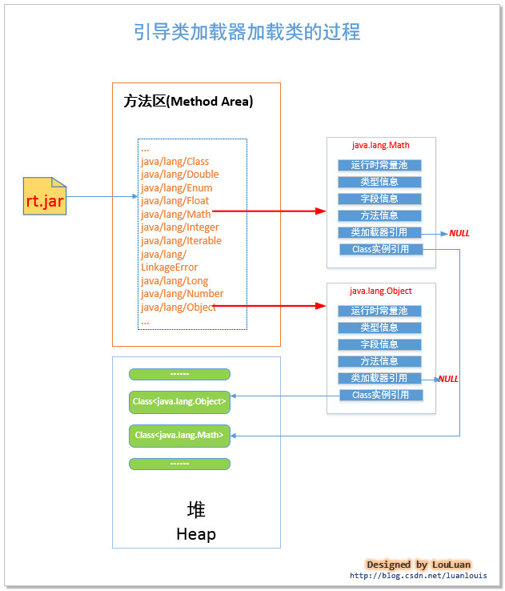

# jvm架构
  
    

# java 类的加载器
  

引导类加载器(Bootstrap Class Loader): 该类加载器使JVM使用C/C++底层代码实现的加载器，用以加载JVM运行时所需要的系统类，这些系统类在{JRE_HOME}/lib目录下。由于类加载器是使用平台相关的底层C/C++语言实现的， 所以该加载器不能被Java代码访问到。但是，我们可以查询某个类是否被引导类加载器加载过。我们经常使用的系统类java.lang.*这些都被放在 {JRE_HOME}/lib/rt.jar包内， 当JVM系统启动的时候，引导类加载器会将其加载到 JVM内存的方法区中。
    
拓展类加载器(Extension Class Loader): 该加载器是用于加载 java 的拓展类 ，拓展类一般会放在 {JRE_HOME}/lib/ext/ 目录下，用来提供除了系统类之外的额外功能。拓展类加载器是是整个JVM加载器的Java代码可以访问到的类加载器的最顶端，即是超级父加载器，拓展类加载器是没有父类加载器的。
    
应用类加载器(Applocatoin Class Loader): 该类加载器是用于加载用户代码，是用户代码的入口。应用类加载器将拓展类加载器当成自己的父类加载器，当其尝试加载类的时候，首先尝试让其父加载器-拓展类加载器加载；如果拓展类加载器加载成功，则直接返回加载结果Class<T>；加载失败，则会询问是否引导类加载器已经加载了该类；如果没有加载，应用类加载器才会尝试自己加载。由于main所在的类是整个用户代码的入口，在Java虚拟机规范中，称其为初始类(Initial Class)。
    
用户自定义类加载器（Customized Class Loader）：用户可以自己定义类加载器来加载类。所有的类加载器都要继承java.lang.ClassLoader类。
    

## 引导类加载器 Bootstrap
引导类加载器是用来加载 {JRE_HOME}/lib，也可以使用参数 -Xbootclasspath 或 系统变量sun.boot.class.path来指定的目录来加载类。
{JRE_HOME}/lib下存放着JVM正常工作所需要的系统类。
    
 | 文件名 | 描述 |
 | rt.jar | 运行环境包，rt即runtime，J2SE 的类定义都在这个包内 |
 | charsets.jar | 字符集支持包 | 
 | jce.jar | 是一组包，它们提供用于加密、密钥生成和协商以及 Message Authentication Code（MAC）算法的框架和实现 | 
 | jsse.jar | 安全套接字拓展包Java(TM) Secure Socket Extension | 
 | classlist | 该文件内表示是引导类加载器应该加载的类的清单 | 
 | net.properties  JVM 网络配置信息 | 
    
引导类加载器(Bootstrap ClassLoader） 加载系统类后，JVM内存会呈现如下格局：    
  
    
引导类加载器将类信息加载到方法区中，以特定方式组织，对于某一个特定的类而言，在方法区中它应该有 运行时常量池、类型信息、字段信息、方法信息、类加载器的引用，对应class实例的引用等信息。
    
**类加载器的引用**: 由于这些类是由引导类加载器(Bootstrap Classloader)进行加载的，而 引导类加载器是有C++语言实现的，所以是无法访问的，故而该引用为NULL。
    
**对应class实例的引用**: 类加载器在加载类信息放到方法区中后，会创建一个对应的Class 类型的实例放到堆(Heap)中, 作为开发人员访问方法区中类定义的入口和切入点。
    

## 启动器实例 Launcher
创建JVM启动器实例 Launcher, 并取得类加载器 ClassLoader
    
```
//获取Java启动器
sun.misc.Launcher launcher = sun.misc.Launcher.getLauncher();
//获取类加载器ClassLoader用来加载class到内存来
ClassLoader classLoader = launcher.getClassLoader();
```
    
sun.misc.Launcher 使用了单例模式设计，保证一个JVM虚拟机内只有一个sun.misc.Launcher实例。
    

## ExtClassLoader 和 AppClassLoader
在Launcher的内部，其定义了两个类加载器(ClassLoader), 分别是sun.misc.Launcher.ExtClassLoader和sun.misc.Launcher.AppClassLoader，这两个类加载器分别被称为拓展类加载器(Extension ClassLoader) 和 应用类加载器(Application ClassLoader)。如下图所示：    
  
    

此时的 launcher.getClassLoader() 方法将会返回 AppClassLoader 实例，AppClassLoader将ExtClassLoader作为自己的父加载器。
    
当AppClassLoader加载类时，会首先尝试让父加载器ExtClassLoader进行加载，如果父加载器ExtClassLoader加载成功，则AppClassLoader直接返回父加载器ExtClassLoader加载的结果；如果父加载器ExtClassLoader加载失败，AppClassLoader则会判断该类是否是引导的系统类(即是否通过Bootstrap类加载器加载，这会调用Native方法进行查找)；若要加载的类不是系统引导类，那么ClassLoader将会尝试自己加载，加载失败将会抛出“ClassNotFoundException”。
    

## 双亲委托模型(parent-delegation model)
在java术语中，要求某个类装载器装载一个类型，但是却返回了其他类装载器装载的类型，这种装载器被称为是那个类型的初始类装载器（发起请求）。而实际装载和定义那个类型的类装载器被称为那个类型的定义类装载器。
    
任何被要求装载类型，并且能够返回Class实例的引用的类装载器都是这个类型的初始类装载器，每个类装载器都会维护一张已装载的初始类表，下次遇到该类型的加载请求时直接返回已加载的Class实例。
    
  
    
1. 委托父类加载器进行加载；这个过程一直进行到委托链的末端，通常是启动类装载器（c++写的，只提供native查询方法，子类加载器只能判断某个类是否被引导类加载器加载过，而不能委托它加载某个类）。
2. 父类加载器加载不了，则查询引导类加载器有没有加载过该类（调用Native方法进行查找）；
3. 如果引导类加载器没有加载过该类，则当前的类加载器应该自己加载该类；
4. 若加载成功，返回 对应的Class<T> 对象；若失败，抛出异常“ClassNotFoundException”。
    

## 双亲委托模型的底层实现
可以通过JDK源码看java.lang.ClassLoader的核心方法 loadClass()的实现：
    
```
//提供class类的二进制名称表示，加载对应class，加载成功，则返回表示该类对应的Class<T> instance 实例
public Class<?> loadClass(String name) throws ClassNotFoundException {
    return loadClass(name, false);
}
 
protected Class<?> loadClass(String name, boolean resolve) throws ClassNotFoundException {
    synchronized (getClassLoadingLock(name)) {
        // 首先，检查是否已经被当前的类加载器记载过了，如果已经被加载，直接返回对应的Class<T>实例
        Class<?> c = findLoadedClass(name);
        //初次加载
        if (c == null) {
        long t0 = System.nanoTime();
        try {
            if (parent != null) {
                //如果有父类加载器，则先让父类加载器加载
                c = parent.loadClass(name, false);
            } else {
                // 没有父加载器，则查看是否已经被引导类加载器加载，有则直接返回
                c = findBootstrapClassOrNull(name);
            }
        } catch (ClassNotFoundException e) {
            // ClassNotFoundException thrown if class not found
            // from the non-null parent class loader
        }
        
        // 父加载器加载失败，并且没有被引导类加载器加载，则尝试该类加载器自己尝试加载
        if (c == null) {
            // If still not found, then invoke findClass in order
            // to find the class.
            long t1 = System.nanoTime();
            // 自己尝试加载
            c = findClass(name);
 
            // this is the defining class loader; record the stats
            sun.misc.PerfCounter.getParentDelegationTime().addTime(t1 - t0);
            sun.misc.PerfCounter.getFindClassTime().addElapsedTimeFrom(t1);
            sun.misc.PerfCounter.getFindClasses().increment();
        }

        //是否解析类 
        if (resolve) {
            resolveClass(c);
        }
        return c;
    }
}
```
    
## 双亲委托模型的工作流程图
  
    

## 类加载器与Class<T>实例的关系
  
    


## 线程上下文中的类加载器
任何一段代码的执行，都有对应的线程上下文。如果我们在代码中，想看当前是哪一个线程在执行当前代码，我们经常是使用如下方法：
    
```
//返回对当当前运行线程的引用
Thread  thread = Thread.currentThread();
```
    
线程对应的类加载器：     
  
    

为当前的线程指定类加载器：    
线程上下文类加载器是从线程的角度来看待类的加载，为每一个线程绑定一个类加载器，可以将类的加载从单纯的 双亲加载模型解放出来，进而实现特定的加载需求。
    
```
public Launcher() {
    Launcher.ExtClassLoader var1;
    try {
        var1 = Launcher.ExtClassLoader.getExtClassLoader();
    } catch (IOException var10) {
        throw new InternalError("Could not create extension class loader", var10);
    }
 
    try {
        this.loader = Launcher.AppClassLoader.getAppClassLoader(var1);
    } catch (IOException var9) {
        throw new InternalError("Could not create application class loader", var9);
    }
        
    //将AppClassLoader设置成当前线程的上下文加载器
    Thread.currentThread().setContextClassLoader(this.loader);
    //.......
}
```
    

## 用户自定义类加载器（Customized Class Loader）
用户可以自己定义类加载器来加载类。所有的类加载器都要继承java.lang.ClassLoader类。    
  
    
    
