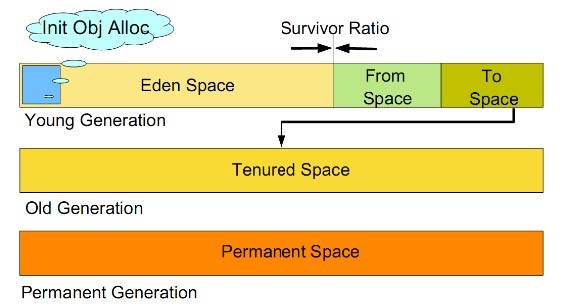

# 对象创建过程
  
    
    
## 类加载检查
虚拟机遇到一条 new 指令时，首先将去检查这个指令的参数是否能在常量池中定位到这个类的符号引用，并且检查这个符号引用代表的类是否已被加载过、解析和初始化过。如果没有，那必须先执行相应的类加载过程。
    
## 内存分配
在类加载检查通过后，接下来虚拟机将为新生对象分配内存。对象所需的内存大小在类加载完成后便可确定，为对象分配空间的任务等同于把一块确定大小的内存从 Java 堆中划分出来。
    
分配方式有 “指针碰撞” 和 “空闲列表” 两种，对象内存空间分配的方式受堆空间是否规整影响，而 Java 堆内存是否规整，取决于 GC 收集器的算法是"标记-清除"，还是"标记-整理"，值得注意的是，复制算法内存也是规整的。
    
  
    
### 指针碰撞
如果堆内存是规整的空间，即已经分配的内存与未使用的内存都是连续的空间，此时存在着一个指针位于已用与可用内存的分界，新内存的分配即指针移动对象大小的距离即可。此方式称为指针碰撞。
    
在Eden区，HotSpot虚拟机使用了两种技术来加快内存分配。分别是指针碰撞(bump-the-pointer)和本地线程分配缓冲TLAB(Thread- Local Allocation Buffers)。
    
  
    
由于堆空间是线程共享的，所以该方式存在着并发问题，通常有以下两种解决方案：
1. 对内存分配的动作进行同步处理：CAS加上失败重试(自旋)保证更新操作的原子性。
2. 本地线程分配缓冲（LTAB）：将内存按照分配的动作按线程划分在不同的空间进行，为每一个线程预先在 Eden 区分配一块内存(LTAB)，JVM 在给线程中的对象分配内存时，首先在 TLAB 分配，当对象大于 TLAB 中的剩余内存或 TLAB 的内存已用尽时，再采用 CAS 进行内存分配。
    

### 空闲列表
如果堆空间中已分配的内存与未分配的内存相互交错，就需要使用“空闲列表”的方式进行内存分配操作。此时堆内存中维护了一份可用内存的列表，当有新内存分配的需求时，会到空闲列表中确定足够大小的内存空间予以分配操作。
    
  
    
    
## 初始化零值
内存分配完成后，虚拟机需要将分配到的内存空间都初始化为零值（不包括对象头），这一步操作保证了对象的实例字段在 Java 代码中可以不赋初始值就直接使用，程序能访问到这些字段的数据类型所对应的零值。
    
## 设置对象头
初始化零值完成之后，虚拟机要对对象进行必要的设置，例如这个对象是那个类的实例、如何才能找到类的元数据信息、对象的哈希码、对象的 GC 分代年龄等信息。 这些信息存放在对象头中。 另外，根据虚拟机当前运行状态的不同，如是否启用偏向锁等，对象头会有不同的设置方式。
    
## 执行实例 init 方法
在上面工作都完成之后，从虚拟机的视角来看，一个新的对象已经产生了，但从 Java 程序的视角来看，对象创建才刚开始，`<init>()`方法还没有执行，所有的字段都还为初始值。所以一般来说，执行 new 指令之后会接着执行 `<init>()`方法，把对象按照程序员的意愿进行初始化，这样一个真正可用的对象才算完全产生出来。
    


# 对象的访问定位
对象的访问定位也取决于具体的虚拟机实现。当我们在堆上创建一个对象实例后，就要通过虚拟机栈中的reference类型数据来操作堆上的对象。现在主流的访问方式有两种（HotSpot虚拟机采用的是第二种）：
- 使用句柄访问对象。即reference中存储的是对象句柄的地址，而句柄中包含了对象实例数据与类型数据的具体地址信息，相当于二级指针。
    
  

- 直接指针访问对象。即reference中存储的就是对象地址，相当于一级指针。
    
  
    
两种方式有各自的优缺点。当垃圾回收移动对象（复制/整理）时，对于方式一而言，reference中存储的地址是稳定的地址，不需要修改，仅需要修改对象句柄的地址；而对于方式二，则需要修改栈中reference存储的地址。从访问效率上看，方式二优于方式一，因为方式二只进行了一次指针定位，节省了时间开销，而这也是HotSpot采用的实现方式。
    


# 垃圾回收
Java 的自动内存管理主要是针对对象内存的回收和对象内存的分配。同时，Java自动内存管理最核心的功能是堆内存中对象的分配与回收。
    
## 内存分配策略
内存空间的基本结构：    
  
    
大部分情况，对象都会首先在 Eden 区域分配，在一次新生代垃圾回收后，如果对象还存活，则会进入 s1("To")，并且对象的年龄还会加 1(Eden 区->Survivor 区后对象的初始年龄变为 1)，当它的年龄增加到一定程度（默认为 15 岁），就会被晋升到老年代中。对象晋升到老年代的年龄阈值，可以通过参数 -XX:MaxTenuringThreshold 来设置。经过这次GC后，Eden区和"From"区已经被清空。这个时候，"From"和"To"会交换他们的角色，也就是新的"To"就是上次GC前的“From”，新的"From"就是上次GC前的"To"。不管怎样，都会保证名为To的Survivor区域是空的。Minor GC会一直重复这样的过程，直到“To”区被填满，"To"区被填满之后，会将所有对象移动到年老代中。    
  
    
- 对象优先在 eden 区分配。目前主流的垃圾收集器都会采用分代回收算法，因此需要将堆内存分为新生代和老年代，这样我们就可以根据各个年代的特点选择合适的垃圾收集算法。大多数情况下，对象在新生代中 eden 区分配。当 eden 区没有足够空间进行分配时，虚拟机将发起一次Minor GC / Young GC。

- 大对象直接进入老年代。大对象就是需要大量连续内存空间的对象（比如：字符串、数组）。这样做的原因是为了避免为大对象分配内存时由于分配担保机制带来的复制而降低效率。

- 长期存活的对象将进入老年代。如果对象在 Eden 出生并经过第一次 Minor GC 后仍然能够存活，并且能被 Survivor 容纳的话，将被移动到 Survivor 空间中，并将对象年龄设为 1。对象在 Survivor 中每熬过一次 MinorGC 年龄就增加 1 岁，当它的年龄增加到阀值（默认为 15 岁），就会被晋升到老年代中。对象晋升到老年代的年龄阈值，可以通过参数 -XX:MaxTenuringThreshold 来设置。
    

**空间分配担保(Handle Promotion)**：存储位置晋升，让老年代空间来存放年轻代中的对象，其前提是老年代还有容纳的空间。在发生Minor GC时，虚拟机会检查老年代连续的空闲区域，如果大于新生代对象总大小或者历次晋升的平均大小就会进行Minor GC，否则将进行Full GC。
    

## 判断对象的生死
  
    

## 判断对象是否可用的算法
### 引用计数算法
**算法描述**：
- 给对象添加一个引用计数器；
- 每有一个地方引用它，计数器加 1；
- 引用失效时，计数器减 1；
- 计数器值为 0 的对象不再可用。
    
**缺点**：
无法解决循环引用的问题。即 objA.instance = objB; objB.instance = objA; objA 和 objB 都不会再被访问，它们仍然相互引用着对方，所以它们的引用计数器不为 0，将永远不能被判为不可用。
    
### 可达性分析算法（主流）
**算法描述**：
- 从 "GC Root" 对象作为起点开始向下搜索，走过的路径称为引用链（Reference Chain）；
- 从 "GC Root" 开始，不可达的对象被判为不可用。
    
  
    
**Java 中可作为“GC Root”的对象**：
- 栈中（本地变量表中的reference）
    - 虚拟机栈中，栈帧中的本地变量表引用的对象；
    - 本地方法栈中，JNI 引用的对象（native方法）；
- 方法区中
    - 类的静态属性引用的对象；
    - 常量引用的对象；
    
一个对象被判为不可达，并不会立即死去，宣告一个对象的死亡需要经过两次标记过程。
    

## 宣告对象死亡的两次标记过程
即使在可达性分析法中不可达的对象，也并非是“非死不可”的，这时候它们暂时处于“缓刑阶段”，要真正宣告一个对象死亡，至少要经历两次标记过程。
    
- 当发现对象不可达后，该对象被第一次标记，并进行是否有必要执行 finalize() 方法的判断；
    - 不需要执行：对象没有覆盖 finalize() 方法，或者 finalize() 方法已被执行过；
    - 需要执行：将该对象放置在一个队列中，稍后由一个虚拟机自动创建的低优先级线程执行。

- finalize() 方法是对象逃脱死亡的最后一次机会，被判定为需要执行的对象将会被放在一个队列中进行第二次标记，除非这个对象与引用链上的任何一个对象建立关联，否则就会被真的回收。

- 虚拟机不保证等待 finalize() 方法执行结束，也就是说，虚拟机只触发 finalize() 方法的执行，如果这个方法要执行很久，那么虚拟机并不等待它执行结束，所以最好不要用这个方法。finalize() 方法能做的，try-finally 都能做。所以不要使用这个方法进行资源释放。
    

## 四种引用类型
- **强引用**： 像 Object obj = new Object() 这种，只要强引用还存在，垃圾收集器就永远不会回收掉被引用的对象。

- **软引用**： 用来引用还存在但非必须的对象。对于软引用对象，在 OOM 前，虚拟机会把这些对象列入回收范围中进行第二次回收，如果这次回收后，内存还是不够用，就 OOM。实现类：SoftReference。

- **弱引用**： 被弱引用引用的对象只能生存到下一次垃圾收集前，一旦发生垃圾收集，被弱引用所引用的对象就会被清掉。实现类：WeakReference。

- **虚引用**： 幽灵引用，对对象没有半毛钱影响，甚至不能用来取得一个对象的实例。它唯一的用途就是：当被一个虚引用引用的对象被回收时，系统会收到这个对象被回收了的通知。实现类：PhantomReference。
    

## 如何快速确定GC Roots节点
进行可达性分析的第一步，就是要枚举 GC Roots，这就需要虚拟机知道哪些地方存放着对象应用。如果每一次枚举 GC Roots 都需要把整个栈上位置都遍历一遍，那样太浪费时间。为了提高 GC 的效率，HotSpot 使用了一种 OopMap 的数据结构，OopMap 记录了栈上本地变量到堆上对象的引用关系，也就是说，GC 的时候就不用遍历整个栈只遍历每个栈的 OopMap 就行了。    
  
    
在 OopMap 的帮助下，HotSpot 可以快速准确的完成 GC 枚举了，不过，OopMap 也不是万年不变的，它也是需要被更新的，当内存中的对象间的引用关系发生变化时，就需要改变 OopMap 中的相应内容。可是能导致引用关系发生变化的指令非常之多，如果我们执行完一条指令就改下 OopMap，这 GC 成本实在太高了。
    
因此，HotSpot 采用了一种在 “安全点” 更新 OopMap 的方法，安全点的选取既不能让 GC 等待的时间过长，也不能过于频繁增加运行负担，也就是说，我们既要让程序运行一段时间，又不能让这个时间太长。我们知道，JVM 中每条指令执行的是很快的，所以一个超级长的指令流也可能很快就执行完了，所以 真正会出现 “长时间执行” 的一般是指令的复用，例如：方法调用、循环跳转、异常跳转等，虚拟机一般会将这些地方设置为安全点更新 OopMap 并判断是否需要进行 GC 操作。
    
此外，在进行枚举根节点的这个操作时，为了保证准确性，我们需要在一段时间内 “冻结” 整个应用，即 Stop The World（传说中的 GC 停顿），因为如果在我们分析可达性的过程中，对象的引用关系还在变来变去，那是不可能得到正确的分析结果的。即便是在号称几乎不会发生停顿的 CMS 垃圾收集器中，枚举根节点时也是必须要停顿的。
    

## 方法区的回收
回收的无用类型需要同时满足以下 3 个条件：
- 该类的所有实例已被回收，Java 堆中不存在该类的任何实例；
- 加载该类的 Classloader 已被回收；
- 该类的 Class 对象没有被任何地方引用，即无法在任何地方通过反射访问该类的方法。
    
java 8提供了-xx:MetaspaceSize来设置触发元空间垃圾回收的阈值。
   

## GC触发时机
Young GC： 当 eden 区没有足够空间进行新对象分配时。
    
Full GC：
- 当准备要触发一次Young GC时，如果老年代的连续空闲空间小于新生代对象总大小或者历次晋升的平均大小，则不会触发Young GC而是转为触发Full GC。

- 如果有Perm gen的话，要在Perm gen分配空间但已经没有足够空间时，也会触发一次Full GC。

- System.gc()被显示调用。
    

## 垃圾收集算法
  
    
### 标记-清除算法
**算法描述**：
- 先标记出所有需要回收的对象（图中深色区域）；
- 标记完后，统一回收所有被标记对象（留下狗啃似的可用内存区域）。
    
**不足**：
- 效率问题：标记和清理两个过程的效率都不高。
- 空间碎片问题：标记清除后会产生大量不连续的内存碎片，导致以后为较大的对象分配内存时找不到足够的连续内存，会提前触发另一次 GC。
    
  
    

### 复制算法
**算法描述**：
- 将可用内存分为大小相等的两块，每次只使用其中一块。
- 当一块内存用完时，将这块内存上还存活的对象复制到另一块内存上去，将这一块内存全部清理掉。
    
**不足**：可用内存缩小为原来的一半，适合GC过后只有少量对象存活的新生代。
   
**节省内存的方法**：新生代中的对象 98% 都是朝生夕死的，所以不需要按照 1:1 的比例对内存进行划分。
- 把内存划分为：1 块比较大的 Eden 区，2 块较小的 Survivor 区。
- 每次使用 Eden 区和 1 块 Survivor 区；
- 回收时，将以上 2 部分区域中的存活对象复制到另一块 Survivor 区中，然后将以上两部分区域清空
    
JVM 参数设置：`-XX:SurvivorRatio=8` 表示 Eden 区大小 / 1 块 Survivor 区大小 = 8。
    
  
    

### 标记-整理算法
**算法描述**：
- 标记方法与 “标记 - 清除算法” 一样。
- 标记完后，将所有存活对象向一端移动，然后直接清理掉边界以外的内存。
    
**不足**： 存在效率问题，适合老年代。
    
  
    

### 分代收集算法
- 新生代： GC 过后只有少量对象存活(复制算法)
- 老年代： GC 过后对象存活率高(标记 - 整理算法)
    
当前虚拟机的垃圾收集都采用分代收集算法，这种算法没有什么新的思想，只是根据对象存活周期的不同将内存分为几块。一般将 java 堆分为新生代和老年代，这样我们就可以根据各个年代的特点选择合适的垃圾收集算法。
    
比如在新生代中，每次收集都会有大量对象死去，所以可以选择复制算法，只需要付出少量对象的复制成本就可以完成每次垃圾收集。而老年代的对象存活几率是比较高的，而且没有额外的空间对它进行分配担保，所以我们必须选择“标记-清除”或“标记-整理”算法进行垃圾收集。
    
  
    


## 垃圾收集器
收集算法是内存回收的方法论，那么垃圾收集器就是内存回收的具体实现。HotSpot 里足足有 7 种，为啥要弄这么多，因为它们各有各的适用场景。有的属于新生代收集器，有的属于老年代收集器，所以一般是搭配使用的（除了万能的 G1），根据具体应用场景选择适合自己的垃圾收集器。     
  
    

### Serial / ParNew 搭配 Serial Old 收集器
  
    
Serial 收集器是虚拟机在 Client 模式下的默认新生代收集器，它的优势是简单高效，在单 CPU 模式下很牛。它只会使用一条垃圾收集线程去完成垃圾收集工作，更重要的是它在进行垃圾收集工作的时候必须暂停其他所有的工作线程STW(Stop The World)，直到它收集结束。
    
ParNew 收集器就是 Serial 收集器的多线程版本，除了使用多线程进行垃圾收集外，其余行为（控制参数、收集算法、回收策略等等）和 Serial 收集器完全一样。但它却是许多运行在 Server 模式下的虚拟机中的首选新生代收集器，因为除了 Serial 收集器外，只有它能与 CMS 收集器（真正意义上的并发收集器）配合工作。
    
新生代使用复制算法，老年代使用标记-整理算法。
    

### Parallel 搭配 Parallel Scavenge 收集器
Parallel Scavenge 收集器关注点是吞吐量（高效率的利用 CPU）。CMS 等垃圾收集器的关注点更多的是用户线程的停顿时间（提高用户体验）。所谓吞吐量就是 CPU 中用于运行用户代码的时间与 CPU 总消耗时间的比值，`吞吐量 = 运行用户代码时间 / ( 运行用户代码时间 + 垃圾收集时间 )`。Parallel Scavenge 收集器不管是新生代还是老年代都是多个线程同时进行垃圾收集，十分适合于应用在注重吞吐量以及 CPU 资源敏感的场合。
    
Parallel Scavenge 收集器提供了很多参数供用户找到最合适的停顿时间或最大吞吐量。
    
可调节的虚拟机参数：
    
```
-XX:MaxGCPauseMillis：最大 GC 停顿的秒数。
-XX:GCTimeRatio：吞吐量大小，一个 0 ~ 100 的数，最大 GC 时间占总时间的比率 = 1 / (GCTimeRatio + 1)。
-XX:+UseAdaptiveSizePolicy：一个开关参数，打开后就无需手工指定 -Xmn，-XX:SurvivorRatio 等参数了，虚拟机会根据当前系统的运行情况收集性能监控信息，自行调整。
```
    

### CMS 收集器
  
    
CMS（Concurrent Mark Sweep）收集器是一种以获取最短回收停顿时间为目标的收集器。它而非常符合在注重用户体验的应用上使用。
    
CMS（Concurrent Mark Sweep）收集器是 HotSpot 虚拟机第一款真正意义上的并发收集器，它第一次实现了让垃圾收集线程与用户线程（基本上）同时工作。
    
  

CMS 收集器是一种 “标记-清除”算法实现的，它的运作过程相比于前面几种垃圾收集器来说更加复杂一些。整个过程分为四个步骤：
- 初始标记： 暂停所有的其他线程STW，并记录下直接与 gc root 相连的对象，速度很快。

- 并发标记： 同时开启 GC 和用户线程，用一个闭包结构去记录可达对象。但在这个阶段结束，这个闭包结构并不能保证包含当前所有的可达对象。因为用户线程可能会不断的更新引用域，所以 GC 线程无法保证可达性分析的实时性。所以这个算法里会跟踪记录这些发生引用更新的地方。

- 重新标记： 重新标记阶段就是为了修正并发标记期间因为用户程序继续运行而导致标记产生变动的那一部分对象的标记记录，这个阶段的停顿时间STW一般会比初始标记阶段的时间稍长，远远比并发标记阶段时间短。

- 并发清除： 开启用户线程，同时 GC 线程开始对为标记的区域做清扫。
    
```
Young GC (复制算法：Eden / Survivor(from) -> Survivor(to), Survivor(to) -> Old generation)
Full GC (标记-清除算法：gc roots开始初始标记stw -> 并发标记 -> 重新标记stw -> 并发清除，会产生大量内存碎片 -> 引发Full GC(Serial Old 标记-整理算法))
```
    
**优点**：并发收集、低停顿。
    
**缺点**：
- 对 CPU 资源敏感。占用大量的CPU资源。
- 无法处理浮动垃圾。在最后一步并发清理过程中，用户线程执行也会产生垃圾，但是这部分垃圾是在标记之后，所以只有等到下一次gc的时候清理掉。
- 它使用的回收算法 “标记-清除” 会导致收集结束时会有大量空间碎片产生。当发生FullGC时会使用Serial Old回收器来处理碎片空间。
    
**参数设置**：
    
```
-XX:+UseCMSCompactAtFullCollection：在 CMS 要进行 Full GC 时进行内存碎片整理（默认开启）
-XX:CMSFullGCsBeforeCompaction：在多少次 Full GC 后进行一次空间整理（默认是 0，即每一次 Full GC 后都进行一次空间整理）
```
    
**CMS 使用 标记 - 清除 算法的思考**：
标记 - 整理 会将所有存活对象向一端移动，然后直接清理掉边界以外的内存。这就意味着需要一个指针来维护这个分隔存活对象和无用空间的点，而我们知道 CMS 是并发清理的，虽然我们启动了多个线程进行垃圾回收，不过如果使用 标记 - 整理 算法，为了保证线程安全，在整理时要对那个分隔指针加锁，保证同一时刻只有一个线程能修改它，加锁的这一过程相当于将并行的清理过程变成了串行的，也就失去了并行清理的意义了。所以，CMS 采用了 标记 - 清除 算法。
    
    

### G1 收集器
  
    
G1 (Garbage-First) 是一款面向服务器的垃圾收集器，主要针对配备多颗处理器及大容量内存的机器，以极高概率满足 GC 停顿时间要求的同时还具备高吞吐量性能特征。
    
  
    
被视为 JDK1.7 中 HotSpot 虚拟机的一个重要进化特征。它具备一下特点：

- 并行与并发：G1 能充分利用 CPU、多核环境下的硬件优势，使用多个 CPU（CPU 或者 CPU 核心）来缩短 Stop-The-World 停顿时间。部分其他收集器原本需要停顿 Java 线程执行的 GC 动作，G1 收集器仍然可以通过并发的方式让 java 程序继续执行。

- 分代收集：虽然 G1 可以不需要其他收集器配合就能独立管理整个 GC 堆，但是还是保留了分代的概念。

- 空间整合：与 CMS 的“标记--清理”算法不同，G1 从整体来看是基于“标记-整理”算法实现的收集器；从局部上来看是基于“复制”算法实现的。

- 可预测的停顿：这是 G1 相对于 CMS 的另一个大优势，降低停顿时间是 G1 和 CMS 共同的关注点，但 G1 除了追求低停顿外，还能建立可预测的停顿时间模型，能让使用者明确指定在一个长度为 M 毫秒的时间片段内。
    
  
    
G1 收集器将整个java堆划分为多个大小相等的独立区域(Region), 保留有新生代和老年代的概念，但新生代和老年代不再是物理隔离，跟踪各个region里面的垃圾堆积的价值大小（回收所获得的空间大小以及回收所需时间的经验值），G1 收集器在后台维护了一个优先列表，每次根据允许的收集时间，优先回收价值最大的Region(这也就是它的名字 Garbage-First 的由来)。这种使用 Region 划分内存空间以及有优先级的区域回收方式，保证了 G1 收集器在有限时间内可以尽可能高的收集效率（把内存化整为零）。
    
从整体来看是基于“标记-整理”算法实现收集，从局部（两个Region）上来看是基于“复制”算法实现的，这两种算法都意味着G1运作期间不会产生内存空间碎片。
    
`Young GC  (复制算法：eden/survivor region -> survivor region, survivor region -> old region)`
    
发生在年轻代的GC算法，一般对象（除了巨型对象）都是在eden region中分配内存，当所有eden region被耗尽无法申请内存时，就会触发一次young gc，这种触发机制和之前的young gc差不多，执行完一次young gc，活跃对象会被拷贝到survivor region或者晋升到old region中，空闲的region会被放入空闲列表中，等待下次被使用。
    
`Mixed GC = Young GC + Parallel Old GC (标记-整理算法：old region -> annother old region)`
    
当越来越多的对象晋升到老年代old region时，为了避免堆内存被耗尽，虚拟机会触发一个混合的垃圾收集器，即mixed gc，该算法并不是一个old gc，除了回收整个young region，还会回收一部分的old region(在最有价值的region上进行)，这里需要注意：是一部分老年代，而不是全部老年代。
    
`Full GC (Serial old )`
    
如果对象内存分配速度过快，mixed gc来不及回收，导致老年代被填满，就会触发一次full gc，G1的full gc算法就是单线程执行的serial old gc，会导致异常长时间的暂停时间，需要进行不断的调优，尽可能的避免full gc。
    


### GC 日志
  
    

