# 虚拟机机器指令运行原理
```
public class Bootstrap {
    public static void main(String[] args) {
        String name = "Louis";
        greeting(name);
    }
    public static void greeting(String name) {
        System.out.println("Hello,"+name);
    }
}
```
    
当运行Bootstrap.class的时候，在JVM复杂的运行逻辑中，会有以下几步：    
1. 首先 JVM会先将这个Bootstrap.class 信息加载到内存中的方法区(Method Area)中。Bootstrap.class 中包含了常量池信息，方法的定义以及编译后的方法实现的二进制形式的机器指令，所有的线程共享一个方法区，从中读取方法定义和方法的指令集。

2. 接着 JVM会在Heap堆上为Bootstrap.class 创建一个Class<Bootstrap>实例用来表示Bootstrap.class的 类型实例。

3. JVM开始执行main方法，这时会为main方法创建一个栈帧，以表示main方法的整个执行过程。

4. main方法在执行的过程中，调用了greeting静态方法，则JVM会为greeting方法创建一个栈帧，推到虚拟机栈顶。

5.当greeting方法运行完成后，则greeting方法出栈，main方法继续运行。
    
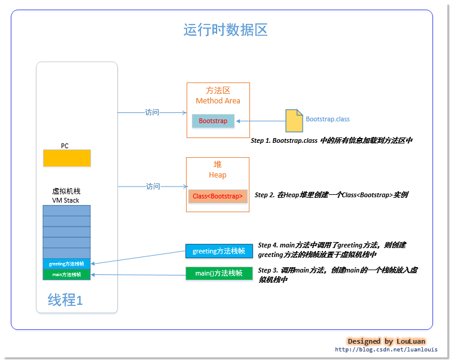  
    

JVM在编译Bootstrap.java 的过程中，在将源代码编译成二进制机器码的同时，会判断其中的每一个方法的三个信息：
1. 在运行时会使用到的局部变量的数量（当JVM为方法创建栈帧的时候，在栈帧中为该方法创建一个局部变量表，来存储方法指令在运算时的局部变量值）。
2. 其机器指令执行时所需要的最大的操作数栈的大小（当JVM为方法创建栈帧的时候，在栈帧中为方法创建一个操作数栈，保证方法内指令可以完成工作）。
3. 方法的参数的数量。
    
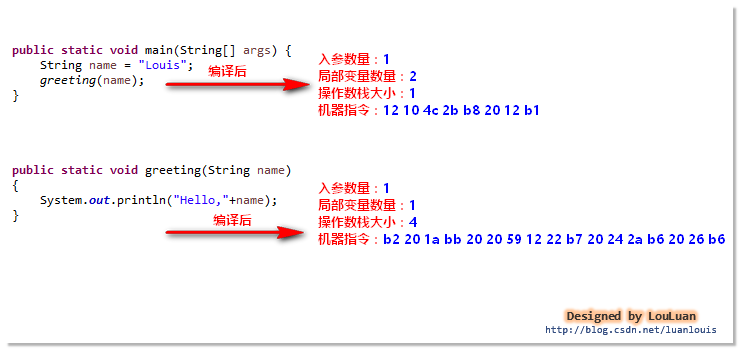  
    

# JVM运行main方法

## 为main方法创建栈帧
JVM解析main方法，发现其 局部变量的数量为 2，操作数栈的数量为1， 则会为main方法创建一个栈帧（VM Stack），并将其加入虚拟机栈中：    
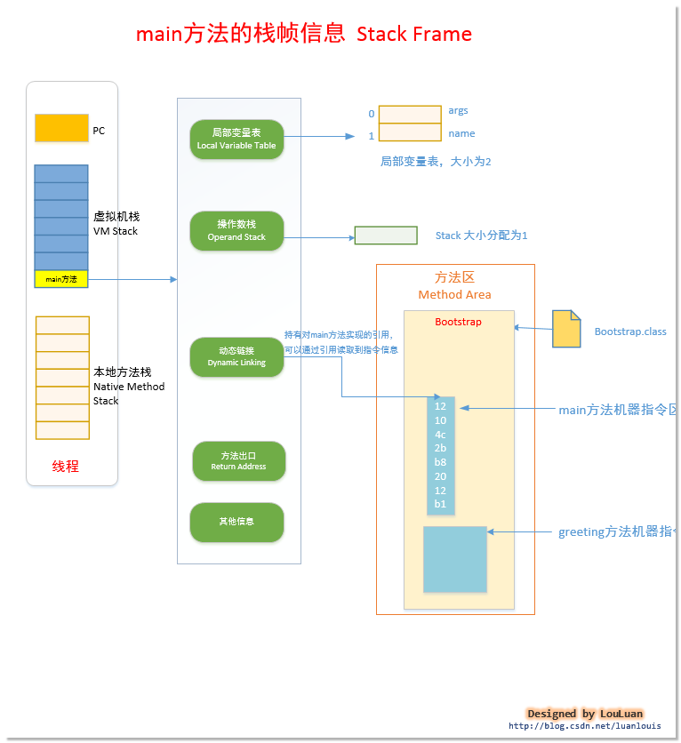  
    
## 完成栈帧初始化
main栈帧创建完成后，会将栈帧push 到虚拟机栈中，现在有两步重要的事情要做：
1. 计算PC值。PC是指令计数器，其内部的地址值决定了JVM虚拟机下一步应该执行的机器指令，而机器指令存放在方法区，我们需要让PC的值指向方法区的main方法上。初始化 PC = main方法在方法区指令的地址 + 0。

2. 局部变量的初始化。main方法有个入参(String[] args) ，JVM已经在main所在栈帧的局部变量表中为其空出来了一个slot，我们需要将 args 的引用值初始化到局部变量表中。
    
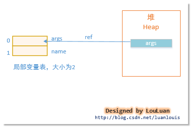  
    
接着JVM开始读取PC指向的机器指令。如上图所示，main方法的指令序列：12 10 4c 2b b8 20 12 b1 ，通过JVM虚拟机指令集规范，可以将这个指令序列解析成以下Java汇编语言：
    
| 机器指令 | 字节码 | 解释|
| :---: | :---: | :---:|
| 0x12 0x10 | ldc #16 | 将常量池中第16个常量池项引用推到操作数栈栈顶, 常量池第16项是CONSTANT_UTF-8_INFO项，表示字符串 Louis |
| 0x4c| astore_1 | 操作数栈的栈顶元素出栈，将栈顶元素的值赋给index = 1 的局部变量表slot上 , 等价于：name = "Louis" | 
| 0x2b | aload_1 | 将局部变量表中index = 1的slot的值推到操作数栈栈顶 |
| 0xb8 0x20 0x12 | invokestatic #18 | 0xb8表示机器指令invokestatic, 操作数0x12表示指向常量池第18项，该项是main方法的符号引用：Bootstrap.greeting:(Ljava/lang/String;)V |
| 0xb1 | return | 返回 |
    

invokestatic #18, 当JVM执行这条语句的时候，会做以下几件事：
1. 方法符号引用校验。校验这个方法的符号引用，在常量池中查找是否有这个方法的定义，如果找到了此方法的定义，则表示解析成功。如果方法greeting:(Ljava/lang/String;)V没有找到，JVM会抛出错误NoSuchMethodError。
2. 为新的方法调用创建新的栈帧。JVM会为此方法greeting创建一个新的栈帧(VM stack)，并根据greeting中操作数栈的大小和局部变量的数量分别创建相应大小的操作数栈和局部变量slot；然后将此栈帧推到虚拟机栈的栈顶。
3. 更新PC指令计数器的值。将当前PC程序计数器的值记录到greeting栈帧中，当greeting执行完成后，以便恢复PC值。更新PC的值，使下一条执行的指令地址指向greeting方法的指令开始部分。这条语句会使当前的main方法执行暂停，使JVM进入对greeting方法的执行当中，当greeting方法执行完成后，才会恢复PC程序计数器的值指向main的下一条指令。 
    

当main方法调用greeting()时， JVM会为greeting方法创建一个栈帧，用以表示对greeting方法的调用，具体栈帧信息如下：    
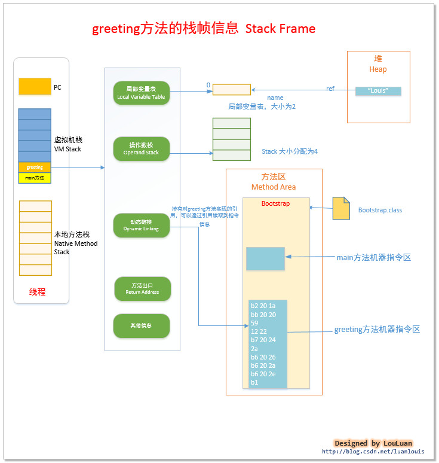  
    
greeting方法的机器码表示的含义：
    
| 机器指令 | 字节码 | 解释|
| :---: | :---: | :---:|
| b2 20 1a | getstatic #26 | 获取指定类的静态域，并将其值压入栈顶(java/lang/System.out:Ljava/io/PrintStream) | 
| bb 20 20 | new #32 | 创建一个对象，并将其引用值压入栈顶(java/lang/StringBuider) | 
| 59 | dup | 复制操作数栈栈顶的值，并插入到栈顶 | 
| 12 22 | ldc #34 | 从运行时常量池中提取数据推入操作数栈("Hello"引用复制到 操作数栈中) | 
| b7 20 24 | invokespecial #36 | 调用Method java/lang/StringBuilder."<init>":(Ljava/lang/String;)V构造方法，并将结果推到栈顶 |  
| 2a | aload_0 | 将第一个局部变量的引用推到栈顶。当前局部变量表的第一个局部变量引用是"Louis" | 
| b6 20 26 | invokevirtual #38 | 调用java/lang/StringBuilder.append:(Ljava/lang/String;)Ljava/lang/StringBuilder方法 | 
| b6 20 2a | invokevirtual #42 | 调用java/lang/StringBuilder.toString:()Ljava/lang/String方法 |  
| b6 20 2e | invokevirtual #46 | 调用java/io/PrintStream.println:(Ljava/lang/String;)V | 
| b1 | return | 结束返回 | 
    

栈帧信息的简化图：    
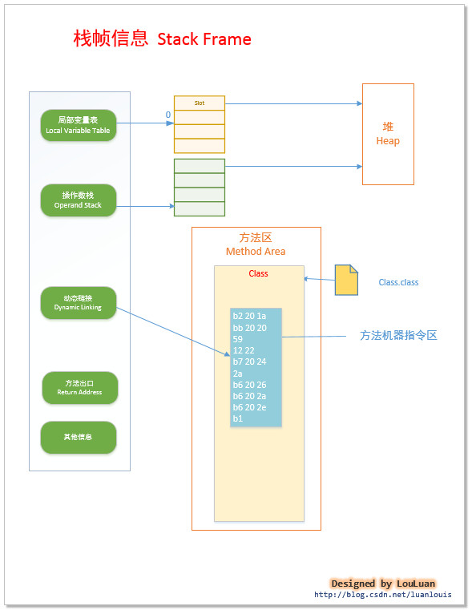  
    

## 机器指令的格式
所谓的机器指令，就是只有机器才能够认识的二进制代码。JVM虚拟机的操作码是由一个字节组成的，也就是说对于JVM虚拟机而言，其指令的数量最多为 2^8,即 256个。一个机器指令分为两部分组成：    
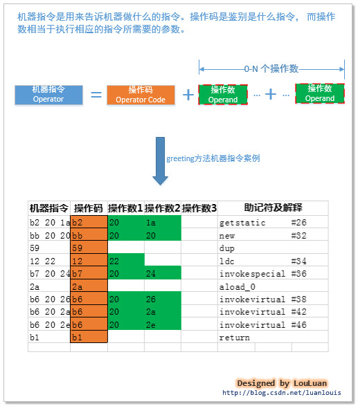  
    

## 机器指令的执行模式 - 基于操作数栈的模式
Java虚拟机使用操作数栈 来存储机器指令的运算过程中的值。所有的操作数的操作，都要遵循出栈和入栈的规则，所以在《Java虚拟机规范》中，你会发现有很多机器指令都是关于出栈入栈的操作。    
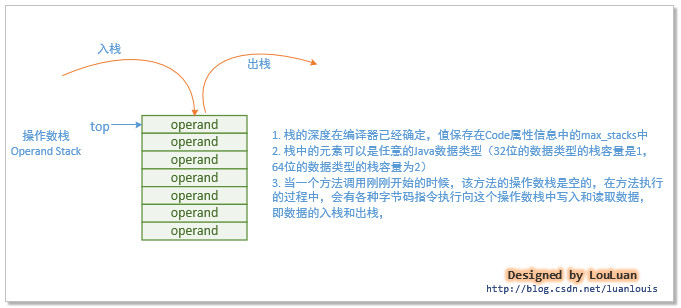  
    
    


# 常用指令集
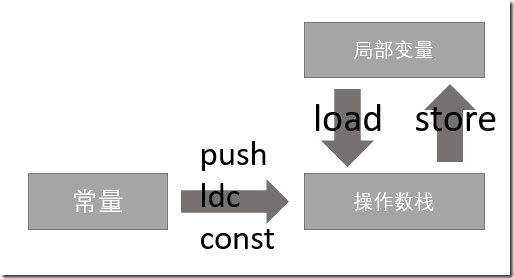 
    
## 常量入栈指令 const/push/ldc
```
const 把简单的数值类型送到栈顶，该系列命令不带参数（取值    -1~5 时，JVM采用const指令将常量压入栈中 ）。
push 把一个整型数字（长度比较小）送到到栈顶。有一个参数，用于指定要送到栈顶的数字。指令主要包括 bipush(操作数是byte)，sipush(操作数是short)。

对于const系列命令和push系列命令操作范围之外的数值类型常量，都放在常量池中，需要使用ldc指令。
ldc 把数值常量或String常量值从常量池中推送至栈顶，需要给一个表示常量在常量池中位置(编号)的参数。接收 8位参数（指向常量池中int/float/string的索引），ldc_w接收16位参数，ldw2_w接收的参数指向常量池long/double类型索引。 
```
    

## 局部变量压栈
```
xload_n(i,l,f,d,a)，n取值范围为(0-3)
xload(i,l,f,d,a) + slot索引
xaload(i,l,f,d,a,b,c,s)
```
    
括号内是x的可用类型范围。
    
x取值及操作数的类型含义：
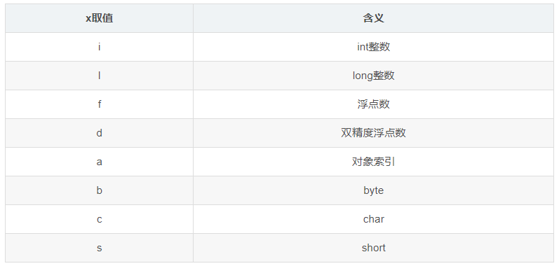  
    
```
xload_n 表示把第n个局部变量入栈。当局部变量数超过4个时，使用xload。
xload 表示把第n个局部变量入栈，这个指令要求栈顶元素是slot索引。
xaload 表示将数组元素入栈，这个指令要求栈顶元素是数组索引，栈顶第二元素是数组引用，在执行完后，会将a[i]入栈。
```
    

## 出栈并装入局部变量表
出栈装入局部变量表指令，将栈顶元素弹出，然后给局部变量表赋值。
    
```
xstore(i,f,l,d,a) + slot索引
xstore_n(i,f,l,d,a)，n取值范围为(0-3)
xastore(i,f,l,d,a,b,c,s) slot索引
```
    
xastore会弹出操作数栈的3个值：值、索引、引用，在执行完后，会栈顶的值存入a[i]。
    

## 通用型操作
```
NOP 表示什么都不做。 
dup 复制栈顶元素，并压入栈顶。
pop把元素从栈顶弹出，并直接废弃。
```
    

## 类型转换指令
```
x2y
x: i,f,l,d
y: i,f,l,d,c,s,b
```
   
在操作数栈上，没有 char / short / byte这三种类型，所以x没有它们。
   

## 运算指令
```
加法：iadd,ladd,fadd,dadd
减法：isub,lsub,fsub,dsub
乘法：imul同上
除法：idiv同上
取余：irem同上
取反：ineg同上
自增：iinc
```
    
位运算：
    
```
位移：ishl,ishr,iushr,ushl,lshr,lushr
位或：ior,lor
位与：iand,land
位异或：ixor,lxor
```
    
    
## 字段访问指令
```
getfield, putfield, getstatic, putstatic
```
    

## 数组/对象操作指令 
创建指令：
     
```
new 创建普通对象，接收一个操作数，指向常量池索引。执行完成后，将对象的引用入栈。
newarray 创建数组，会取出栈顶的数作为数组的大小。 
anewarray 创建对象数组，接收参数指向常量池类型。
multianewarray 创建多维数组，接收2个参数，第一个参数指向常量池类型，第二个参数表示数组维度。
```
    

## 类型检查指令 
```
checkcast 用于检查类型强制转换是否可以进行。 
instanceof 用来判断给定对象是否是一个类的实例，会将判断结果压入操作数栈。 
```

## 数组操作指令 
除了xastore,xaload指令，还有获取数组长度的arraylength指令，它弹出栈顶数组引用，将长度入栈。


## 比较控制指令
```
比较指令：比较栈顶两个元素的大小，并将比较结果入栈。比较指令有:dcmpg,dcmpl,fcmpg,fcmpl,lcmp。 
fcmpg遇到NAN，会压入1，fmpl会压入-1。


条件跳转指令：*ifeq,iflt,ifle, ifne,ifgt,ifge,ifnull,ifnonnull，这些指令都接收两个字节的操作数，用于计算跳转的位置。

比较条件跳转指令：将比较和跳转两个步骤合二为一，指令有if_icmpeq,if_icmpne,if_icmplt,if_icmpgt,if_icmple,if_icmpge,if_acmpeq,ifacmpne

多条件分支跳转：转为switch-case语句设计，主要有tableswitch和lookupswitch。 
case的值是连续的，则使用tableswitch，否则使用lookupswitch。

string作为case类型时，比较的是哈希值。

无条件跳转 
goto接收2个字节,goto_w接收4个字节。
```
    

## 函数调用与返回指令 
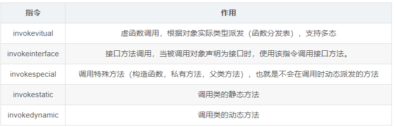  
    

## 同步控制 
monitorenter，monitorexit临界区进入和离开操作，访问当前对象的监视器的计数，如果为0，则可以进入，否则，看持有计数器的线程是否是当前线程，不是的话等待计数器降低到0。每个对象都有对应的监视器。
    
    