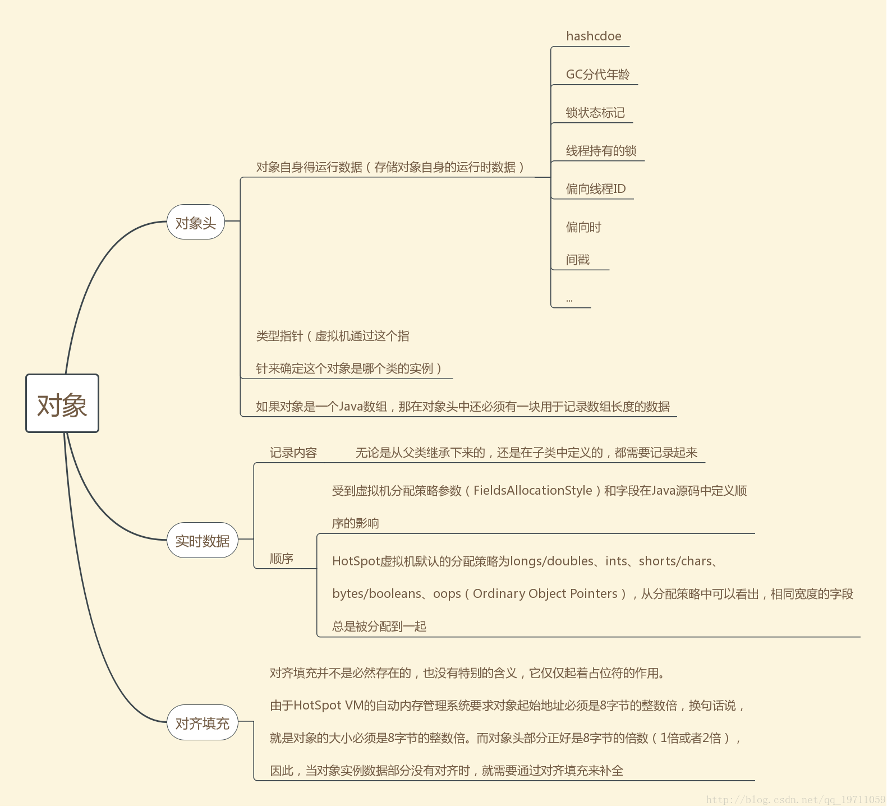

# java对象存储
  
    

# padding填充
由于HotSpot VM的自动内存管理系统要求对象起始地址必须是8byte的整数倍，换句话说，就是对象的大小必须是8字节的整数倍。而对象头(_mark、_oop)刚好是1倍(32位)或者2倍(64位)，因此当对象实例字段部分没有对齐时，就需要通过padding填充来对齐。
    
HotSpot虚拟机 默认的分配策略为：
- _mark / 8byte
- _oop / 8byte
- 超类基本类型，long/double -> int/float -> short/char -> byte/boolean
- padding
- 超类引用类型，Reference
- padding
- 子类基本类型，long/double -> int/float -> short/char -> byte/boolean
- padding
- 子类引用类型，Reference
    
从分配策略中可以看出，相同宽度的字段总是被分配到一起；其中基本类型字段和引用类型字段之间需要padding填充，使其与8byte的倍数对齐。
    
`long/double -> int/float -> short/char -> byte/boolean -> Reference`
    
这个顺序可以使用JVM参数:  -XX:FieldsAllocationSylte=0(默认是1)来改变。
    

# 需要填充的地方
- 对象头和基本类型之间(开启压缩指针时)

- 基本类型和引用之间

- 超类引用类型和子类基本类型之间
    

# 字段填充
在64位的HotSpot虚拟机中，对象头包括： _mark(8byte) 和  _oop(8byte)，其中_oop是对象的类型指针，在开启压缩指针的情况下，_oop和Reference只占用4byte。这个时候对象头是12byte就不是8byte的倍数，此时需要进行字段填充，需要优先使用 基本数据类型字段中的int/float -> short/char -> byte/boolean 进行填充，不够8byte的倍数部分使用padding填充；然后再按 long/double -> int/float -> short/char -> byte/boolean 的字段顺序排列。
   

# 字段填充开启的必要条件
- 通过命令行开启压缩指针：`-XX:+UseCompressedOops`

- 需要的padding >= 4 byte，如果小于4byte则直接使用padding

- 字段填充优先使用相邻的 int/float -> short/char -> byte/boolean 进行填充
    

## 普通对象的存储结构
- 对象头 _mark
- 对象头 _oop
- 超类基本类型填充(如果没有基本类型字段，也可使用引用类型字段填充)，int/float -> short/char -> byte/boolean
- padding(如果填充后没能跟8byte的倍数对齐，使用padding填充)
- 超类剩余基本类型，long/double -> int/float -> short/char -> byte/boolean
- padding
- 超类引用类型
- padding
- 子类基本类型
- padding
- 子类引用类型
- padding

    
```
static class S extends P {
    public long j;
    public short s;
    public byte b; 
    public P[] eArray = new P[3];
    E() {
        for (int i = 0; i < eArray.length; i++) {
            eArray[i] = new P();
        }
    }
}
static class P extends PP {
    public int iP;
    public byte bP;
    public B rP;
}
static class PP {
    public short sPP;
}
```
    
**-XX:+UseCompressedOops**:     
mark/8 + oop/4 + sPP/2 + padding/2 + iP/4 + bP/1 + padding/3 + rP/4 + s/2 + b/1 + padding/1 + j/8 + eArray/4 + padding/4 = 48 
    
**-XX:-UseCompressedOops**:     
mark/8 + oop/8 + sPP/2 + padding/6 + iP/4 + bP/1 + padding/3 + rP/4 + padding/4 + j/8 + s/2 + b/1 + padding/5 + eArray/4 + padding/4 = 64 
    

## 数组对象
- 对象头 _mark
- 对象头 _oop
- 数组长度 length(4字节)
- 数组元素（值、引用）
- padding
    
`new int[11])`
    
**-XX:+UseCompressedOops**:  
mark/8 + oop/4 + length/4 + data/44 + padding/4 = 64 
    
**-XX:-UseCompressedOops**:     
mark/8 + oop/8 + length/4 + data/44 = 64 
    

## 判断是否开启压缩指针
`unsafe.arrayIndexScale(Object[].class) == 8` 未开启
    
`unsafe.objectFieldOffset(Field f)` 判断字段在对象中的偏移量
    

# Java对象大小的计算方法
## Instrumentation.getObjectSize()
通过java.lang.instrument.Instrumentation的getObjectSize(obj)直接获取对象的大小（不计算所引用的对象的实际大小）：
- 定义一个类，提供一个premain方法：public static void premain(String agentArgs, Instrumentation instP)
- 创建META-INF/MANIFEST.MF文件，内容是指定PreMain的类是哪个：Premain-Class: com.asiainfo.insidejvm.MySizeOf
- 把这个类打成jar，然后用java -javaagent XXXX.jar MySizeExample的方式执行
    

## Unsafe.objectFieldOffset()
通过sun.misc.Unsafe对象的objectFieldOffset(field)等方法结合反射来计算对象的大小：
- 通过反射获得一个类的Field
- 通过Unsafe的objectFieldOffset()获得每个Field的offSet
- 对Field按照offset排序，取得最大的offset，然后加上这个field的长度，再加上Padding对齐
    

# 对象头_mark
对象头包含： hashCode、gc分代年龄、锁状态、持有锁的线程、偏向线程id    
  
    
锁状态标志位：    
  
    
