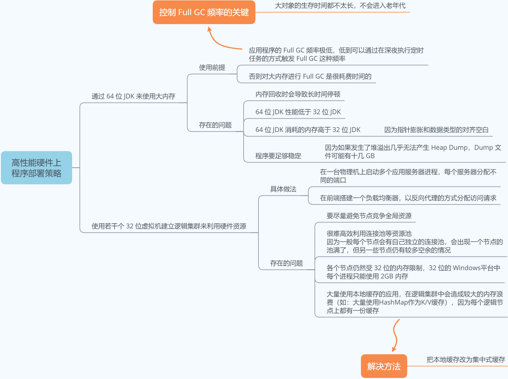

# 虚拟机调优
  
    
在 Java EE 方面，企业级应用经常需要使用超过 4GB 的内存，此时，32 位虚拟机将无法满足需求，可是 64 位虚拟机虽然可以设置更大的内存，却存在以下缺点：

- **内存问题**： 由于指针膨胀和各种数据类型对齐补白的原因，运行于 64 位系统上的 Java 应用程序需要消耗更多的内存，通常要比 32 位系统额外增加 10% ~ 30% 的内存消耗。
- **性能问题**： 64 位虚拟机的运行速度在各个测试项中几乎全面落后于 32 位虚拟机，两者大概有 15% 左右的性能差距。
    

## 服务系统经常出现卡顿（Full GC 时间太长）
首先 jstat -gcutil 观察 GC 的耗时，jstat -gccapacity 检查内存用量（也可以加上 -verbose:gc 参数获取 GC 的详细日志），发现卡顿是由于 Full GC 时间太长导致的，然后 jinfo -v pid，查看虚拟机参数设置，发现 -XX:NewRatio=9，这就是原因：

- 新生代太小，对象提前进入老年代，触发 Full GC
- 老年代较大，一次 Full GC 时间较长
    
可以调小 NewRatio 的值，尽可能让比较少的对象进入老年代。
    

## GC 调优角度解决新生代存活大量对象问题（Minor GC 时间太长）
将 Survivor 空间去除，让新生代中存活的对象在第一次 Minor GC 后立刻进入老年代，等到 Full GC 时再清理。
参数调整方法：
    
```
-XX:SurvivorRatio=65536
-XX:MaxTenuringThreshold=0
-XX:AlwaysTenure
```
    
## JVM内存调优
对JVM内存的系统级的调优主要的目的是减少Young GC的频率和Full GC的次数，过多的Young GC和Full GC是会占用很多的系统资源（主要是CPU），影响系统的吞吐量。

- 尽量让对象在新生代GC时被回收
- 控制好新生代和旧生代的比例
    - 新生代设置过小, Young GC次数非常频繁，增大系统消耗；二是导致大对象直接进入旧生代，占据了旧生代剩余空间，诱发Full GC
    - 新生代设置过大, 导致旧生代过小（堆总量一定），从而诱发Full GC；二是young GC耗时大幅度增加
    - Survivor设置过小, 导致对象从eden直接到达旧生代，降低了在新生代的存活时间
    - Survivor设置过大, 导致eden过小，增加了young GC频率
- 吞吐量优先, JVM以吞吐量为指标，自行选择相应的GC策略及控制新生代与旧生代的大小比例，来达到吞吐量指标。可由-XX:GCTimeRatio=n来设置
- 暂停时间优先, 尽量保证每次GC造成的应用停止时间都在指定的数值范围内完成。可由-XX:MaxGCPauseRatio=n来设置
    


# JVM 常见参数设置

## 内存设置
```
-Xms    初始堆大小，JVM 启动的时候，给定堆空间大小。此值可以设置与-Xmx相同，以避免每次垃圾回收完成后JVM重新分配内存。
-Xmx    最大堆大小，如果初始堆空间不足的时候，最大可以扩展到多少。
-Xss    设置每个线程的栈大小。JDK 5 后每个线程 Java 栈大小为 1M。在相同物理内存下，减小这个值能生成更多的线程。但是操作系统对一个进程内的线程数还是有限制的，不能无限生成，经验值在 3000~5000 左右。
-Xmn    设置年轻代大小。整个堆大小 = 年轻代大小 + 年老代大小 + 永久代大小。永久代一般固定大小为 64M，所以增大年轻代后，将会减小年老代大小。此值关系到JVM垃圾回收，对系统性能影响较大，官方推荐配置为整个堆大小的3/8。

-XX:NewRatio=n      年轻代与老年代的比率，如 –XX:NewRatio=2，则年轻代占整个堆空间的1/3，老年代占2/3
-XX:NewSize         初始时年轻代内存。通常为 Xmx 的 1/3 或 1/4。年轻代 = Eden + 2个 Survivor。实际可用空间为 = Eden + 1个Survivor，即 90%
-XX:MaxNewSize      最大年轻代内存(Eden + 2个Survivor)
-XX:SurvivorRatio=n 年轻代中 Eden 与 Survivor 的比值。默认值为 8。即 Eden 占新生代空间的 8/10，另外两个 Survivor 各占 1/10
-XX:MaxTenuringThreshold 设置垃圾最大年龄。如果设置为 0的话，则年轻代对象不经过 Survivor 区，直接进入年老代。对于年老代比较多的应用（即 Minor GC 过后有大量对象存活的应用），可以提高效率。如果将此值设置为一个较大值，则年轻代对象会在 Survivor 区进行多次复制，这样可以增加对象再年轻代的存活时间，增加在年轻代即被回收的概率。从eden -> suvivor时 年龄加1，默认15岁移到老年代。

-XX:PermSize         初始时持久代内存
-XX:MaxPermSize      最大持久代内存，jdk8后移到Metaspace中
-XX:MetaspaceSize    设置Metaspace的初始内存
-XX:MaxMetaspaceSize 设置Metaspace的最大内存
```
    
-Xmn，-XX:NewSize/-XX:MaxNewSize，-XX:NewRatio 3组参数都可以影响年轻代的大小，混合使用的情况下，优先级是什么？
    
- 高优先级：`-XX:NewSize/-XX:MaxNewSize`
- 中优先级：`-Xmn（等价于 -XX:NewSize -XX:MaxNewSize）`
- 低优先级：`-XX:NewRatio`
    
推荐使用-Xmn参数，原因是这个参数简洁，相当于一次设定 `NewSize/MaxNewSIze`，而且两者效果相同，适用于生产环境。 
    
    
### 设置经验
开发过程的测试应用，要求物理内存大于 4G
    
```
-Xmx3550m
-Xms3550m 
-Xmn2g
-Xss128k
```
    
高并发本地测试使用，大对象相对较多（如 IO 流）
    
```
-Xmx3550m
-Xms3550m
-Xss128k
-XX:NewRatio=4
-XX:SurvivorRatio=4
-XX:MaxTenuringThreshold=0
```
    

环境： 16G 物理内存，高并发服务，重量级对象中等（线程池，连接池等），常用对象比例为 40%（即运行过程中产生的对象 40% 是生命周期较长的）
    
```
-Xmx10G
-Xms10G
-Xss1M
-XX:NewRatio=3
-XX:SurvivorRatio=4 
-XX:MaxTenuringThreshold=5
```
    

## 收集器设置
JVM给出了3种选择：串行收集器、并行收集器、并发收集器。串行收集器只适用于小数据量的情况，所以生产环境的选择主要是并行收集器和并发收集器。默认情况下JDK5.0以前都是使用串行收集器，JDK5.0以后，JVM会根据当前系统配置进行智能判断。
    
```
-XX:+PrintGC                 打印 GC 信息
-XX:+PrintGCDetails

# 串行收集器
-XX:+UseSerialGC    串行收集器。

# 并行收集器（吞吐量优先）
-XX:+UseParallelGC  仅对年轻代有效。即年轻代使用并行收集，而年老代仍使用串行收集。
-XX:+UseParallelOldGC       年老代垃圾收集方式为并行收集。JDK6.0开始支持对年老代并行收集。
-XX:ParallelGCThreads=n     配置并行收集器的线程数，即：同时有多少个线程一起进行垃圾回收。此值建议配置与CPU数目相等。
-XX:MaxGCPauseMillis=n      每次年轻代垃圾回收Young GC的最长时间（单位毫秒）。如果无法满足此时间，JVM会自动调整年轻代大小，以满足此时间。
-XX:+UseAdaptiveSizePolicy  并行收集器会自动调整年轻代Eden区大小和Survivor区大小的比例，以达成目标系统规定的最低响应时间或者收集频率等指标。此参数建议在使用并行收集器时，一直打开。
-XX:GCTimeRatio=n           垃圾回收时间占程序运行时间的百分比。公式为1/(1+n)。

# 并发收集器（响应时间优先）
-XX:+UseConcMarkSweepGC     使用CMS，设置年老代为并发收集。CMS是JDK1.4后期版本开始引入的新GC算法。它的主要适合场景是对响应时间的重要性需求大于对吞吐量的需求。CMS收集的目标是尽量减少应用的暂停时间，减少Full GC发生的几率，利用和应用程序线程并发的垃圾回收线程来标记清除年老代内存。
-XX:+UseParNewGC：                            年轻代为并发收集。可与CMS收集同时使用。JDK5.0以上，JVM会根据系统配置自行设置，所以无需再设置此参数。
-XX:CMSFullGCsBeforeCompaction=n    由于 CMS不对内存空间进行压缩、整理，所以运行一段时间以后会产生"碎片"，使得运行效率降低。此值设置运行多少次 Full GC 以后对内存空间进行压缩、整理。如果设为0，则每次Full GC后立刻开始压缩和整理内存。
-XX:+UseCMSCompactAtFullCollection  打开对年老代的压缩、整理。可能会影响性能，但是可以消除碎片。
-XX:CMSInitiatingOccupancyFraction=70   年老代内存空间使用到70%时就开始执行CMS收集，以确保年老代有足够的空间接纳来自年轻代的对象，避免Full GC的发生。

-XX:-PrintGC                每次GC时打印相关信息。
-XX:-PrintGCDetails         每次GC时打印详细信息。
-XX:-PrintGCTimeStamps      打印每次GC的时间戳。
-XX:-TraceClassLoading      跟踪类的加载信息。
-XX:-TraceClassLoadingPreorder  跟踪被引用到的所有类的加载信息。
-XX:-TraceClassResolution       跟踪常量池。
-XX:-TraceClassUnloading        跟踪类的卸载信息。
```
    
  
    