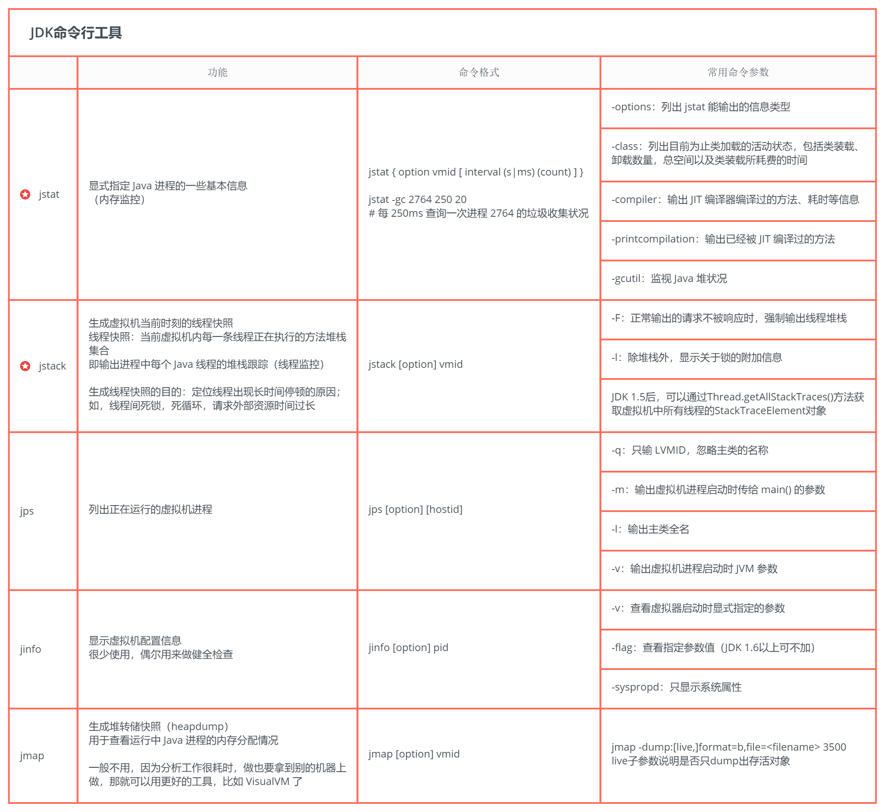
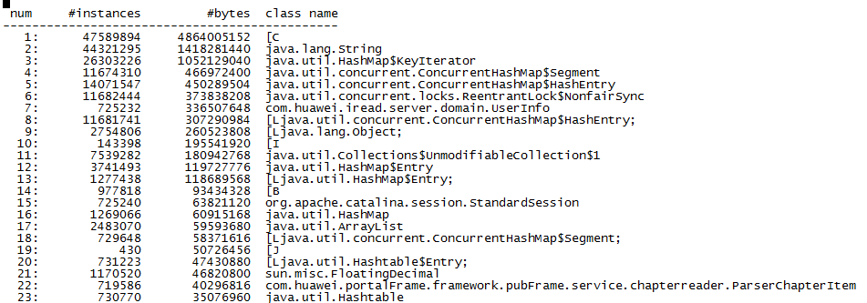
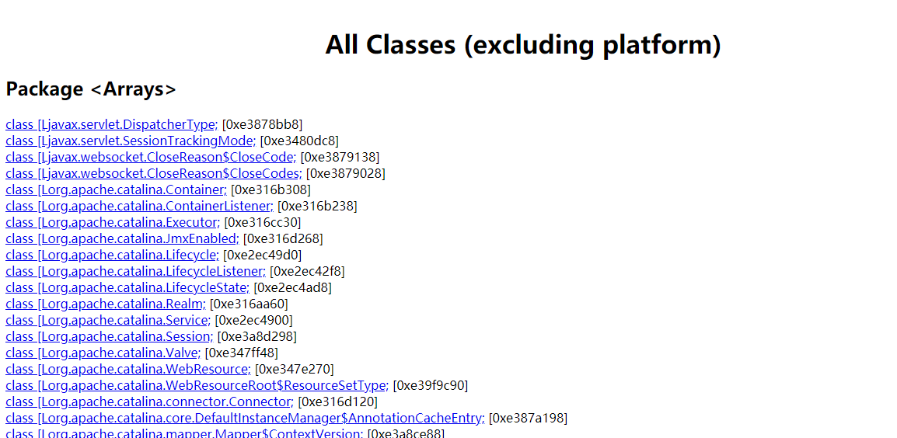
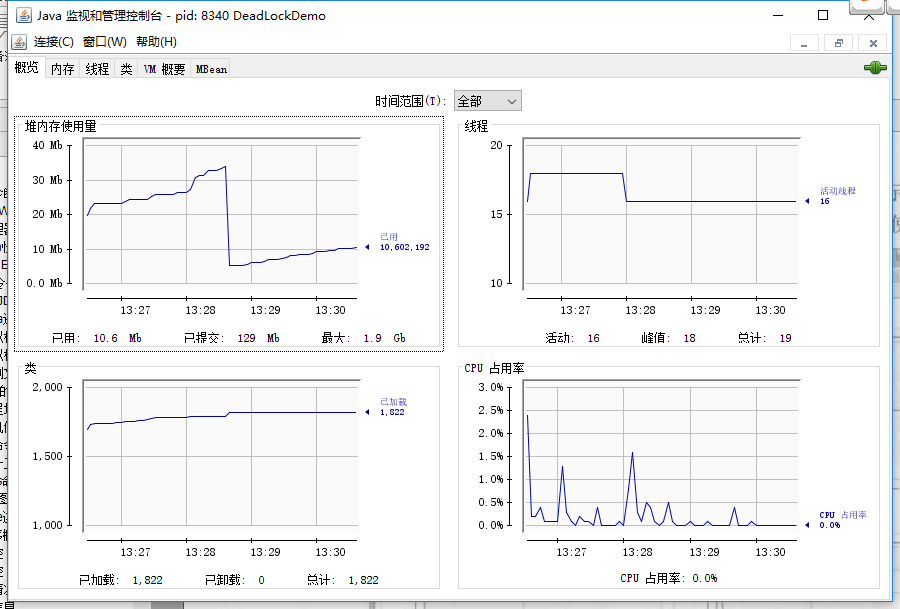

# 命令行工具及命令
在JDK的bin目录下有很多命令行工具，这些工具大多数是jdk\lib\tools.jar类库的一层包装而已，他们的主要功能代码是在tools类库中实现的。
    
  
    
## jps: 查看所有 Java 进程
jps(JVM Process Status) 命令类似 UNIX 的 ps 命令。
    
`jps`：显示虚拟机执行主类名称以及这些进程的本地虚拟机唯一 ID（Local Virtual Machine Identifier, LVMID）。

`jps -l`：输出主类的全限定名称，如果进程执行的是 Jar 包，输出 Jar 路径。
    
```
[root@localhost apache-tomcat-8.5.35]# jps -l
10432 org.apache.catalina.startup.Bootstrap
10458 sun.tools.jps.Jps
```
    
`jps -v`：输出虚拟机进程启动时 JVM 参数。
    
```
[root@localhost apache-tomcat-8.5.35]# jps -v
10432 Bootstrap -Djava.util.logging.config.file=/usr/local/workspace/apache-tomcat-8.5.35/conf/logging.properties -Djava.util.logging.manager=org.apache.juli.ClassLoaderLogManager -Djdk.tls.ephemeralDHKeySize=2048 -Djava.protocol.handler.pkgs=org.apache.catalina.webresources -Dorg.apache.catalina.security.SecurityListener.UMASK=0027 -Dcatalina.base=/usr/local/workspace/apache-tomcat-8.5.35 -Dcatalina.home=/usr/local/workspace/apache-tomcat-8.5.35 -Djava.io.tmpdir=/usr/local/workspace/apache-tomcat-8.5.35/temp
10525 Jps -Denv.class.path=/usr/local/java/jdk1.8.0_151/lib -Dapplication.home=/usr/local/java/jdk1.8.0_151 -Xms8m
```
    
`jps -m`：输出传递给 Java 进程 main() 函数的参数。

```
[root@localhost apache-tomcat-8.5.35]# jps -m
10432 Bootstrap start
10545 Jps -m
```
   
linux 进程命令：
   
```
ps aux  # 列出所有进程的信息
ps aux | grep java
ps -ef # 显示所有进程信息，连同命令行
ps -ef | grep java
```
    

## jstat: 监视虚拟机各种运行状态信息
jstat（JVM Statistics Monitoring Tool） 使用于监视虚拟机各种运行状态信息的命令行工具。 它可以显示本地或者远程（需要远程主机提供 RMI 支持）虚拟机进程中的类信息、内存、垃圾收集、JIT 编译等运行数据，在没有 GUI，只提供了纯文本控制台环境的服务器上，它将是运行期间定位虚拟机性能问题的首选工具。
    
**jstat 命令使用格式**：`jstat -<option> [-t] [-h<lines>] <vmid> [<interval> [<count>]]`
    
**常见的 option 如下**：
- `jstat -class vmid`：显示 ClassLoader 的相关信息；
- `jstat -compiler vmid`：显示 JIT 编译的相关信息；
- `jstat -gc vmid`：显示与 GC 相关的堆信息；
- `jstat -gccapacity vmid`：显示各个代的容量及使用情况；
- `jstat -gcnew vmid`：显示新生代信息；
- `jstat -gcnewcapcacity vmid`：显示新生代大小与使用情况；
- `jstat -gcold vmid`：显示老年代和永久代的信息；
- `jstat -gcoldcapacity vmid`：显示老年代的大小；
- `jstat -gcpermcapacity vmid`：显示永久代大小；
- `jstat -gcutil vmid`：显示垃圾收集信息；
- `interval`：间隔时间，单位为毫秒
- `count`：打印次数
    
分析进程 id 为 10432 的 gc 情况，每隔 1000ms 打印一次记录，打印 5 次停止:
    
```
[root@localhost apache-tomcat-8.5.35]# jstat -gc 10432 1000 5
 S0C    S1C    S0U    S1U      EC       EU        OC         OU       MC     MU    CCSC   CCSU   YGC     YGCT    FGC    FGCT     GCT   
1472.0 1472.0 1462.0  0.0   12032.0   6416.0   30080.0    13547.8   16512.0 16006.3 1920.0 1822.0      6    0.099   0      0.000    0.099
1472.0 1472.0 1462.0  0.0   12032.0   6416.0   30080.0    13547.8   16512.0 16006.3 1920.0 1822.0      6    0.099   0      0.000    0.099
1472.0 1472.0 1462.0  0.0   12032.0   6459.3   30080.0    13547.8   16512.0 16006.3 1920.0 1822.0      6    0.099   0      0.000    0.099
1472.0 1472.0 1462.0  0.0   12032.0   6459.3   30080.0    13547.8   16512.0 16006.3 1920.0 1822.0      6    0.099   0      0.000    0.099
1472.0 1472.0 1462.0  0.0   12032.0   6459.3   30080.0    13547.8   16512.0 16006.3 1920.0 1822.0      6    0.099   0      0.000    0.099
```
    
显示项含义：
    
```
S0C:年轻代第一个survivor的容量（字节）
S0U：年轻代第一个survivor已使用的空间（字节）
S1C：年轻代第二个survivor的容量（字节）
S1U：年轻代第二个survivor已使用的空间（字节）
EC：年轻代中Eden的容量（字节）
EU：年代代中Eden已使用的空间（字节）
OC：老年代的容量（字节）
OU: 老年代中已使用的空间（字节）
PC：永久代的容量
PU：永久代已使用的容量
MC: metaspace容量
MU: metaspace已使用空间
YGC：从应用程序启动到采样时年轻代中GC的次数
YGCT: 从应用程序启动到采样时年轻代中GC所使用的时间（单位：S）
FGC：从应用程序启动到采样时老年代中GC（FULL GC）的次数
FGCT：从应用程序启动到采样时老年代中GC所使用的时间（单位：S）
```
    
最常用的参数就是 -gcutil，使用格式如下：`jstat -gcutil [pid] [intervel] [count]`
    
```
S0：堆上 Survivor space 0 区已使用空间的百分比
S1：堆上 Survivor space 1 区已使用空间的百分比
E：堆上 Eden 区已使用空间的百分比
O：堆上 Old space 区已使用空间的百分比
P：堆上 Perm space 区已使用空间的百分比
YGC：从程序启动到采样时发生的 Minor GC 次数
YGCT：从程序启动到采样时 Minor GC 所用的时间
FGC：从程序启动到采样时发生的 Full GC 次数
FGCT：从程序启动到采样时 Full GC 所用的时间
GCT：从程序启动到采样时 GC 的总时间
```
    

## jinfo: 实时地查看和调整虚拟机各项参数
jinfo 可以用来查看正在运行的java运用程序的各种参数，甚至支持在运行时动态地更改部分参数。
    
`jinfo vmid`: 输出当前 jvm 进程的全部参数和系统属性 (第一部分是系统的属性，第二部分是 JVM 的参数)。
   
```
[root@localhost apache-tomcat-8.5.35]# jinfo 10432
......

VM Flags:
Non-default VM flags: -XX:CICompilerCount=2 -XX:InitialHeapSize=46137344 -XX:MaxHeapSize=734003200 -XX:MaxNewSize=244645888 -XX:MinHeapDeltaBytes=196608 -XX:NewSize=15335424 -XX:OldSize=30801920 -XX:+UseCompressedClassPointers -XX:+UseCompressedOops -XX:+UseFastUnorderedTimeStamps 
Command line:  -Djava.util.logging.config.file=/usr/local/workspace/apache-tomcat-8.5.35/conf/logging.properties -Djava.util.logging.manager=org.apache.juli.ClassLoaderLogManager -Djdk.tls.ephemeralDHKeySize=2048 -Djava.protocol.handler.pkgs=org.apache.catalina.webresources -Dorg.apache.catalina.security.SecurityListener.UMASK=0027 -Dignore.endorsed.dirs= -Dcatalina.base=/usr/local/workspace/apache-tomcat-8.5.35 -Dcatalina.home=/usr/local/workspace/apache-tomcat-8.5.35 -Djava.io.tmpdir=/usr/local/workspace/apache-tomcat-8.5.35/temp
```
   
`jinfo -flag name vmid`: 输出对应名称的参数的具体值。
    
```
[root@localhost apache-tomcat-8.5.35]# jinfo -flag MaxNewSize 10432 
-XX:MaxNewSize=244645888
[root@localhost apache-tomcat-8.5.35]# jinfo -flag PrintGC 10432            
-XX:-PrintGC
```
    
使用 jinfo 可以在不重启虚拟机的情况下，可以动态的修改 jvm 的参数。尤其在线上的环境特别有用。
    
`jinfo -flag [+|-]name vmid` 开启或者关闭对应名称的参数。
    
```
[root@localhost apache-tomcat-8.5.35]# jinfo -flag PrintGC 10432            
-XX:-PrintGC
[root@localhost apache-tomcat-8.5.35]# jinfo -flag +PrintGC 10432
[root@localhost apache-tomcat-8.5.35]# jinfo -flag PrintGC 10432 
-XX:+PrintGC
```
    

## jstack :生成虚拟机当前时刻的线程快照
jstack（Stack Trace for Java）命令用于生成虚拟机当前时刻的线程快照。线程快照就是当前虚拟机内每一条线程正在执行的方法堆栈的集合。
    
生成线程快照的目的主要是定位线程长时间出现停顿的原因，如线程间死锁、死循环、请求外部资源导致的长时间等待等都是导致线程长时间停顿的原因。线程出现停顿的时候通过jstack来查看各个线程的调用堆栈，就可以知道没有响应的线程到底在后台做些什么事情，或者在等待些什么资源。
    
下面是一个线程死锁的代码。我们下面会通过 jstack 命令进行死锁检查，输出死锁信息，找到发生死锁的线程。
    
```
public class DeadLockDemo {
    private static Object resource1 = new Object();//资源 1
    private static Object resource2 = new Object();//资源 2

    public static void main(String[] args) {
        new Thread(() -> {
            synchronized (resource1) {
                System.out.println(Thread.currentThread() + "get resource1");
                try {
                    Thread.sleep(1000);
                } catch (InterruptedException e) {
                    e.printStackTrace();
                }
                System.out.println(Thread.currentThread() + "waiting get resource2");
                synchronized (resource2) {
                    System.out.println(Thread.currentThread() + "get resource2");
                }
            }
        }, "线程 1").start();

        new Thread(() -> {
            synchronized (resource2) {
                System.out.println(Thread.currentThread() + "get resource2");
                try {
                    Thread.sleep(1000);
                } catch (InterruptedException e) {
                    e.printStackTrace();
                }
                System.out.println(Thread.currentThread() + "waiting get resource1");
                synchronized (resource1) {
                    System.out.println(Thread.currentThread() + "get resource1");
                }
            }
        }, "线程 2").start();
    }
}
```
    
线程 A 通过 synchronized (resource1) 获得 resource1 的监视器锁，然后通过 Thread.sleep(1000);让线程 A 休眠 1s 为的是让线程 B 得到执行然后获取到 resource2 的监视器锁。线程 A 和线程 B 休眠结束了都开始企图请求获取对方的资源，然后这两个线程就会陷入互相等待的状态，这也就产生了死锁。
    
```
[root@localhost workspace]# jstack 9256
......

Found one Java-level deadlock:
=============================
"线程 2":
  waiting to lock monitor 0x000000000333e668 (object 0x00000000d5efe1c0, a java.lang.Object),
  which is held by "线程 1"
"线程 1":
  waiting to lock monitor 0x000000000333be88 (object 0x00000000d5efe1d0, a java.lang.Object),
  which is held by "线程 2"

Java stack information for the threads listed above:
===================================================
"线程 2":
        at DeadLockDemo.lambda$main$1(DeadLockDemo.java:31)
        - waiting to lock <0x00000000d5efe1c0> (a java.lang.Object)
        - locked <0x00000000d5efe1d0> (a java.lang.Object)
        at DeadLockDemo$$Lambda$2/1078694789.run(Unknown Source)
        at java.lang.Thread.run(Thread.java:748)
"线程 1":
        at DeadLockDemo.lambda$main$0(DeadLockDemo.java:16)
        - waiting to lock <0x00000000d5efe1d0> (a java.lang.Object)
        - locked <0x00000000d5efe1c0> (a java.lang.Object)
        at DeadLockDemo$$Lambda$1/1324119927.run(Unknown Source)
        at java.lang.Thread.run(Thread.java:748)

Found 1 deadlock.
```
   
可以看到 jstack 命令已经帮我们找到发生死锁的线程的具体信息。
   

## jmap:生成堆转储快照
jmap（Memory Map for Java）命令用于生成堆转储快照。 如果不使用 jmap 命令，要想获取 Java 堆转储，可以使用 “-XX:+HeapDumpOnOutOfMemoryError” 参数，可以让虚拟机在 OOM 异常出现之后自动生成 dump 文件，Linux下可以通过 kill -3 发送进程退出信号也能拿到 dump 文件。
    
jmap 的作用并不仅仅是为了获取 dump 文件，它还可以查询 finalizer 执行队列、Java 堆和永久代的详细信息，如空间使用率、当前使用的是哪种收集器等。
    
`jmap -heap pid`：查看堆使用情况。
    
```
[root@localhost workspace]# jmap -heap 10432
Attaching to process ID 10432, please wait...
Debugger attached successfully.
Server compiler detected.
JVM version is 25.151-b12

using thread-local object allocation.
Mark Sweep Compact GC

Heap Configuration:                                     // 堆内存初始配置
   MinHeapFreeRatio         = 40                        // 堆最小空闲比率
   MaxHeapFreeRatio         = 70                        // 堆最大空闲比率
   MaxHeapSize              = 734003200 (700.0MB)       // 堆最大大小
   NewSize                  = 15335424 (14.625MB)       // 新生代默认大小
   MaxNewSize               = 244645888 (233.3125MB)    // 新生代最大大小
   OldSize                  = 30801920 (29.375MB)       // 老年代默认大小
   NewRatio                 = 2                         // 年轻代与老年代的比率，如 –XX:NewRatio=2，则年轻代占整个堆空间的1/3，老年代占2/3
   SurvivorRatio            = 8                         // 年轻代 Eden 与 Survivor 的比率。默认值为 8。即 Eden 占 8/10，两个 Survivor各占 1/10
   MetaspaceSize            = 21807104 (20.796875MB)    // Metaspace的初始内存
   CompressedClassSpaceSize = 1073741824 (1024.0MB)     
   MaxMetaspaceSize         = 17592186044415 MB         // Metaspace的最大内存
   G1HeapRegionSize         = 0 (0.0MB)

Heap Usage:                                     // 堆使用情况
New Generation (Eden + 1 Survivor Space):       // 新生代
   capacity = 13828096 (13.1875MB)
   used     = 6920832 (6.6002197265625MB)
   free     = 6907264 (6.5872802734375MB)
   50.049059537914694% used
Eden Space:                                     // eden的内存使用情况
   capacity = 12320768 (11.75MB)
   used     = 6904128 (6.58428955078125MB)
   free     = 5416640 (5.16571044921875MB)
   56.036506815159576% used
From Space:                                     // from Survivor的内存使用情况
   capacity = 1507328 (1.4375MB)
   used     = 16704 (0.01593017578125MB)
   free     = 1490624 (1.42156982421875MB)
   1.108186141304348% used
To Space:                                       // to Survivor的内存使用情况
   capacity = 1507328 (1.4375MB)
   used     = 0 (0.0MB)
   free     = 1507328 (1.4375MB)
   0.0% used
tenured generation:                             // 老年代
   capacity = 30801920 (29.375MB)
   used     = 14798752 (14.113189697265625MB)
   free     = 16003168 (15.261810302734375MB)
   48.044901097074465% used

11975 interned Strings occupying 1722832 bytes. // 字符串池
```
    
`jmap -histo pid`：查看堆中对象数量和大小。
    
  
    
打印的信息分别是：序列号、Class实例的数量、内存的占用、类限定名。
    
如果是内部类，类名的开头会加上*，如果加上live子参数的话，如jmap -histo：live pid，这个命名会触发一次FUll GC，只统计存活对象。
    

`jmap -dump:format=b,file=heap.dump 10432`：生成堆快照文件，可以通过 jhat、Visual VM 等工具分析该堆文件。
    


## jhat: 分析 heapdump 文件
jhat 用于分析 heapdump 文件，它会建立一个 HTTP/HTML 服务器，让用户可以在浏览器上查看分析结果。
    
默认端口7000，可以使用 -port 指定端口：
    
```
[root@localhost workspace]# jhat -port 8081 heap.dump
Reading from heap.dump...
Dump file created Thu Jun 20 11:40:14 CST 2019
Snapshot read, resolving...
Resolving 233943 objects...
Chasing references, expect 46 dots..............................................
Eliminating duplicate references..............................................
Snapshot resolved.
Started HTTP server on port 8081
Server is ready.
```
    
`http://localhost:8081`
    
  
    

## jcmd
在JDK 1.7之后，新增了一个命令行工具jcmd。它是一个多功能工具，可以用来导出堆，查看java进程，导出线程信息，执行GC等。jcmd拥有jmap的大部分功能，Oracle官方建议使用jcmd代替jmap。
    

```
[root@localhost workspace]# jcmd -l
10432 org.apache.catalina.startup.Bootstrap start
11092 sun.tools.jcmd.JCmd -l
```
   
针对每一个虚拟机，可以使用help命令列出该虚拟机支持的所有命令 `jcmd pid cmd`。
   
````
[root@localhost workspace]# jcmd 10432 help
10432:
The following commands are available:
JFR.stop
JFR.start
JFR.dump
JFR.check
VM.native_memory
VM.check_commercial_features
VM.unlock_commercial_features
ManagementAgent.stop
ManagementAgent.start_local
ManagementAgent.start
GC.rotate_log
Thread.print                // 打印线程栈信息
GC.class_stats              // 查看系统中类统计信息
GC.class_histogram
GC.heap_dump                // 导出堆信息，与jmap -dump功能一样
GC.run_finalization         // 触发finalize()
GC.run                      // 触发gc()
VM.uptime                   // VM启动时间
VM.flags                    // 获取JVM启动参数
VM.system_properties        // 获取系统Properties
VM.command_line             // 启动时命令行指定的参数
VM.version
help

For more information about a specific command use 'help <command>'.
```
    


# 图像化工具远程连接


## JConsole:Java 监视与管理控制台
JConsole 是基于 JMX 的可视化监视、管理工具。可以很方便的监视本地及远程服务器的 java 进程的内存使用情况。你可以在控制台输出console命令启动或者在 JDK 目录下的 bin 目录找到jconsole.exe然后双击启动。
    
### 连接 Jconsole    
  
    
如果需要使用 JConsole 连接远程进程，可以在远程 Java 程序启动时加上下面这些参数:
    
```
-Djava.rmi.server.hostname=192.168.0.102    // 外网ip地址 
-Dcom.sun.management.jmxremote.port=60001   // 监控的端口号
-Dcom.sun.management.jmxremote.authenticate=false   //关闭认证
-Dcom.sun.management.jmxremote.ssl=false
```
    
在使用 JConsole 连接时，远程进程地址如下：`192.168.0.102:60001`
    
查看 Java 程序概况    
  
    
### 内存监控
JConsole 可以显示当前内存的详细信息。不仅包括堆内存/非堆内存的整体信息，还可以细化到 eden 区、survivor 区等的使用情况，如下图所示。    
  
    
点击右边的“执行 GC(G)”按钮可以强制应用程序执行一个 Full GC。
    
### 线程监控
类似jstack 命令，不过这个是可视化的。最下面有一个"检测死锁 (D)"按钮，点击这个按钮可以自动为你找到发生死锁的线程以及它们的详细信息 。    
  
    
    

## Visual VM:多合一故障处理工具
VisualVM 提供在 Java 虚拟机 (Java Virutal Machine, JVM) 上运行的 Java 应用程序的详细信息。在 VisualVM 的图形用户界面中，您可以方便、快捷地查看多个 Java 应用程序的相关信息。
    
VisualVM（All-in-One Java Troubleshooting Tool）是到目前为止随 JDK 发布的功能最强大的运行监视和故障处理程序，官方在 VisualVM 的软件说明中写上了“All-in-One”的描述字样，预示着他除了运行监视、故障处理外，还提供了很多其他方面的功能，如性能分析（Profiling）。
    
VisualVM 基于 NetBeans 平台开发，因此他一开始就具备了插件扩展功能的特性，通过插件扩展支持，VisualVM 可以做到：
- 显示虚拟机进程以及进程的配置、环境信息（jps、jinfo）。
- 监视应用程序的 CPU、GC、堆、方法区以及线程的信息（jstat、jstack）。
- dump 以及分析堆转储快照（jmap、jhat）。
- 方法级的程序运行性能分析，找到被调用最多、运行时间最长的方法。
- 离线程序快照：收集程序的运行时配置、线程 dump、内存 dump 等信息建立一个快照，可以将快照发送开发者处进行 Bug 反馈。
    
