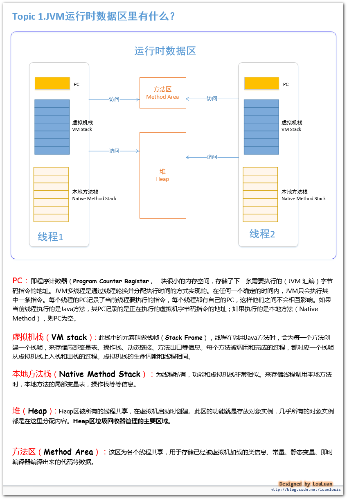

# 运行时数据区
JVM运行时数据区其实就是指JVM在运行期间，其对计算机内存空间的划分和分配。
  
    
## 虚拟机栈
  
    

## 栈帧
栈帧用于存储局部变量表、操作数栈、动态链接、方法返回地址和一些额外的附加信息。在编译程序代码时，栈帧中需要多大的局部变量表、多深的操作数栈都已经完全确定了，并且写入了方法表的Code属性之中。    
  
    
在Java虚拟机规范中，对这个区域规定了两种异常情况：
- 如果线程请求的栈深度大于虚拟机所允许的深度，将抛出StackOverflowError异常。
- 如果虚拟机在动态扩展栈时无法申请到足够的内存空间，则抛出OutOfMemoryError异常。
    
这两种情况存在着一些互相重叠的地方：当栈空间无法继续分配时，到底是内存太小，还是已使用的栈空间太大，其本质上只是对同一件事情的两种描述而已。在单线程的操作中，无论是由于栈帧太大，还是虚拟机栈空间太小，当栈空间无法分配时，虚拟机抛出的都是StackOverflowError异常，而不会得到OutOfMemoryError异常。而在多线程环境下，则会抛出OutOfMemoryError异常。
    
### 局部变量表
局部变量表是一组变量值存储空间，用于存放方法参数和方法内部定义的局部变量，其中存放的数据的类型是编译期可知的各种基本数据类型、对象引用（reference）和returnAddress类型（它指向了一条字节码指令的地址）。局部变量表所需的内存空间在编译期间完成分配，即在Java程序被编译成Class文件时，就确定了所需分配的最大局部变量表的容量。当进入一个方法时，这个方法需要在栈中分配多大的局部变量空间是完全确定的，在方法运行期间不会改变局部变量表的大小。
    
局部变量表的容量以变量槽（Slot）为最小单位。在虚拟机规范中并没有明确指明一个Slot应占用的内存空间大小（允许其随着处理器、操作系统或虚拟机的不同而发生变化），一个Slot可以存放一个32位以内的数据类型：boolean、byte、char、short、int、float、reference和returnAddresss。对于64位的数据类型（long和double），虚拟机会以高位在前的方式为其分配两个连续的Slot空间。
    
虚拟机通过索引定位的方式使用局部变量表，在方法执行时，虚拟机是使用局部变量表来完成参数值到参数变量列表的传递过程的，如果是实例方法（非static），则局部变量表中的第0位索引的Slot默认是用于传递方法所属对象实例的引用，在方法中可以通过关键字“this”来访问这个隐含的参数。其余参数则按照方法参数定义的顺序来排列，占用从1开始的局部变量表Slot。方法参数分配完毕后，再根据方法体内部定义的局部变量顺序和作用域分配其余的Slot，局部变量根据作用域可能复用slot。
    
### 操作数栈
操作数栈又常被称为操作栈，操作数栈的最大深度也是在编译的时候就确定了。32位数据类型所占的栈容量为1,64为数据类型所占的栈容量为2。当一个方法开始执行时，它的操作栈是空的，在方法的执行过程中，会有各种字节码指令（比如：加操作、赋值元算等）向操作栈中写入和提取内容，也就是入栈和出栈操作。
    
Java虚拟机的解释执行引擎称为“基于栈的执行引擎”，其中所指的“栈”就是操作数栈。因此我们也称Java虚拟机是基于栈的，这点不同于Android虚拟机，Android虚拟机是基于寄存器的。
    
基于栈的指令集最主要的优点是可移植性强，主要的缺点是执行速度相对会慢些；而由于寄存器由硬件直接提供，所以基于寄存器指令集最主要的优点是执行速度快，主要的缺点是可移植性差。
    
### 动态连接
每个栈帧都包含一个指向运行时常量池中该栈帧所属方法的引用，持有这个引用是为了支持方法调用过程中的动态连接。Class文件的常量池中存在有大量的符号引用，字节码中的方法调用指令就以常量池中指向方法的符号引用为参数。这些符号引用，一部分会在类加载阶段或第一次使用的时候转化为直接引用（如final、static域等），称为静态解析，另一部分将在每一次的运行期间转化为直接引用，这部分称为动态连接。
    
### 方法返回地址
当一个方法被执行后，有两种方式退出该方法：执行引擎遇到了任意一个方法返回的字节码指令或遇到了异常，并且该异常没有在方法体内得到处理。无论采用何种退出方式，在方法退出之后，都需要返回到方法被调用的位置，程序才能继续执行。方法返回时可能需要在栈帧中保存一些信息，用来帮助恢复它的上层方法的执行状态。一般来说，方法正常退出时，调用者的PC计数器的值就可以作为返回地址，栈帧中很可能保存了这个计数器值，而方法异常退出时，返回地址是要通过异常处理器来确定的，栈帧中一般不会保存这部分信息。
    
方法退出的过程实际上等同于把当前栈帧出站，因此退出时可能执行的操作有：恢复上层方法的局部变量表和操作数栈，如果有返回值，则把它压入调用者栈帧的操作数栈中，调整PC计数器的值以指向方法调用指令后面的一条指令。
    
    
    
## 方法区
方法区也是各个线程共享的内存区域，它用于存储已经被虚拟机加载的类信息、常量、静态变量、即时编译器编译后的代码等数据。方法区域又被称为“永久代”。当方法区无法满足内存分配需求时，将抛出OutOfMemoryError异常。      
 

##  直接内存（Direct Memory）
在JDK1.4中新引入了NIO机制，它是一种基于通道与缓冲区的新I/O方式，可以直接从操作系统中分配直接内存，即在堆外分配内存，这样能在一些场景中提高性能，因为避免了在Java堆和Native堆中来回复制数据。
    

## 内存泄露（Memory Leak）
内存泄露是指分配出去的内存没有被回收回来，由于失去了对该内存区域的控制，因而造成了资源的浪费。Java中一般不会产生内存泄露，因为有垃圾回收器自动回收垃圾，但这也不绝对，当我们new了对象，并保存了其引用，但是后面一直没用它，而垃圾回收器又不会去回收它，这边会造成内存泄露。

