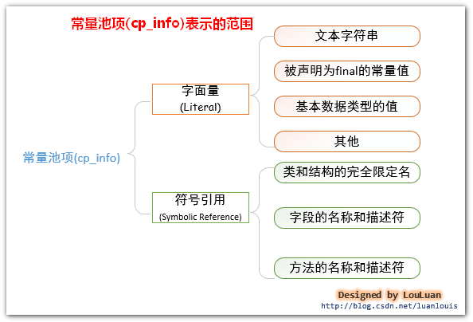
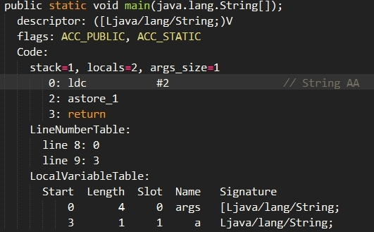
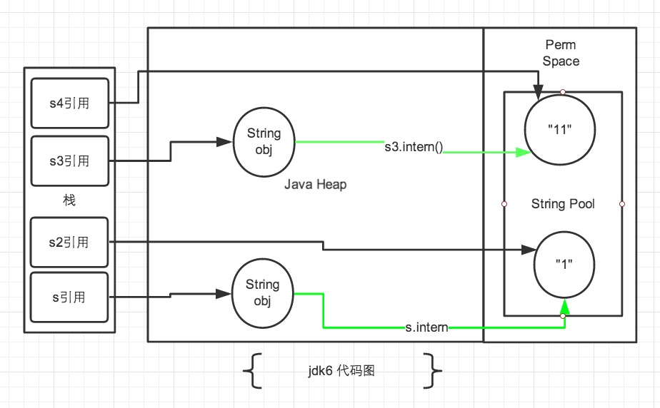
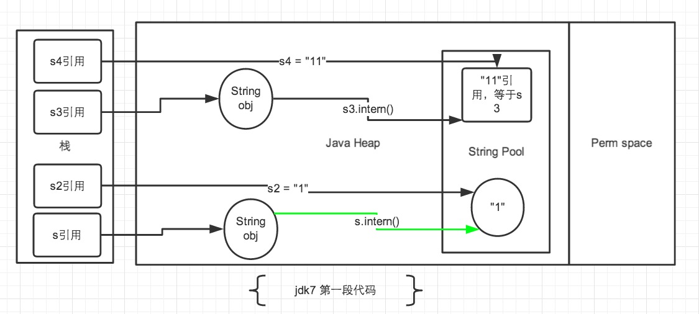

# 常量池(Class Constant Pool)
又叫静态常量池，每一个Java类编译后就会生成一份class文件；class文件中除了包含类的版本、字段、方法、接口等描述信息外，还有一项信息就是常量池(Constant Pool Table)，用于存放编译器生成的各种字面量(Literal)和符号引用(Symbolic References)。每个class文件都有一个常量池。
    
  
    
字面量(Literal)：
- 文本字符串(用双引号包围的字符串字面量)
- 八种基本类型的值
- 被声明为final的常量
    
符号引用(Symbolic References)：
- 类和接口的全限定名
- 字段的名称和描述符
- 方法的名称和描述符
    

# 运行时常量池(Runtime Constant Pool)
运行时常量池是方法区的一部分。每个class文件都对应有一个运行时常量池。
    
JVM在执行某个类的时候，必须经过加载、连接、初始化，而连接又包括验证、准备、解析三个阶段。当类加载到方法区后，jvm就会将class常量池中的内容存放到运行时常量池中。在解析阶段，会把符号引用替换为直接引用，解析的过程会去查询字符串常量池，以保证运行时常量池所引用的字符串与全局字符串常量池中是一致的。
    
由于jvm规范没有要求在连接时立即进行常量池解析，HotSpot VM的实现推迟了解析步骤，只在真正使用时才进行常量池解析。
    
在HotSpot VM的运行时常量池里，CONSTANT_Utf8会在类加载的过程中就全部创建出来，而CONSTANT_String则是lazy resolve的，例如说在第一次引用该项的 ldc 指令被第一次执行到的时候才会resolve。在尚未resolve的时候，HotSpot VM把它的类型叫做JVM_CONSTANT_UnresolvedString，内容跟Class文件里一样是一个常量池index；等到resolve过后这个常量项的类型就会变成最终的JVM_CONSTANT_String，而内容则变成实际的那个oop，指向Heap中的java.lang.String对象。
    

CONSTANT_Utf8类型的常量，才真正持有字符串的内容。CONSTANT_Utf8是c++的对象，CONSTANT_String才是java.lang.String。
    
CONSTANT_Utf8 -> Symbol*（一个指针，指向一个Symbol类型的C++对象，内容是Class文件同样格式的UTF-8编码的字符串）
    
Symbol对象在HotSpot VM里是个特殊的东西，它的字符串内容是直接嵌在对象尾部的。所以一个Symbol对象是一个固定长度的头部和一个可变长度、装有实际字符内容的尾部。
    
在HotSpot VM的运行时常量池里：
- CONSTANT_Utf8 -> Symbol*（一个指针，指向一个Symbol类型的C++对象，内容是跟Class文件同样格式的UTF-8编码的字符串）
- CONSTANT_String -> java.lang.String（一个实际的Java对象的引用）
    

CONSTANT_Utf8会在类加载的过程中就全部创建出来，而CONSTANT_String则是lazy resolve的，例如说在第一次引用该项的ldc指令被第一次执行到的时候才会resolve。在尚未resolve的时候，HotSpot VM把它的类型叫做JVM_CONSTANT_UnresolvedString，内容跟Class文件里一样只是一个常量池index；等到resolve过后这个项的常量类型就会变成最终的JVM_CONSTANT_String，而内容则变成实际的那个oop，指向Heap中的java.lang.String对象。
    
就HotSpot VM的实现来说，加载类的时候，那些字符串字面量会进入到当前类的运行时常量池，不会进入全局的字符串常量池（即在StringTable中并没有相应的引用，在堆中也没有对应的对象产生），ldc指令是什么东西？简单地说，它用于将int、float或String类型常量值从常量池中推送至操作数栈顶。
    
```
public class Abc {
    public static void main(String[] args) {
        String a = "AA"; 
    }
}
```
    
查看其编译后的Class文件如下：    
  
    
使用ldc将"AA"送到栈顶，然后用astore_1把它赋值给我们位于slot 1 位置的局部变量a，然后就return了。根据上面说的，在类加载阶段，这个解析步骤（ constant pool resolution ）是lazy的。换句话说并没有真正的对象，全局字符串常量池里自然也没有，那么ldc指令还怎么把字符串引用推送至栈顶？或者换一个角度想，既然resolve 阶段是lazy的，那总有一个时候它要真正的执行吧，是什么时候？ 执行ldc指令就是触发这个lazy resolution动作的条件，ldc字节码在这里的执行语义是：到当前类的运行时常量池（runtime constant pool）去查找该index对应的常量池项，如果该项尚未resolve则resolve之，并返回resolve后的内容。
    
在String.intern()的javadoc中提到：字符串常量或者常量表达式中的字符串在解析时都被使用方法String.intern()在字符串池中保留了唯一的引用。字面量创建字符串时会先在字符串池中找，看是否有相等的对象，没有的话就在堆中创建，把地址驻留在字符串池；有的话则直接用池中的引用，避免重复创建对象。
    
在resolve CONSTANT_String类型常量时，如果发现StringTable已经有了内容匹配的java.lang.String的引用，则直接返回这个引用；反之，如果StringTable里尚未有内容匹配的String实例的引用，则会在Java堆里创建一个对应内容的String对象，然后在StringTable记录下这个引用，并返回这个引用。可见，ldc指令是否需要创建新的String实例，全看在第一次执行这一条ldc指令时，StringTable是否已经记录了一个对应内容的String的引用。
    

# 字符串池(string pool)
又叫全局字符串常量池，HotSpot VM中只有一个，被所有类共享。
    

# String.intern()
HotSpot VM里，记录interned string的一个全局表叫做StringTable，它本质上就是个HashSet<String>。这是个纯运行时的结构，而且是惰性（lazy）维护的。它只存储对java.lang.String实例的引用，而不存储String对象的内容。 
    
一般我们说一个字符串进入了全局的字符串常量池其实是说在这个StringTable中保存了对它的引用，反之，如果说没有在其中就是说StringTable中没有对它的引用。
    
String.intern()方法干了什么？JDK7中，如果字符串池中已经有了这个字符串，那么直接返回字符串池中它的引用；如果没有，那就将它的引用保存一份到字符串常量池，然后直接返回这个引用。
    

JDK6及之前的HotSpot VM使用symbolOop来实现CONSTANT_Utf8的内容，symbolOop存放在永久代PermGen里。
    
JDK7开始HotSpot VM把symbol移到了native memory里，类型名改为Symbol。在resolve 运行时常量池里的一个CONSTANT_String项时，先去StringTable查找，StringTable支持以Symbol为key来查询是否已经有内容匹配的项存在，存在则直接返回匹配项的引用，不存在则根据Symbol对象的内容在Java堆中创建出内容匹配的java.lang.String对象。
    

# jdk版本的存储区域变化
- 在JDK7之前运行时常量池包含字符串常量池存放在方法区，此时HotSpot 虚拟机对方法区的实现为永久代(Perm Gen)。

- 在JDK7中字符串常量池被从方法区移到了堆中，这里没有提到运行时常量池，也就是说字符串常量池被单独拿到堆，运行时常量池剩下的东西还在方法区，也就是hotspot中的永久代。

- 在JDK8 HotSpot VM移除了永久代用元空间(Metaspace)取而代之，这时候字符串常量池还在堆中，运行时常量池还在方法区，只不过方法区的实现从永久代变成了元空间(Metaspace)，元空间在native memory里。
    

从JDK7开始永久代的移除工作，贮存在永久代的一部分数据已经转移到了Java Heap或者是Native Memory。但永久代仍然存在并没有完全的移除，符号引用(Symbols)转移到了Native Heap; 字符串池转移到了Java heap; 类的静态变量(class statics)转移到了Java heap。
    
在JDK7 update 4即随后的版本中，提供了完整的支持对于Garbage-First(G1)垃圾收集器，以取代在JDK5中发布的CMS收集器。使用G1，PermGen仅仅在Full GC（stop-the-word,STW）时才会被收集。G1仅仅在PermGen满了或者应用分配内存的速度比G1并发垃圾收集速度快的时候才触发Full GC。
    
永久代在JDK8中被完全的移除了。所以永久代的参数-XX:PermSize和-XX：MaxPermSize也被移除了。

在JDK8中， classe metadata 被存储在叫做Metaspace的Native Memory中。
    
`-XX:MetaspaceSize`: class metadata的初始空间配额，以Mbytes为单位，达到该值就会触发垃圾收集进行类型卸载，同时GC会对该值进行调整：如果释放了大量的空间，就适当的降低该值；如果释放了很少的空间，那么在不超过MaxMetaspaceSize（如果设置了的话）的情况下，适当的提高该值。
   
`-XX：MaxMetaspaceSize`: 可以为class metadata分配的最大空间。默认是没有限制的。
    
`-XX：MinMetaspaceFreeRatio`: 在GC之后，最小的Metaspace剩余空间容量的百分比，减少为class metadata分配空间导致的垃圾收集。
    
默认情况下，class metadata的分配仅受限于可用的native memory总量。可以使用MaxMetaspaceSize来限制可为class metadata分配的最大内存。当class metadata的使用的内存达到MetaspaceSize(64位的服务器端JVM，MetaspaceSize的默认大小是21M)时就会对死亡的类加载器和类型进行垃圾收集。设置MetaspaceSize为一个较高的值可以推迟垃圾收集的发生。
    
Native Heap，就是C-Heap。对于32位的JVM，C-Heap的容量=4G-Java Heap-PermGen/Metaspace；对于64位的JVM，C-Heap的容量=物理服务器的总RAM+虚拟内存-Java Heap-PermGen/Metaspace
    
虚拟内存： 在Windows下称为虚拟内存(virtual memory),在Linux下称为交换空间(swap space),用于当系统需要更多的内存资源而物理内存已经满了的情况下，将物理内存中不活跃的页转移到磁盘上的交换空间中。
    
在JDK8，Native Memory包括Metaspace和C-Heap。
    
Metaspace背后的一个思想是，类和它的元数据的生命周期是和它的类加载器的生命周期一致的。也就是说，只要类的类加载器是存活的，在Metaspace中的类元数据也是存活的，不能被释放。
    
每个类加载器存储区叫做“a metaspace”。这些metaspaces一起总体称为”the Metaspace”。仅仅当类加载器不在存活，被垃圾收集器声明死亡后，该类加载器对应的metaspace空间才可以回收。
   


# intern 在jdk7及以前版本的差异

```
String s = new String("1");
s.intern();
String s2 = "1";
System.out.println(s == s2);

String s3 = new String("1") + new String("1");
s3.intern();
String s4 = "11";
System.out.println(s3 == s4);
```
    
在JDK1.6中的运行结果是false false，而在1.7中结果是false true。
    
jdk1.6 如果字符串常量池中存在当前字符串，就会直接返回引用；如果字符串池中没有此字符串，会将堆中的字符串复制一份放入Perm区字符串池中后，再返回字符串池中的对象引用。    
  
    
方块代表引用，圆代表对象。
    
jdk1.7 jvm设计人员对intern()进行了一些修改，当执行String.intern()时，如果字符串池里不存在，jvm不再把字符串对象复制一份到字符串池中，而是在字符串池中存储一个指向堆中字符串对象的引用。    
  
    


# 字符串常量池优化
每个class的运行时常量池在解析CONSTANT_String类型时，都需要去字符串池中查找一次，在HotSpot VM里实现的string pool功能的是一个StringTable类，它是一个Hash表，默认值大小长度是1009；这个StringTable在每个HotSpot VM的实例只有一份，被所有的类共享。
    
在JDK6.0中，StringTable的长度是固定的，长度就是1009，因此如果放入String Pool中的String非常多，就会造成hash冲突，导致链表过长，当调用String#intern()时会需要到链表上一个一个找，从而导致性能大幅度下降。
    
在JDK7.0中，StringTable的长度可以通过参数指定：
-XX:StringTableSize=66666
    


# 8种基本类型的包装类
- Java 基本类型的包装类的大部分都实现了常量池技术，即 Byte, Character, Short, Integer, Long 这 5 种包装类默认创建了数值[-128，127] 的相应包装类型的缓存，但是超出此范围仍然会去创建新的对象。
- 两种浮点数类型的包装类 Float, Double 并没有实现常量池技术。
    
## Integer 缓存源代码
```
//此方法将始终缓存-128 到 127范围内的Integer类型值。
public static Integer valueOf(int i) {
    if (i >= IntegerCache.low && i <= IntegerCache.high)
        return IntegerCache.cache[i + (-IntegerCache.low)];
    return new Integer(i);
}
```
    
## 应用场景
```
Integer i1 = 40; // Java 在编译的时候会直接将代码优化成 Integer i1=Integer.valueOf(40);从而使用常量池中的对象。
Integer i1 = new Integer(40); // 明确使用new会创建新的对象。
```

## 示例
```
Integer i1 = 40;
Integer i2 = 40;
Integer i3 = 0;
Integer i4 = new Integer(40);
Integer i5 = new Integer(40);
Integer i6 = new Integer(0);
  
System.out.println(i1 == i2);           // true
System.out.println(i1 == i2 + i3);      // true
System.out.println(i1 == i4);           // false
System.out.println(i4 == i5);           // false
System.out.println(i4 == i5 + i6);      // true
System.out.println(40 == i5 + i6);      // true
```
    
解释：语句 i4 == i5 + i6，因为+这个操作符不适用于 Integer 对象，首先 i5 和 i6 进行自动拆箱操作，进行数值相加，即 i4 == 40。然后 Integer 对象无法与数值进行直接比较，所以 i4 自动拆箱转为 int 值 40，最终这条语句转为 40 == 40 进行数值比较。

