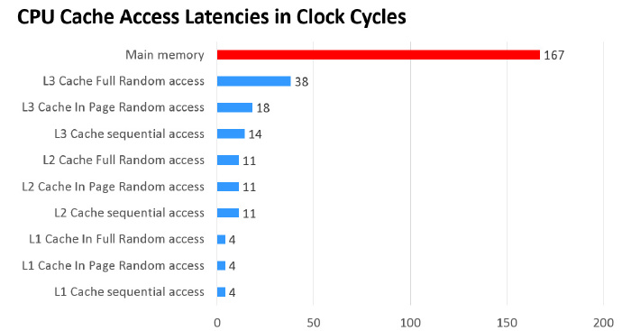
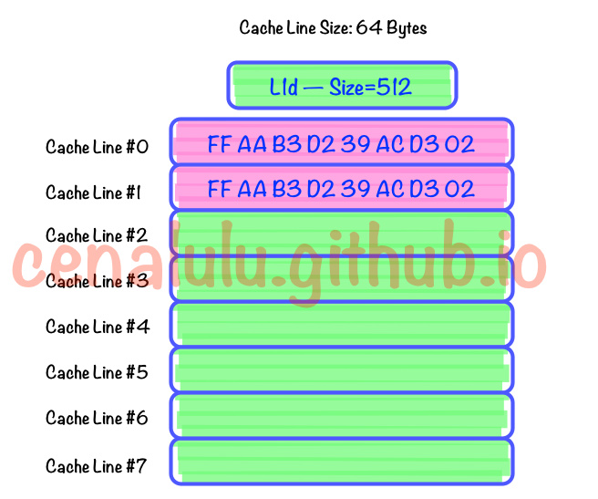
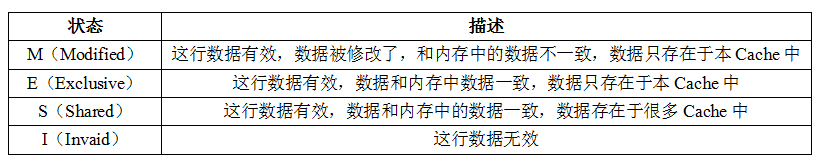
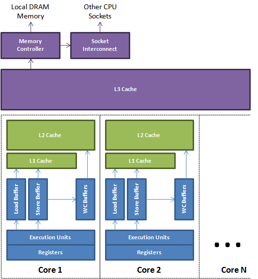
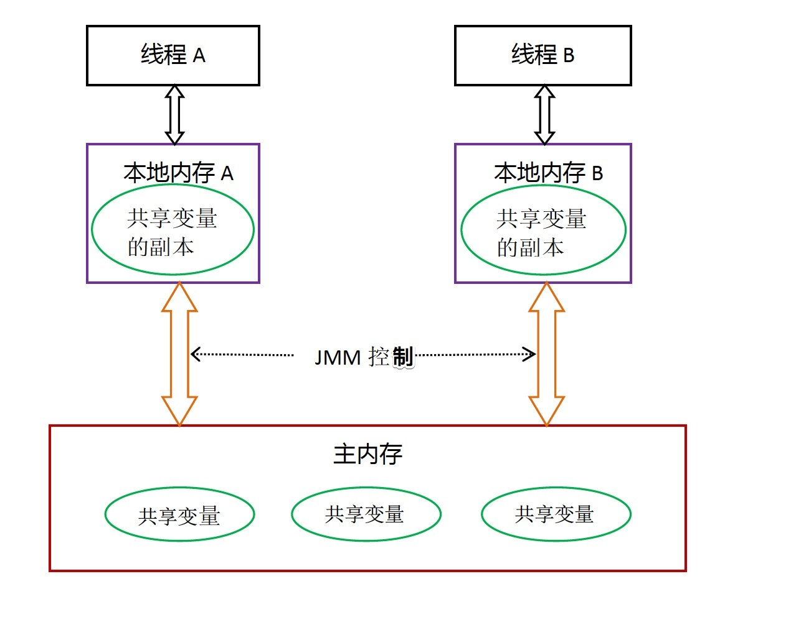
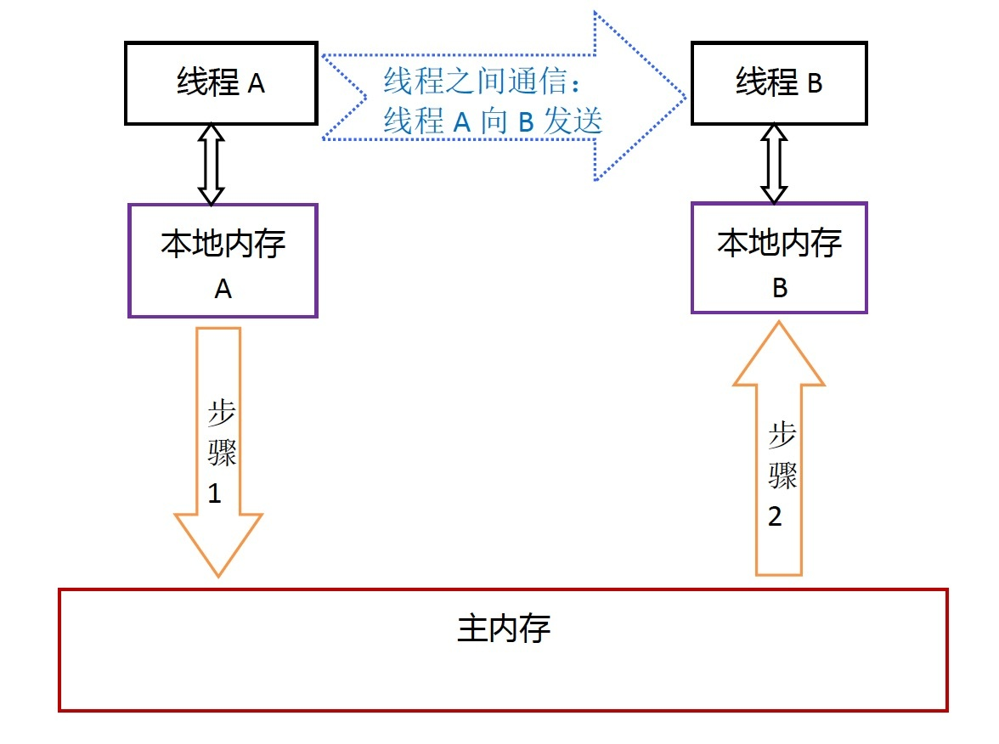
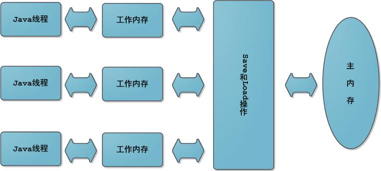

# 硬件架构 
  
    

# CPU缓存
CPU缓存的出现主要是为了解决CPU运算速度与内存读写速度不匹配的矛盾，因为CPU运算速度要比内存读写速度快得多。
    
  
    
这种访问速度的显著差异，导致CPU可能会花费很长时间等待读取内存数据或把数据写入内存。
    
基于此，现在CPU大多数情况下读写都不会直接访问内存，取而代之的是CPU缓存。当CPU要读取一个数据时，首先从一级缓存中查找，如果没有再从二级缓存中查找，如果还是没有再从三级缓存中或内存中查找。一般来说每级缓存的命中率大概都有80%左右，也就是说全部数据量的80%都可以在一级缓存中找到，只剩下20%的总数据量才需要从二级缓存、三级缓存或内存中读取。
    
# 缓存行
缓存行 (Cache Line) 便是 CPU Cache 中的最小单位，CPU Cache 由若干缓存行组成，一个缓存行的大小通常是 64 字节（这取决于 CPU），并且它有效地引用主内存中的一块地址。一个 Java 的 long 类型是 8 字节，因此在一个缓存行中可以存 8 个 long 类型的变量。当CPU遇到一条读取内存的指令时，它会把内存地址传递给L1缓存，L1缓存会检查它是否有这个内存地址对应的缓存行，如果没有就把整个缓存行从L2缓存或者内存中加载进来。
    
  
    

查看L1 缓冲区大小    
`cat /sys/devices/system/cpu/cpu0/cache/index0/size`
    

查看cpu缓存行大小
`cat /sys/devices/system/cpu/cpu0/cache/index0/coherency_line_size`
    

# 局部性原理
局部性原理是指计算机在执行某个程序时，倾向于使用最近使用的数据。局部性原理有两种表现形式：时间局部性和空间局部性。
- 时间局部性是指被引用过的存储器位置很可能会被再次引用，例如：重复的引用一个变量时则表现出较好的时间局部性
- 空间局部性是指被引用过的存储器位置附近的数据很可能将被引用；例如：遍历二维数组时按行序访问数据元素具有较好的空间局部性
    
缓存之所以有效，主要是因为程序运行时对内存的访问呈现局部性（Locality）特征。这种局部性既包括空间局部性（Spatial Locality），也包括时间局部性（Temporal Locality）。有效利用这种局部性，缓存可以达到极高的命中率。
    
CPU 缓存在顺序访问连续内存数据时挥发出了最大的优势。
    

# 伪共享
通常提到缓存行，大多数时候都会提到伪共享问题（正如提到 CAS 便会提到 ABA 问题一般）。
    
伪共享指的是多个线程同时读写同一个缓存行的不同变量时导致的 CPU 缓存失效。尽管这些变量之间没有任何关系，但由于在主内存中邻近，存在于同一个缓存行之中，它们的相互覆盖会导致频繁的缓存未命中，引发性能下降。伪共享问题难以被定位，如果系统设计者不理解 CPU 缓存架构，甚至永远无法发现 — 原来我的程序还可以更快。
    
如果多个线程的变量共享了同一个 CacheLine，任意一方的修改操作都会使得整个 CacheLine 失效（因为 CacheLine 是 CPU 缓存的最小单位），也就意味着，频繁的多线程操作，CPU 缓存将会彻底失效，降级为 CPU core 和主内存的直接交互。
    
伪共享问题的解决方法便是字节填充。
    
java7 重新排列了无用的字段，使得字节填充失效，可以通过继承或者内部类的方式使用字节填充。
    
```
// java7 字节填充
abstract class AbstractPaddingObject {
    protected long p1, p2, p3, p4, p5, p6;// 填充
}
public class PaddingObject extends AbstractPaddingObject {
    public volatile long value = 0L;    // 实际数据
}
```
    
java8开始提供官方的字节填充解决方案  @sun.misc.Contended，无需担心 jdk 的无效字段优化，无需担心 Cache Line 在不同 CPU 下的大小究竟是不是 64 字节。使用 @Contended 注解可以完美的避免伪共享问题。@Contended 暗示虚拟机“这个字段可以分离到不同的cache line中”。
    

# 使用CPU缓存带来的问题
- 核0读取了一个字节，根据局部性原理，它相邻的字节同样被被读入核0的缓存
- 核3做了上面同样的工作，这样核0与核3的缓存拥有同样的数据
- 核0修改了那个字节，被修改后，那个字节被写回核0的缓存，但是该信息并没有写回主存
- 核3访问该字节，由于核0并未将数据写回主存，数据不同步
    
为了解决这个问题，CPU制造商制定了一个规则：当一个CPU修改缓存中的字节时，服务器中其他CPU会被通知，它们的缓存将视为无效。于是，在上面的情况下，核3发现自己的缓存- 中数据已无效，核0将立即把自己的数据写回主存，然后核3重新读取该数据。
    
    
# MESI
对于不同插槽的CPU，L1和L2的数据并不共享，一般通过缓存一致性协议(MESI)保证Cache的一致性，但需要付出代价。
    
在MESI协议中，每个Cache line有4种状态，分别是：
    
  
    
I、S和M状态已经有了对应的概念：失效、干净以及脏的缓存行。
    
只有当缓存行处于E或者M状态时，处理器才能去写它，也就是说只有在这两种状态下，处理器是独占这个缓存行的。当处理器想写某个缓存行时，如果它没有独占权，它必须先发送一条”我要独占权”的请求给总线，这会通知其它处理器把它们拥有的同一缓存段的拷贝失效。
    
每个Core的Cache控制器不仅知道自己的读写操作，也监听其它Cache的读写操作，假如有4个Core：
    
1. Core1从内存中加载了变量X，值为10，这时Core1中缓存变量X的cache line的状态是E；
2. Core2也从内存中加载了变量X，这时Core1和Core2缓存变量X的cache line状态转化成S；
3. Core3也从内存中加载了变量X，然后把X设置成了20，这时Core3中缓存变量X的cache line状态转化成M，其它Core对应的cache line变成I（无效）
    
CPU在cache line状态的转化期间是阻塞的，经过长时间的优化，在寄存器和L1缓存之间添加了LoadBuffer、StoreBuffer来降低阻塞时间，LoadBuffer、StoreBuffer，合称排序缓冲(Memory Ordering Buffers (MOB))，Load缓冲64长度，store缓冲36长度，Buffer与L1进行数据传输时，CPU无须等待。
    
  
    
1. CPU执行load读数据时，把读请求放到LoadBuffer，这样就不用等待其它CPU响应，先进行下面操作，稍后再处理这个读请求的结果。
2. CPU执行store写数据时，把数据写到StoreBuffer中，待到某个适合的时间点，把StoreBuffer的数据刷到主存中。
    
因为StoreBuffer的存在，CPU在写数据时，真实数据并不会立即表现到内存中，所以对于其它CPU是不可见的；同样的道理，LoadBuffer中的请求也无法拿到其它CPU设置的最新数据；
    
由于StoreBuffer和LoadBuffer是异步执行的，所以在外面看来，先写后读，还是先读后写，没有严格的固定顺序。
    

# 读/写操作原子性:
在计算机中，数据通过总线在处理器和内存之间传递。每次处理器和内存之间的数据传递都是通过一系列步骤来完成的，这一系列步骤称之为总线事务（bus transaction）。总线事务包括读事务（read transaction）和写事务（write transaction）。读事务从内存传送数据到处理器，写事务从处理器传送数据到内存，每个事务会读/写内存中一个或多个物理上连续的字。这里的关键是，总线会同步试图并发使用总线的事务。在一个处理器执行总线事务期间，总线会禁止其它所有的处理器和I/O设备执行内存的读/写。总线的这些工作机制可以把所有处理器对内存的访问以串行化的方式来执行；在任意时间点，最多只能有一个处理器能访问内存。这个特性确保了单个总线事务之中的内存读/写操作具有原子性。
    

# Java内存模型
JMM决定一个线程对共享变量的写入何时对另一个线程可见。     
  
    
线程之间的共享变量存储在主内存（main memory）中，每个线程都有一个私有的本地内存（local memory通常是cpu缓存、寄存器），本地内存中存储了该线程已读/写共享变量的副本。本地内存是JMM的一个抽象概念，并不真实存在。它涵盖了cpu寄存器、一级缓存，二级缓存、写缓冲区以及其他的硬件和编译器优化。
    

线程A与线程B之间如要通信的话，必须要经历下面2个步骤：    
1. 首先，线程A把本地内存A中更新过的共享变量刷新到主内存中去。
2. 然后，线程B到主内存中去读取线程A之前已更新过的共享变量。 
  
    
JMM通过控制主内存与每个线程的本地内存之间的交互，来为java程序员提供内存可见性保证。
    
在JVM内部，Java内存模型把内存分成了两部分：线程栈区stack和堆区heap。
-  线程栈包含了当前线程执行的方法调用相关信息，线程栈包含了当前方法的所有局部变量信息，所有原始类型(boolean,byte,short,char,int,long,float,double)的局部变量都直接保存在线程栈当中，对于它们的值各个线程之间都是独立的。
-  堆区包含了Java创建的所有对象信息，不管对象是哪个线程创建的，其中的对象包括原始类型的封装类（如Byte、Integer、Boolean等等）。不管对象是属于一个成员变量还是方法中的局部变量，它都会被存储在堆区。一个局部变量如果是原始类型，那么它会被完全存储到栈区。 一个局部变量也有可能是一个对象的引用，这种情况下，这个变量的引用会被存储到栈中，但是对象本身仍然存储在堆区。
- static类型的变量以及类型本身相关信息都会随着类型存储在方法区(Perm/Metadata)。
    

# 主内存和工作内存
Java内存模型的主要目标是定义程序中各个共享变量的访问规则，即在虚拟机中将变量存储到内存和从内存中取出变量这样底层细节。此处的变量与Java编程时所说的变量不一样，包括了实例字段、静态字段和构成数组对象的元素，但是不包括局部变量、局部引用与方法参数，后者是线程私有的，不会被共享。
    
Java内存模型中规定了所有的变量都存储在主内存中，每条线程还有自己的工作内存，线程的工作内存中保存了该线程使用到的变量到主内存副本拷贝，线程对变量的所有操作（读取、赋值）都必须在工作内存中进行，而不能直接读写主内存中的变量。不同线程之间无法直接访问对方工作内存中的变量，线程间变量值的传递均需要在主内存来完成，线程、主内存和工作内存的交互关系如下图所示：
    
这里的主内存、工作内存与Java内存区域的Java堆、栈、方法区不是同一层次内存划分。

    
# 主内存和工作内存的交互
一个共享变量如何从主内存拷贝到工作内存、如何从工作内存同步回主内存之类的实现细节，Java内存模型中定义了以下8种操作来完成，虚拟机实现时必须保证每一种操作都是原子的、不可再分的：
    
1. lock（锁定）：作用于主内存中的共享变量，它把一个变量标识为线程独占的状态

2. unlock（解锁）：作用于主内存中的共享变量，它把一个处于锁定状态的变量释放出来，释放后的共享变量才可以被其他线程锁定

3. read（读取）：作用于主内存中的共享变量，它把一个变量的值从主内存传输到线程的工作内存中，以便随后的load动作使用，与load一起使用

4. load（载入）：作用于工作内存的共享变量，它把read操作从主内存中得到的变量值放入工作内存的变量副本中

5. use（使用）：作用于工作内存的共享变量，它把工作内存中一个变量的值传递给执行引擎，每当虚拟机遇到需要使用到变量的值的字节码指令时将会执行这个操作

6. assign（赋值）：作用于工作内存中的共享变量，它把一个从执行引擎接收到的值赋值给工作内存中的变量，每当虚拟机遇到给变量赋值的字节码指令时执行这个操作

7. store（存储）：作用于工作内存中的共享变量，它把工作内存中一个变量的值传送到主内存中，以便随后的write操作使用，与write一起使用

8. write（写入）：作用于主内存中的共享变量，它把store操作从工作内存中得到的变量值放入主内存的变量中
    
    
    
如果要把一个变量从主内存中复制到工作内存，就需要按顺序地执行read和load操作；如果把变量从工作内存中同步回主内存中，就要按顺序地执行store和write操作。Java内存模型只要求上述操作必须按顺序执行，而没有保证必须是连续执行。也就是read和load之间，store和write之间是可以插入其他指令的，如对主内存中的变量a、b进行访问时，重排序后可能的顺序是read a;read b;load b;load a。
    

Java内存模型还规定了在执行上述8种基本操作时必须满足以下规则：
    
1. 不允许read和load、store和write操作之一单独出现

2. 不允许一个线程丢弃它的最近的assign操作，即共享变量的值在工作内存中改变了之后必须把该变化同步回主内存

3. 不允许一个线程无原因地把数据从线程的工作内存同步回主内存中

4. 一个新的变量只能从主内存中诞生，不允许在工作内存中直接使用一个未被初始化（load或assign）的变量

5. 一个变量在同一时刻只允许一个线程对其进行lock操作，但lock操作可以被同一条线程重复执行多次，多次执行lock后，只有执行相同次数的unlock操作，变量才会被解锁

6. 如果对同一个变量执行lock操作，那将会清空工作内存中此变量的值，在执行引擎使用这个变量前，需要重新执行load或assign操作初始化变量的值

7. 如果一个变量事先没有被lock操作锁定，那就不允许对它进行unlock操作，也不允许去unlock一个被其他线程锁定的变量

8. 对一个变量执行unlock操作之前，必须先把此变量同步回主内存中
    

# 重排序
在执行程序时为了提高性能，编译器和处理器经常会对指令进行重排序。重排序分成三种类型：
- 编译器优化的重排序。编译器在不改变单线程程序语义放入前提下，可以重新安排语句的执行顺序。
- 指令级并行的重排序。现代处理器采用了指令级并行技术来将多条指令重叠执行。如果不存在数据依赖性，处理器可以改变语句对应机器指令的执行顺序。
- 内存系统的重排序。由于处理器使用缓存和读写缓冲区，这使得加载和存储操作看上去可能是在乱序执行。
    
    
    
JMM 属于语言级的内存模型，它确保在不同的编译器和不同的处理器平台之上，通过禁止特定类型的编译器重排序和处理器重排序，为程序员提供一致的内存可见性保证。
- 对于编译器重排序，JMM 的编译器重排序规则会禁止特定类型的编译器重排序（不是所有的编译器重排序都要禁止）。
- 对于处理器重排序，JMM 的处理器重排序规则会要求 Java 编译器在生成指令序列时，插入特定类型的内存屏障指令，通过内存屏障指令来禁止特定类型的处理器重排序（不是所有的处理器重排序都要禁止）。
    

# 内存屏障
现代的处理器使用写缓冲区来临时保存向内存写入的数据。写缓冲区可以保证指令流水线持续运行，它可以避免由于处理器停顿下来等待向内存写入数据而产生的延迟。同时，通过以批处理的方式刷新写缓冲区，以及合并写缓冲区中对同一内存地址的多次写，可以减少对内存总线的占用。虽然写缓冲区有这么多好处，但每个处理器上的写缓冲区，仅仅对它所在的处理器可见。
    
  
    
常见处理器允许的重排序类型的列表：
| cpu | Load-Load | Load-Store | Store-Store | Store-Load | 数据依赖
| :---: | :---: | :---: | :---: | :---: | :---: |
| sparc | N | N | N | Y | N
| x86 | N | N | N | Y | N
| arm | Y | Y | Y | Y | N
    
常见的处理器都允许Store-Load重排序；常见的处理器都不允许对存在数据依赖的操作做重排序。sparc和x86拥有相对较强的处理器内存模型，它们仅允许对写-读操作做重排序（因为它们都使用了写缓冲区）。
    

为了保证内存可见性，java编译器在生成指令序列的适当位置会插入内存屏障指令来禁止特定类型的处理器重排序。
    
Java内存模型把内存屏障分为LoadLoad、LoadStore、StoreLoad和StoreStore四种：
    
  
    
StoreLoad Barriers是一个全能型屏障，同时具有其他三个屏障的效果。现代的多处理器大都支持该屏障。
执行该屏障开销会很昂贵，因为当前处理器通常要把写缓冲区中的数据全部刷新到内存中（buffer fully flush）。
    

# 原子性、可见性、有序性
Java内存模型围绕着并发过程中如何处理原子性、可见性和有序性这三个特征来建立的。
1. 原子性（Atomicity）：由Java内存模型来直接保证原子性变量操作(read/load、assign、use、store/write)，大致可以认为基本数据类型的访问读写是具备原子性的。如果应用场景需要一个更大的原子性保证，Java内存模型还提供了lock和unlock，尽管虚拟机没有把lock和unlock操作直接开放给用户使用，但是却提供了更高层次的字节码指令monitorenter和monitorexit来隐式地使用这两个操作，这两个字节码指令反映到Java代码中就是同步块synchronized关键字。

2. 可见性（Visibility）：可见性是指当一个线程修改了共享变量的值，其他线程能够立即得知这个修改。volatile、synchronized关键字可以实现可见性。volatile关键字修饰的变量在被修改后可以立即同步到主内存，在每次读之前都从主内存刷新。synchronized的可见性是由”对一个共享变量执行unlock操作之前，必须先把此变量同步回主内存中”这条规则获得的。final关键字也可以实现可见性，因为被final修饰的字段在构造器中一旦初始化完成，并且构造器没有把this传递出去，那在其他线程中就能看见final字段的值。

3. 有序性（Ordering）：Java程序中天然的有序性可以总结为一句话：如果在本线程内观察，所有的操作都是有序的；如果在一个线程中观察另外一个线程，所有的操作都是无序的。前半句是指”线程内表现为串行的语义”，后半句是指”指令重排序”和”工作内存与主内存同步延迟”现象。Java语言提供了volatile和synchronized两个关键字来保证线程之间操作的有序性。volatile关键字会禁止指令重排；synchronized关键字保证同一时刻只允许一条线程操作。。
    

# 数据依赖性
如果两个操作访问同一个变量，且这两个操作中有一个为写操作，此时这两个操作之间就存在数据依赖性。数据依赖分下列三种类型：
    
| 名称 | 代码示例 | 说明
| :---: | :---: | :---: |
| 写后读|a = 1;b = a; | 写一个变量之后，再读这个位置。
| 写后写|a = 1;a = 2; | 写一个变量之后，再写这个变量。
| 读后写|a = b;b = 1; | 读一个变量之后，再写这个变量。
    
编译器和处理器在重排序时，会遵守数据依赖性，编译器和处理器不会改变存在数据依赖关系的两个操作的执行顺序。

注意，这里所说的数据依赖性仅针对单个处理器中执行的指令序列和单个线程中执行的操作，不同处理器之间和不同线程之间的数据依赖性不被编译器和处理器考虑。
        

# AS-IF-SERIAL
as-if-serial 语义的意思指：不管怎么重排序（编译器和处理器为了提高并行度），（单线程）程序的执行结果不能被改变。编译器，jvm 和处理器都必须遵守 as-if-serial 语义。
    
为了遵守 as-if-serial 编译器和处理器不会对存在数据依赖关系的操作做重排序，因为这种重排序会改变执行结果。但是如果操作之间没有数据依赖关系，这些操作就可能被编译器和处理器重排序。
    
as-if-serial语义把单线程程序保护了起来，遵守as-if-serial语义的编译器，runtime 和处理器共同为编写单线程程序的程序员创建了一个幻觉：单线程程序是按程序的顺序来执行的。as-if-serial语义使单线程程序员无需担心重排序会干扰他们，也无需担心内存可见性问题。
    

# happens-before
JSR-133 内存模型使用 happens-before 的概念来阐述操作之间的内存可见性。在 JMM 中，如果一个操作执行的结果需要对另一个操作可见，那么这两个操作之间必须要存在 happens-before 关系。这里提到的两个操作既可以是在一个线程之内，也可以是在不同线程之间。
    
与程序员密切相关的 happens-before 规则如下：    
- 程序顺序规则：一个线程中的每个操作，happens-before 于该线程中的任意后续操作。
- 监视器锁规则：对一个监视器的解锁，happens-before 于随后对这个监视器的加锁。
- volatile 变量规则：对一个 volatile 域的写，happens-before 于任意后续对这个 volatile 域的读。
- 传递性：如果 A happens-before B，且 B happens-before C，那么 A happens-before C。
注意，两个操作之间具有 happens-before 关系，并不意味着前一个操作必须要在后一个操作之前执行！happens-before 仅仅要求前一个操作（执行的结果）对后一个操作可见，且前一个操作按顺序排在第二个操作之前。
    

# 重排序对多线程的影响
```
class Demo {
    int a = 0;
    boolean flag = false;
 
    public void write() {
        a = 1;              //1
        flag = true;        //2
    }
    public void read() {
        if (flag) {         //3
            int i = a * a;  //4
        }
    }
}
```
    
在单线程程序中，对存在控制依赖的操作重排序，不会改变执行结果（这也是 as-if-serial 语义允许对存在控制依赖的操作做重排序的原因）；但在多线程程序中，对存在控制依赖的操作重排序，可能会改变程序的执行结果。
    
