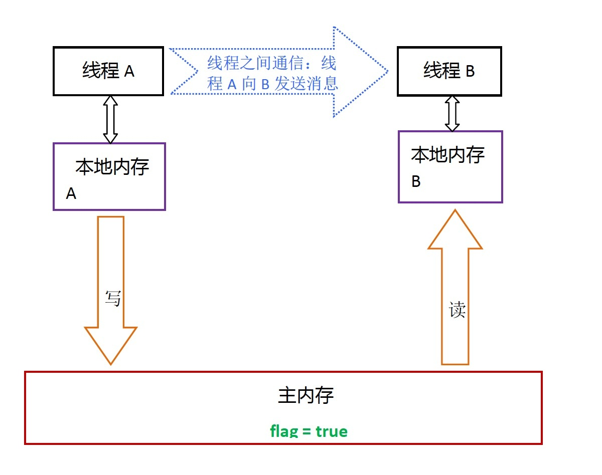
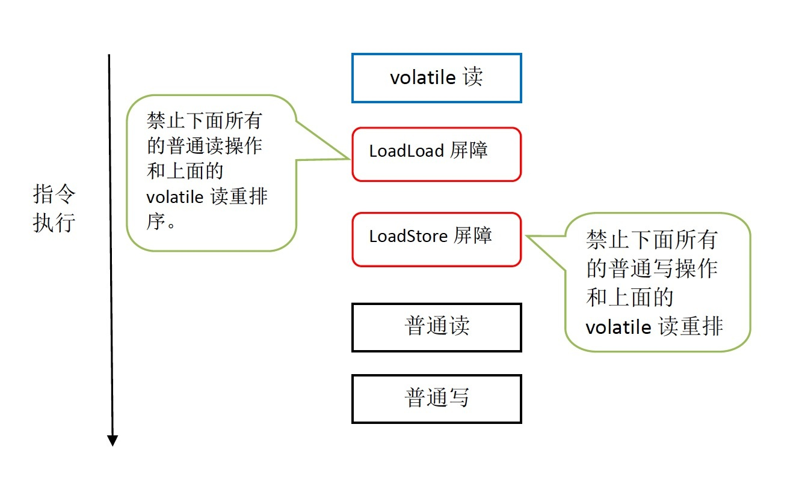
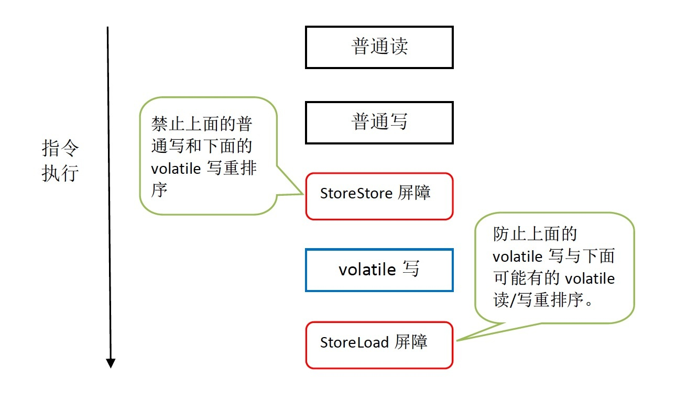

# volatile
volatile的共享变量进行写操作，JVM就会向处理器发送一条Lock前缀的指令，将这个变量所在缓存行的数据写回到主内存。在多处理器下，为了保证各个处理器的缓存是一致的，就会实现缓存一致性协议MESI，每个处理器通过嗅探在总线上传播的数据来检查自己缓存的值是不是过期了，当处理器发现自己缓存行对应的内存地址被修改，就会将当前处理器的缓存行设置成无效状态，当处理器对这个数据进行修改操作的时候，会重新从系统内存中把数据读到处理器缓存里。
    
lock前缀的指令在多核处理器下会引发了两件事情：    
- lock前缀指令将引起当前处理器缓存的数据写回到系统内存。
- 处理器的缓存写回到内存中将会导致其他处理器的缓存无效。
    
多核CPU之间的缓存一致性协议（锁缓存的保证）：每个处理器通过嗅探总线上有其他处理器写内存地址，如果处理器发现正好是自己缓存行所对应的内存地址，就会将当前处理器的缓存行设置成无效状态，当处理器再次访问这个数据时，就会重新将内存中的数据加载到处理器缓存中。
    
处理器使用嗅探技术保证它的内部缓存、系统内存和其他处理器的缓存的数据在总线上保持一致。例如CPU A嗅探到CPU B打算写内存地址，且这个地址处于共享状态，那么正在嗅探的处理器将使它的缓存行无效，在下次访问相同内存地址时，强制执行缓存行填充。
    

# volatile的特性
volatile具有可见性、有序性和单个读/写操作的原子性，不保证复合操作的原子性。
    
- 可见性：对一个volatile变量的读，总是能看到其他线程对这个变量最新的修改。
- 有序性：限制编译器和处理器对volatile变量与普通变量的重排序，确保volatile的写-读和锁的释放-获取具有相同的内存语义。
- 原子性：volatile变量的单个读/写操作是原子性的（包括long、double），复合操作不具有原子性。
    

## volatile 读写的内存定义
- 当写一个 volatile 变量时，JMM 会把该线程对应的工作内存中的共享变量值刷新到主内存。和锁synchronized的释放内存语义一致。
- 当读一个 volatile 变量时，JMM 会把该线程对应的工作内存缓存行置为无效。线程接下来将从主内存中读取共享变量到工作内存。和锁synchronized的获取内存语义一致。
    
- 线程A写一个volatile变量, 实质上是线程A向接下来将要读这个volatile变量的某个线程发出了(其对共享变量所做修改的)消息。
- 线程B读一个volatile变量, 实质上是线程B接收了之前某个线程发出的(在写这个volatile变量之前对共享变量所做修改的)消息。
- 线程A写一个volatile变量, 随后线程B读这个volatile变量,这个过程实质上是线程A通过主内存向线程B发送消息。
    
  
    
## volatile内存语义的实现
为了实现 volatile 的内存语义，编译器在生成字节码时，会在指令序列中插入内存屏障来禁止特定类型的处理器重排序。
    
下面是基于保守策略的 JMM 内存屏障插入策略：
- 在每个 volatile 写操作的前面插入一个 StoreStore 屏障。
- 在每个 volatile 写操作的后面插入一个 StoreLoad 屏障。
- 在每个 volatile 读操作的后面插入一个 LoadLoad 屏障。
- 在每个 volatile 读操作的后面插入一个 LoadStore 屏障。
    
  
    
  
    
x86处理器仅会对写-读操作做重排序。X86不会对读-读，读-写和写-写操作做重排序，因此在x86处理器中会省略掉这三种操作类型对应的内存屏障。在x86中，JMM仅需在volatile写后面插入一个StoreLoad屏障即可正确实现volatile写-读的内存语义。这意味着在x86处理器中，volatile写的开销比volatile读的开销会大很多（因为执行StoreLoad屏障开销会比较大）。
    
由于volatile仅仅保证对单个volatile变量的读/写具有原子性，而锁的互斥执行的特性可以确保对整个临界区代码的执行具有原子性。在功能上，锁比volatile更强大；在可伸缩性和执行性能上，volatile更有优势。
    

# volatile使用场景
必须具备以下两个条件（其实就是先保证原子性）：    
- 对变量的写不依赖当前值（比如++操作）
- 该变量没有包含在具有其他变量的不等式中
    

## volatile 应用
concurrent包的源代码实现，有一个通用化的实现模式：
1. 首先，声明共享变量为volatile；
2. 然后，使用CAS的原子条件更新来实现线程之间的同步；CAS是利用处理器提供的CMPXCHG指令实现的，处理器执行这个指令是一个原子操作
3. 同时，配合以volatile的读/写和CAS所具有的volatile读和写的内存语义来实现线程之间的通信。
    

# final
JSR-133增强了final的语义。通过为final域增加写和读重排序规则，可以为java程序员提供初始化安全保证：只要对象是被正确构造的（对象的引用在构造函数中没有“逸出”），那么不需要使用同步（synchronized、volatile），就可以保证任意线程都能看到这个final域在构造函数中被初始化之后的值。
    
对于 final 域，编译器和处理器要遵守两个重排序规则：    
- 在构造函数内对一个 final 域的写，与随后把这个被构造对象的引用赋值给一个引用变量，这两个操作之间不能重排序。
- 初次读一个包含 final 域的对象的引用，与随后初次读这个 final 域，这两个操作之间不能重排序。
    
## 写 final 域的重排序规则
写 final 域的重排序规则禁止把 final 域的写重排序到构造函数之外。这个规则的实现包含下面2个方面：
    
- JMM 禁止编译器把 final 域的写重排序到构造函数之外。
- 编译器会在 final 域的写之后，构造函数 return 之前，插入一个 StoreStore 屏障。这个屏障禁止处理器把 final 域的写重排序到构造函数之外。
    
## 读 final 域的重排序规则
在一个线程中，初次读对象引用与初次读该对象包含的 final 域，JMM 禁止处理器重排序这两个操作（注意，这个规则仅仅针对处理器）。编译器会在读 final 域操作的前面插入一个 LoadLoad 屏障。
    
## final语义在处理器中的实现
以x86处理器为例，说明final语义在处理器中的具体实现。
    
写final域的重排序规则会要求译编器在final域的写之后，构造函数return之前，插入一个StoreStore障屏。读final域的重排序规则要求编译器在读final域的操作前面插入一个LoadLoad屏障。
    
由于x86处理器不会对写-写操作做重排序，所以在x86处理器中，写final域需要的StoreStore障屏会被省略掉。同样，由于x86处理器不会对存在间接依赖关系的操作做重排序，所以读final域需要的LoadLoad屏障也会被省略掉。也就是说在x86处理器中，final域的读/写不会插入任何内存屏障。
    

