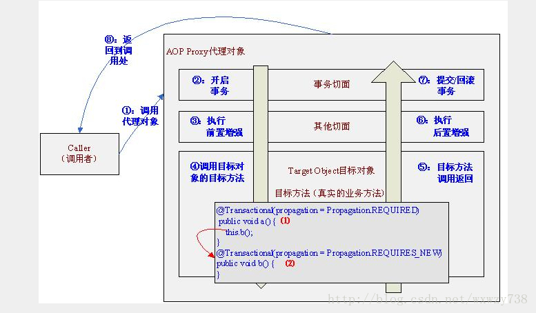

# 问题描述
  

# 通过ThreadLocal暴露Aop代理对象
```
<aop:aspectj-autoproxy expose-proxy="true"/> <!—注解风格支持--> 
<aop:config expose-proxy="true"> <!—xml风格支持-->
```
`this.b();` 修改为 `((AService) AopContext.currentProxy()).b();`    

# 通过初始化方法在目标对象中注入代理对象

```
@Service  
public class AServiceImpl implements AService {
    @Autowired
    private ApplicationContext context;
    private AService proxySelf;
    @PostConstruct
    private void setSelf() {
        proxySelf = context.getBean(AService.class);
    }
    @Transactional(propagation = Propagation.REQUIRED)
    public void a() {
        // 调用代理对象的方法 这样可以执行事务切面
        proxySelf.b();
    }
    @Transactional(propagation = Propagation.REQUIRES_NEW)
    public void b() {
    }
}
```

# 通过BeanPostProcessor 在目标对象中注入代理对象
## 实现BeanSelfAware接口
```
@Service
public class AServiceImpl4 implements AService, BeanSelfAware {
    private AService proxySelf;
    public void setSelf(Object proxyBean) {
        //通过InjectBeanSelfProcessor注入自己（目标对象）的AOP代理对象
        this.proxySelf = (AService) proxyBean;
    }
    @Transactional(propagation = Propagation.REQUIRED)
    public void a() {
        proxySelf.b();
    }
    @Transactional(propagation = Propagation.REQUIRES_NEW)
    public void b() {
    }
}
```

## 实现InjectBeanSelfProcessor接口
postProcessAfterInitialization根据目标对象是否实现BeanSelfAware标识接口，通过setSelf(bean)将代理对象（bean）注入到目标对象中    
```
@Component
public class InjectBeanSelfProcessor implements BeanPostProcessor, ApplicationContextAware {
    private ApplicationContext context;
    // 注入ApplicationContext
    public void setApplicationContext(ApplicationContext applicationContext) throws BeansException {
        this.context = applicationContext;
    }
    public Object postProcessAfterInitialization(Object bean, String beanName) throws BeansException {
        if (!(bean instanceof BeanSelfAware)) {
            return bean;
        }
        if (AopUtils.isAopProxy(bean)) {
            ((BeanSelfAware) bean).setSelf(bean);
        } else {
            ((BeanSelfAware)bean).setSelf(context.getBean(beanName));
        }
        return bean;
    }
    public Object postProcessBeforeInitialization(Object bean, String beanName) throws BeansException {
        return bean;
    }
}
```
